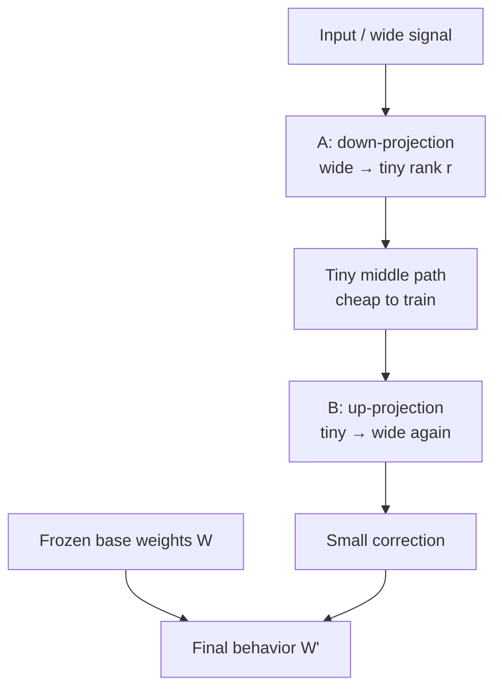

**LoRA** (Low-Rank Adaptation) is a cheap way to fine-tune a large model. You do **not** rewrite every weight. You keep the big model frozen and learn a **small correction** on top.

## Intuition

Think of teaching a chef:

- **Full fine-tuning** = retrain every cooking skill from scratch
- **LoRA** = keep the chef’s skills, add a small “restaurant style” notebook

That notebook has two parts:

- **Down-projection (A)** = notice only the important style differences (squeeze)
- **Up-projection (B)** = apply those differences back to full behavior (stretch)

You do **not** write A and B by hand. Training fills them in from your examples.

A common form:

`W' = W + (α / r) · B · A`

| Symbol | Plain meaning |
| --- | --- |
| **W** | Original frozen weights (the pretrained brain) |
| **W'** | Final behavior = original + correction |
| **A** | Down-projection (wide → narrow) |
| **B** | Up-projection (narrow → wide) |
| **r** | Rank — how wide the tiny middle path is |
| **α** | How strong the LoRA correction is allowed to be |

:::key
LoRA = frozen base model + tiny trainable sticky-note update. A and B are learned automatically, not hand-picked.
:::

## How it works

### The formula in plain words

`W'` (what the model uses) = `W` (frozen) + a small correction.

The correction is `B · A`, scaled by `α / r` so the push stays stable when you change rank.

### Down-projection and up-projection

Imagine a wide highway of size **d** (for example 4096).

1. **Down-projection (`A`)**  
   Compresses the wide signal into a narrow lane of size **r** (for example 8).  
   “Summarize the needed change into a small space.”

2. **Up-projection (`B`)**  
   Expands that narrow lane back to full width **d**.  
   “Write the correction back into the original size.”



### You do not choose the numbers inside A and B

Practically:

1. Start A and B with small random values
2. Show many examples (“user asked this → good answer is that”)
3. Training slowly adjusts A and B
4. Keep **W** frozen the whole time

What **you** choose are settings like:

- **r** — how wide the tiny middle is (8 or 16 is a common start)
- **α** — how strong the adapter may be
- **which layers** get adapters (often attention parts like `q_proj`, `v_proj`)

### Why this helps

For a square **d × d** weight:

| Scenario | About how many trainable numbers |
| --- | --- |
| Full square weight | **d²** |
| LoRA on that matrix | **2 · d · r** |
| Example: d = 4096, r = 8 | **2 × 4096 × 8 = 65,536** |

That LoRA example is roughly **256× smaller** than updating the full 4096×4096 matrix. So you get:

- lower GPU cost
- smaller adapter files to save/share
- usually less forgetting of the original model

### Practically how it is done

1. Load a base model
2. Freeze its weights
3. Attach LoRA adapters (A and B) on chosen layers
4. Train only those adapters on your dataset
5. Save the small adapter (often MBs, not a full model copy)
6. Later: load base model + attach adapter (or merge them)

Tiny PEFT-style sketch (concept only):

```python
from peft import LoraConfig, get_peft_model

lora = LoraConfig(
    r=8,                 # tiny middle width
    lora_alpha=16,       # strength (α)
    target_modules=["q_proj", "v_proj"],
    lora_dropout=0.05,
    bias="none",
    task_type="CAUSAL_LM",
)

model = get_peft_model(base_model, lora)
# train model on your dataset
# then: model.save_pretrained("my-lora-adapter")
```

Libraries create the down/up matrices for you. Your job is good data + sensible `r` / `α` / target layers.

### Rank and strength choices

- **Higher r** → more flexibility, more trainable parameters
- **Lower r** → cheaper, but may underfit a hard domain shift
- **α / r** → keeps update size better behaved when rank changes

If rank is large enough, a low-rank update can approximate a full dense update. LoRA is the practical middle ground: small by default, richer when you need more capacity.

## What goes wrong

- Picking a tiny rank for a big domain shift, then blaming LoRA.
- Thinking you must hand-design A and B — training learns them.
- Unfreezing the whole backbone “just in case,” which removes the memory win.
- Forgetting to use the same base model later when loading the adapter.

## One-line summary

LoRA freezes the big model and trains a small down→up sticky-note correction so fine-tuning stays cheap and effective.

## Key terms

- **LoRA** — Low-Rank Adaptation with frozen base weights.
- **Down-projection (A)** — Compresses the change into a tiny middle path.
- **Up-projection (B)** — Expands that tiny change back to full size.
- **Rank (r)** — Width of the tiny middle path.
- **α (alpha)** — Strength / scaling of the LoRA update.
