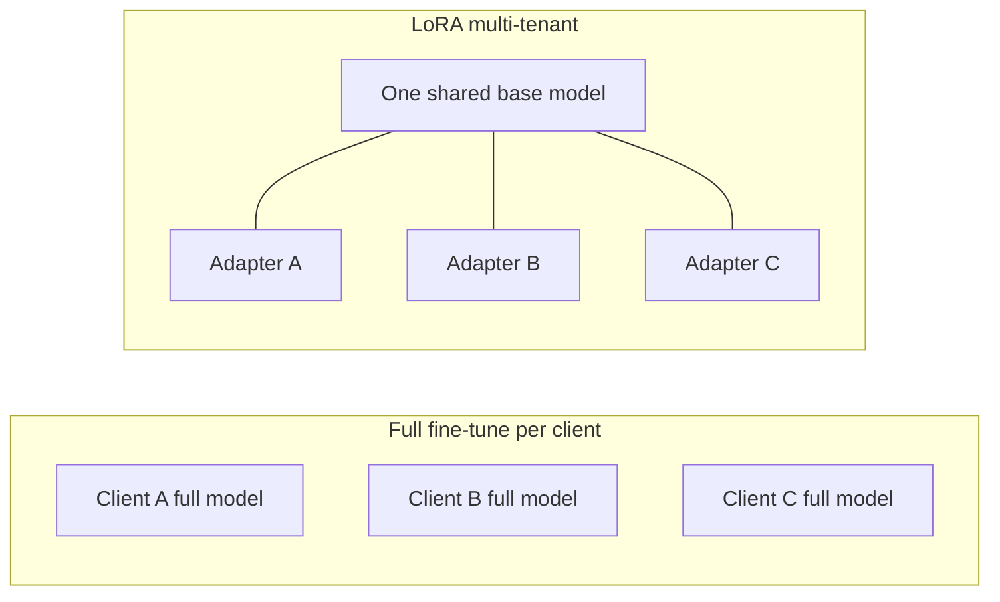

**Multi-tenant** means one product serves many customers (tenants), and each customer wants slightly different behavior.

This is one of the best real-world reasons LoRA (and QLoRA) matter.

## Intuition

Imagine you run a customer-support AI SaaS with **200 companies** on it.

- A **fintech** client wants careful, compliance-aware answers
- A **gaming** client wants a casual, fun tone

Same base “brain.” Different house styles.

If you fully fine-tune a separate big model for every client, costs explode:

- One 13B-style model in 16-bit can take about **26 GB** just for weights
- **200 clients × ~26 GB ≈ 5.2 TB** of model storage
- Each full fine-tune burns serious GPU time
- Serving 200 full models means many GPUs sitting warm all day

That is why the LoRA pattern is so useful:

:::key
Keep **one** shared base model. Train a **small LoRA sticky-note adapter per client**. At answer time, hot-swap the right adapter.
:::

Same idea as the previous lesson: the big textbook stays shared; each client only gets their own notebook.

## How it works

### The problem in one picture

Left side = many giant copies.  
Right side = one brain + many tiny style packs.

### Training side (often with QLoRA)

How teams usually build the adapters:

1. Load the **same base model** (often in **4-bit** with QLoRA so it fits better)
   - Example: a 13B model may drop from about **26 GB** toward about **7 GB**
2. Fine-tune a **separate LoRA adapter** on each client’s own examples
3. Each adapter stays small — often around **tens of MB** (example ballpark: ~50 MB)
4. Because the adapter is tiny and the base can be 4-bit, training one client adapter can fit on a **single consumer-class GPU**, instead of a big multi-GPU cluster

So client A’s data teaches adapter A.  
Client B’s data teaches adapter B.  
The shared base stays the common language engine.

### Simple math behind those numbers

You do not need heavy formulas. Just count **bits per number**.

**1) Why ~26 GB for a 13B model in 16-bit?**

- “13B” means about **13 billion** weight numbers
- 16-bit means each number uses **2 bytes**
- Rough size ≈ `13e9 × 2 bytes ≈ 26e9 bytes ≈ 26 GB`

That is **weights only**. Training needs extra room for gradients/optimizer, so real training memory is higher. This 26 GB figure is the storage-size intuition for one full copy.

**2) Why ~7 GB in 4-bit?**

- 4-bit means each weight uses **0.5 bytes** (4 bits = half a byte)
- Rough size ≈ `13e9 × 0.5 ≈ 6.5 GB` → about **7 GB** with a little overhead

So 16-bit → 4-bit is roughly a **4× shrink** for the frozen base:

`26 GB / 4 ≈ 6.5 GB`

That is why QLoRA helps training fit on fewer GPUs: the big textbook is packed smaller; you still train only the sticky-note adapter.

**3) Why is one LoRA adapter only tens of MB?**

From the previous lesson, for one square weight of size `d × d`, LoRA trains about:

`2 × d × r`

Example: `d = 4096`, `r = 8` → `65,536` numbers for **that one matrix**.  
Real models attach LoRA to several layers/modules, but still far fewer numbers than the full model. In 16-bit, tens of millions of adapter numbers stay in the **tens of MB** range (the lesson’s ~50 MB example is that ballpark, not an exact universal constant).

**4) Full copies vs adapters for 200 clients**

| What you store | Rough math | Result |
| --- | --- | --- |
| 200 full 16-bit models | `200 × 26 GB` | **5,200 GB ≈ 5.2 TB** |
| 200 LoRA adapters | `200 × 50 MB` | **10,000 MB ≈ 10 GB** |

Same product idea (custom behavior per client).  
Huge difference in disk and serving cost.

### Serving side (hot-swap)

At runtime:

1. Keep **one base model** loaded in GPU memory
2. When a request arrives, detect which client it is
3. Load that client’s small adapter (**hot-swap**)
4. Answer with: base model + that adapter
5. For the next request from another client, swap adapters again

So at serve time you mainly pay for:

- **1× base model** in memory (optionally 4-bit), plus
- **1 small adapter** for the active client

not 200 full models.

You are storing sticky notes, not reprinting the whole textbook 200 times.

Systems built for this pattern (for example LoRAX-style serving) exist so you can swap adapters quickly without reloading the full base model every time.

### Approach comparison

| Approach | What it feels like | Storage / compute story |
| --- | --- | --- |
| Full model per client | One whole brain per customer | Huge storage; separate heavy GPU copy each |
| LoRA adapter per client | Shared brain + sticky notes | Small adapter files swapped on demand |
| One 4-bit base + many adapters | Shared compressed brain + sticky notes | Best everyday fit for multi-tenant SaaS |

### Tiny mental checklist

Before you ship multi-tenant LoRA, ask:

1. Can I route each request to the **correct client adapter**?
2. Do I evaluate **each adapter** on that client’s tone/domain?
3. Is the base model shared and frozen, with only adapters changing?

If routing is wrong, the gaming bot may start sounding like a bank.

## What goes wrong

- Training one giant shared model for all clients and hoping tone differences magically sort themselves out.
- Building adapters but forgetting request routing — modular files do not help if you load the wrong one.
- Checking quality on only one client; another adapter may silently get worse.
- Treating adapters like a full knowledge database for facts that change weekly (use retrieval for that).

## One-line summary

For many customers, one shared base model plus many small LoRA adapters beats storing and serving a full fine-tuned model for each tenant.

## Key terms

- **Multi-tenant serving** — One system serves many clients with different behavior.
- **Hot-swap** — Attach the right small adapter for this request without reloading the whole base model.
- **Adapter footprint** — How small each client-specific LoRA file is.
- **Tenant** — One customer/organization on the shared platform.
