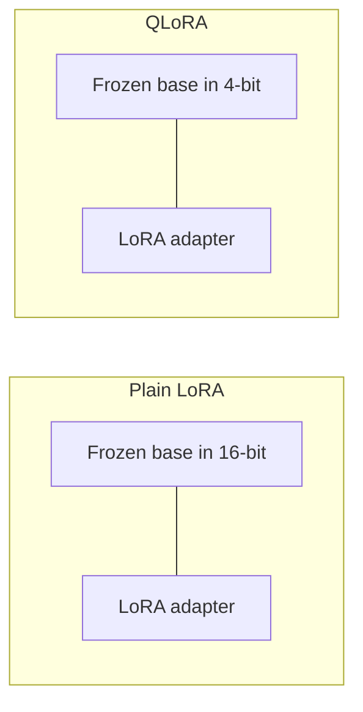

**Quantization** stores numbers with fewer bits. **QLoRA** is LoRA plus that idea: keep the big frozen model in **4-bit**, and still learn the task with a small LoRA adapter.

Same sticky-note story as before. The change is how you pack the textbook.

## Intuition

Plain LoRA still keeps the frozen base in a fatter number format (often 16-bit). That adapter is tiny, but the textbook itself is still bulky in GPU memory.

QLoRA asks a simpler question: if the base is **frozen**, do we need to store it in a fat format at all?

- Base model → compressed (often **NF4** 4-bit)
- Task change → still learned with **LoRA**

Think of it as:

- **LoRA** = keep the full-size textbook, add a sticky note
- **QLoRA** = pack the textbook thinner, still write the sticky note with a nicer pen

The learning still happens in the adapter. Quantization is mostly a storage trick for the frozen part.

:::key
QLoRA = 4-bit frozen backbone + LoRA adapters. Quantization shrinks storage; LoRA still does the learning.
:::

## How it works

### Why quantization helps

A model weight is just a number. Fat number types use more bits:

| Format | Bits per weight | Bytes per weight |
| --- | --- | --- |
| 32-bit float | 32 | 4 |
| 16-bit | 16 | 2 |
| 8-bit | 8 | 1 |
| 4-bit | 4 | **0.5** |

Fewer bits → less memory → a large model has a better chance of fitting on fewer GPUs.

From the previous lesson, a **13B** model in 16-bit is about:

`13e9 × 2 bytes ≈ 26 GB`

In 4-bit:

`13e9 × 0.5 bytes ≈ 6.5 GB` → about **7 GB** with a little overhead

That is the same 4× shrink. QLoRA uses it so the frozen textbook fits; you still train only the sticky note.

Quantization is **not** “free accuracy.” It saves memory. You still check that answers stayed good.



Left: small adapter, bulky base.  
Right: same small adapter, packed base.

### Uniform quantization (simple baseline)

The simplest idea: cut the number line into **evenly spaced bins**, then store “which bin” plus one **scale** constant.

Easy to understand. Not a great match for real LLM weights.

Those weights are often roughly **bell-shaped** (normal-like):

- most values sit **near zero**
- a few live in the tails

Evenly spaced bins waste precision in the empty far-away regions, and give too little detail where most weights actually are.

Tiny picture: if almost every weight is between `-0.1` and `0.1`, but your bins stretch evenly from `-10` to `10`, many bins sit in unused space. The crowded middle gets treated too roughly.

That is why QLoRA does **not** stop at naive uniform quantization.

### Chunking-based quantization

A second problem: one wild **outlier** can ruin a whole tensor.

If you pick one scale for a giant weight matrix, that one extreme value stretches the scale. Then ordinary near-zero weights get squeezed into fewer useful bins.

**Chunking** (block-wise quantization) splits the tensor into **smaller blocks** and quantizes each block on its own scale.

So an outlier mostly hurts **its own block**, not the entire matrix.

Same idea as packing a suitcase by drawers instead of one giant bag: a bulky item in drawer 3 does not crush drawer 1.

### NF4 in simple language

**NF4** means **4-bit NormalFloat**. It is a 4-bit codebook built for weights that are roughly normally distributed:

- **Finer** precision near zero (where most weights live)
- **Coarser** precision in the tails (the rare large values)

4 bits means only **16** possible codes (`2⁴ = 16`). NF4 spends more of those 16 slots near zero, instead of spacing them evenly.

Typical workflow, with what each step is doing:

1. **Fetch the NF4 levels**  
   Load the 16 special bucket values designed for a bell curve.
2. **Take the weight tensor**  
   These are the frozen base numbers you want to pack.
3. **Normalize it (often by absmax)**  
   Divide by the biggest absolute value in the block so numbers sit in a standard range (roughly `-1` to `1`). That scale is saved so you can undo this later.
4. **Map normalized values to 4-bit codes**  
   For each weight, pick the nearest NF4 bucket and store the 4-bit index (0–15), not the original float.
5. **Pack two 4-bit codes into one byte**  
   One byte is 8 bits, so two compressed weights share one byte. That is the 0.5 bytes-per-weight story.
6. **Later dequantize**  
   When the GPU needs to compute, reverse the scale: look up the bucket value and multiply the saved scale back. Compute often happens in a richer type (for example bfloat16). Storage stays 4-bit.

So NF4 is not “the model now thinks in 4-bit forever.” It is **store thin, compute richer when needed**.

### Double quantization

Block-wise quantization needs a **scale constant** for each block. Those constants are extra numbers. They also take space.

**Double quantization** compresses those constants too — quantize the quantization metadata.

This matters more when blocks are **small**, because more blocks mean more scale numbers.

Rough feel for why:

- 13B weights, block size 64 → about `13e9 / 64 ≈ 200 million` blocks
- If each scale were a 4-byte float → `200e6 × 4 ≈ 800 MB` of metadata
- That is not the whole model, but it is a real extra bill
- Double quantization packs those scales so the metadata stays small

You are compressing the packing labels, not just the packed textbook.

### QLoRA ingredients (first look)

QLoRA is a stack. This lesson’s main pieces are the 4-bit storage tricks. Two more memory tricks show up in the next lessons.

| Ingredient | What it saves | Why it helps |
| --- | --- | --- |
| **NF4** | Base weight storage | Cuts model footprint sharply |
| **Double quantization** | Quantization constants | Reduces metadata overhead |
| **Gradient checkpointing** | Activation memory | Trade a bit of compute for memory (next chapter) |
| **Paged optimizer** | Optimizer memory spikes | Avoids sudden out-of-memory crashes (next chapter) |

| Approach | Frozen base in memory | What you train |
| --- | --- | --- |
| **LoRA** | Higher precision (often 16-bit) | Small adapter |
| **QLoRA** | 4-bit (often NF4) | Same kind of small adapter |

Tiny PEFT-style sketch (concept only — the full stack is in a later lesson):

```python
from transformers import BitsAndBytesConfig
import torch

bnb = BitsAndBytesConfig(
    load_in_4bit=True,
    bnb_4bit_quant_type="nf4",
    bnb_4bit_use_double_quant=True,
    bnb_4bit_compute_dtype=torch.bfloat16,
)
# then load the base model with this config
# then attach LoRA as in the previous lessons
```

Read the names as the ideas above:

- `nf4` → pack the frozen base for a bell-shaped weight distribution
- `use_double_quant` → also compress the per-block scales
- `compute_dtype` → compute in a richer type after dequantizing
- LoRA → still the trainable sticky note

## What goes wrong

- Treating quantization as “free accuracy” — it saves memory; quality still needs checking.
- Using naive uniform quantization on heavy-tailed weights and blaming the model.
- Forgetting that QLoRA still needs a sensible LoRA rank and clean data.
- Mixing this up with checkpointing: 4-bit packing shrinks **weights**; checkpointing shrinks **activations** (next lesson).

## One-line summary

Quantization compresses frozen weights; QLoRA pairs 4-bit storage with LoRA so large models become trainable under tight memory.

## Key terms

- **Quantization** — Storing values with fewer bits.
- **QLoRA** — LoRA plus a 4-bit quantized frozen backbone.
- **NF4** — 4-bit NormalFloat, tuned for roughly normal weight distributions.
- **Chunking / block-wise quantization** — Quantize smaller blocks on their own scales so one outlier cannot ruin everything.
- **Double quantization** — Compressing the quantization scale metadata itself.
- **Dequantize** — Unpack a 4-bit code back to a richer number for compute.
