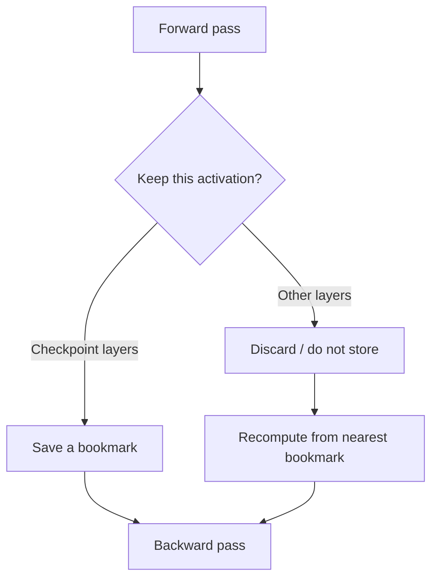

QLoRA is not only about 4-bit weights. It works because several memory-saving methods are stacked. Two big ones are **gradient checkpointing** and a **paged optimizer**.

The previous lessons packed the frozen textbook and kept the sticky note small. This lesson is about two other ways GPU memory still dies.

## Intuition

GPU memory fails for different reasons:

- Weights too large → quantization / LoRA help
- Activations too large → checkpointing helps
- Optimizer state spikes → paging helps

Think of training as cooking with a small counter:

- **Weights** = the recipe books on the counter
- **Activations** = every chopped bowl you keep out “just in case”
- **Optimizer state** = extra notes Adam keeps for each ingredient

QLoRA already shrinks the books. Checkpointing puts some bowls back in the fridge and recooks them when needed. Paging lets overflow notes sit on a side table instead of knocking the whole kitchen over.

:::key
Each trick attacks a different part of the memory budget. Together they make large-model training realistic.
:::

## How it works

### Gradient checkpointing

During normal backpropagation, the model walks **forward** through the layers and stores many **activations** (intermediate outputs) so the **backward** pass can compute gradients later. That storage can be huge — sometimes bigger than the weights.

**Gradient checkpointing** discards some of those activations on purpose and **recomputes** them in the backward pass.

| Benefit | Cost |
| --- | --- |
| Less activation memory | Extra compute during backprop |

It is like keeping **bookmarks** instead of leaving every page open:

- Normal training = keep every layer’s output on the desk
- Checkpointing = keep a bookmark every few layers
- When backward needs a missing page, re-read from the last bookmark



### Placing checkpoints every few layers

A common placement intuition: put checkpoints roughly every **√n** layers (for **n** layers). Then the backward pass can restart from a nearby checkpoint instead of replaying the whole network from layer 1 every time.

Tiny example:

- Model has **36** layers
- `√36 = 6`
- Save a bookmark about every **6** layers (layers 6, 12, 18, 24, 30, 36)

If backward needs layer 20, it restarts from the bookmark at 18 — not from layer 1.  
Too few bookmarks → long recomputation. Too many → you are almost back to storing everything.

You do not need to hand-pick this every time. Libraries often place checkpoints for you once you turn the feature on. The √n picture is why “a few bookmarks, not all pages” is the usual design.

### Paged optimizer

The optimizer is not free. Adam-style methods keep extra numbers per trainable parameter (running averages). That **optimizer state** can cause sudden **out-of-memory** spikes — especially with long sequences or uneven batch sizes.

A **paged optimizer** keeps that state more flexibly, often by paging data between GPU and CPU memory, so a spike is less likely to crash the run.

Same idea as a computer swapping RAM to disk:

- GPU is the small fast desk
- CPU RAM is the side table
- When a spike arrives, spill some optimizer notes to the side table, then bring them back

It does not remove memory cost entirely. It **smooths the spikes** that cause failures.

### Where these fit in QLoRA

| Piece | Memory pain it targets |
| --- | --- |
| 4-bit / NF4 weights | Base weight storage |
| LoRA adapters | Trainable parameter count |
| Double quantization | Scale / metadata overhead |
| Gradient checkpointing | Activation memory |
| Paged optimizer | Optimizer spikes |

Tiny sketch (concept only):

```python
from transformers import TrainingArguments

model.gradient_checkpointing_enable()  # bookmarks, not every activation

args = TrainingArguments(
    optim="paged_adamw_8bit",          # smoother optimizer memory
    per_device_train_batch_size=1,
    gradient_accumulation_steps=16,    # keep the step small; accumulate
)
```

Read the names as the ideas above:

- `gradient_checkpointing_enable()` → save activation memory, pay extra compute
- `paged_adamw_8bit` → Adam-style update that can page optimizer state
- small micro-batch + accumulation → less activation pressure per step

The next lesson puts these flags next to NF4 and LoRA in one stack.

## What goes wrong

- Enabling checkpointing and then being surprised that steps get slower (that is the trade-off).
- Ignoring optimizer spikes and only shrinking weights — then still OOMing mid-update.
- Placing no checkpoints (or too few) so recomputation becomes painfully long.

## One-line summary

Checkpointing saves activation memory by recomputing; a paged optimizer softens optimizer spikes — both help QLoRA fit on fewer GPUs.

## Key terms

- **Gradient checkpointing** — Discard and recompute activations to save memory.
- **Paged optimizer** — Optimizer strategy that reduces sudden GPU memory spikes.
- **Out-of-memory (OOM)** — Crash when the GPU budget is exceeded.
- **Activation memory** — Memory used to store intermediate layer outputs during training.
