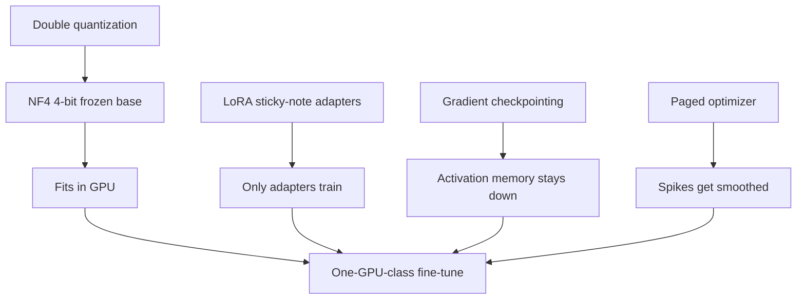

Single-GPU fine-tuning becomes realistic when you stack the right ingredients. Each piece shrinks a different part of the memory bill.

This lesson does not add a new method. It shows how the last few lessons click together.

## Intuition

Rough memory story for a **70B** model:

| Setup | Bits / memory story | GPU picture |
| --- | --- | --- |
| Naive full fine-tuning | Heavy weights + gradients + optimizer | Many data-center GPUs |
| LoRA (higher-precision base) | Smaller trainable set, base still bulky | Fewer GPUs, still heavy |
| QLoRA-style stack | About **5.2 bits/param** class budget in this sketch | Often **1×** data-center GPU class |

The exact numbers depend on hardware and settings. The lesson is the composition: **4-bit weights + small adapters + controlled activations + controlled optimizer spikes**.

What “about 5.2 bits/param” is trying to say:

- Frozen base is stored near **4 bits** (NF4)
- A little extra for quantization scales, LoRA, and training leftovers
- Together the *storage sketch* is a bit above 4, not a full 16-bit copy of every weight

It is a budget picture, not a promise that every run uses exactly 5.2.

:::key
Use full fine-tuning only when you can afford it. Prefer LoRA for tiny trainable budgets. Prefer QLoRA when memory is tight.
:::

## How it works

### Stack roles

| Component | Role in the memory budget |
| --- | --- |
| **4-bit weights (NF4)** | Shrink base model storage |
| **LoRA adapters** | Keep trainable parameters tiny |
| **Double quantization** | Reduce metadata overhead |
| **Gradient checkpointing** | Save activation memory |
| **Paged optimization** | Reduce memory spikes |



Each box attacks a different bill. Miss one, and a 70B-style run can still blow up — even if the others look “on.”

### Tiny code sketch (concept only)

```python
from transformers import AutoModelForCausalLM, BitsAndBytesConfig, TrainingArguments
from peft import LoraConfig, get_peft_model
import torch

bnb = BitsAndBytesConfig(
    load_in_4bit=True,
    bnb_4bit_quant_type="nf4",
    bnb_4bit_use_double_quant=True,
    bnb_4bit_compute_dtype=torch.bfloat16,
)
model = AutoModelForCausalLM.from_pretrained(
    base_model, quantization_config=bnb, device_map="auto"
)
model.gradient_checkpointing_enable()

lora = LoraConfig(
    r=8,
    lora_alpha=16,
    target_modules=["q_proj", "v_proj"],
    lora_dropout=0.05,
)
model = get_peft_model(model, lora)

args = TrainingArguments(
    optim="paged_adamw_8bit",
    per_device_train_batch_size=1,
    gradient_accumulation_steps=16,
)
```

Read this as a map of ideas, not a copy-paste production recipe:

| Line / flag | Plain meaning |
| --- | --- |
| `load_in_4bit` + `nf4` | Pack the frozen textbook in 4-bit NormalFloat |
| `use_double_quant` | Also pack the per-block scale labels |
| `compute_dtype=bfloat16` | Compute in a richer type after dequantizing |
| `gradient_checkpointing_enable()` | Keep bookmarks, not every activation |
| `LoraConfig(r=8, …)` | Train only the tiny sticky note |
| `paged_adamw_8bit` | Smooth optimizer-state spikes |
| `batch_size=1` and `accumulation=16` | Tiny step on GPU; **effective batch = 1 × 16 = 16** |

**Effective batch** here means: how many samples feed one weight update. A micro-batch of 1 with 16 accumulation steps is one update from 16 examples, without holding all 16 in GPU memory at once.

### Quick revision rules

1. Use **full fine-tuning** only when you can afford the compute and really need every weight to move.
2. Use **LoRA** when you want most of the benefit with a tiny trainable parameter budget.
3. Use **QLoRA** when memory is tight and you want the frozen backbone in 4-bit form.
4. Use **gradient checkpointing** when activations, not just weights, are hurting GPU memory.
5. Use **paged optimization** when optimizer spikes are what push you over the limit.

After training, the multi-tenant idea still applies: save the small adapter, keep one shared base, swap adapters per client.

## What goes wrong

- Enabling every flag at once with no eval — you cannot tell which knob helped.
- Assuming “fits on one GPU” means “quality is automatic.” Always measure the task.
- Serving many tenants without an adapter swap plan after training QLoRA successfully.

## One-line summary

QLoRA works as a stack: compress the frozen base, learn a tiny LoRA update, and control activation and optimizer memory so large models become trainable.

## Key terms

- **QLoRA stack** — NF4 + double quant + LoRA + checkpointing + paged optimizer.
- **Bits per parameter** — Rough storage budget after compression tricks.
- **Effective batch** — micro-batch × accumulation × GPUs (how many samples feed one update).
