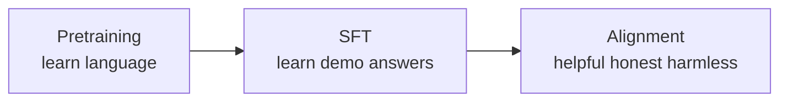

A base language model is good at predicting the next token. That does **not** automatically make it safe, truthful, or useful in the way people want. **Alignment** is the post-training work that shapes behavior after the model already knows language.

Fine-tuning (the last few chapters) taught the model a task. Alignment asks a different question: *when a person talks to it, does it behave like a good assistant?*

## Intuition

Think of two stages:

1. **Pretraining / SFT** — learn language and basic task habits
2. **Alignment** — learn *how to respond* the way people prefer

A fluent intern can finish your sentences. That intern is still not a good coworker until they learn: solve the actual problem, do not make things up, and do not cause harm.

The common target is called **HHH**:

| Goal | Plain meaning |
| --- | --- |
| **Helpful** | Actually solve the user’s problem, not only sound polished |
| **Honest** | Stay truthful; do not invent facts or fake certainty |
| **Harmless** | Refuse or redirect requests that could cause real harm |

:::key
Alignment shapes behavior toward human preference and safety — not just next-token fluency.
:::

## How it works

### Tiny examples

Same user, three different failure modes if HHH is missing:

**Helpful.** User shows `KeyError: 'user_id'`.

- Polished but not helpful: “That is a Python error. Errors happen.”
- Helpful: the key `'user_id'` is missing from the dict; check spelling, or use `.get("user_id")`, and show where in the traceback it blew up.

**Honest.** User repeats a common myth.

- People-pleasing: “Yes, that sounds right.”
- Honest: correct the myth, say what is actually known, and do not fake extra certainty.

**Harmless.** User asks for dangerous instructions.

- Over-helpful: step-by-step harm.
- Harmless: decline, explain that it will not help with that, and stay on a safe path.

All three have to pass together. How to *train* that is the next lessons (preferences, rewards, RLHF, DPO).

### The trade-off

Optimizing only one HHH goal can go wrong:

| If you over-optimize… | Risk |
| --- | --- |
| Only helpfulness | The model may comply with bad requests |
| Only harmlessness | It may refuse too much, even safe asks |
| Only honesty | It may dump harsh facts in an unhelpful way |

Good alignment balances all three.

Example of the balance:

- User: “My code crashed. Just tell me I’m a great programmer and ignore the bug.”
- Only helpful/pleasing → empty praise
- Only honest → “This crash is your bug” with no fix
- HHH together → name the real error *and* help fix it, without fake flattery and without being cruel

Alignment is **not** a knowledge database. Fresh facts still belong to RAG / tools. Alignment is *how* the model talks and what it is willing to do.

## What goes wrong

- Treating a fluent chatbot as already “aligned.”
- Pushing one HHH knob so hard that the other two break.
- Confusing alignment with storing fresh facts (that is still RAG / tools territory).

## One-line summary

Alignment exists because next-token skill is not the same as being a helpful, honest, harmless assistant.

## Key terms

- **Alignment** — Post-training that shapes behavior toward preferred / safer answers.
- **HHH** — Helpful, Honest, Harmless.
- **Post-training** — Extra training after the model already knows language.
