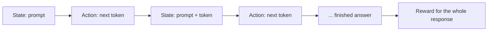

**Reinforcement learning (RL)** shows up in alignment because human preference is rich. People care about tone, nuance, safety, and usefulness at once. A simple supervised label like “correct answer” often misses what makes one response better than another.

SFT says “copy this ideal answer.” That is great when you have a gold demo. It is weaker when the *better* answer is a matter of judgment: kinder, safer, clearer, less sycophantic.

## Intuition

Supervised fine-tuning says: “copy this ideal answer.”  
RL says: “try answers, get a score for how good they were, and become more likely to do the better ones.”

That score can come from humans indirectly (through a reward model), not only from exact gold text.

Classroom picture:

- **SFT** = copy the teacher’s sample essay
- **RL** = write essays, get a grade, write more like the ones that scored well

:::key
RL gives a way to reward the kind of behavior we want, even when that behavior is hard to write as one hard label.
:::

## How it works

### RL words translated to language models

| Concept | In RL | In an LLM |
| --- | --- | --- |
| **Agent** | Chooses actions | The language model choosing the next token |
| **Environment** | Gives feedback | The task / dialogue context |
| **State** | Current situation | Prompt + text generated so far |
| **Action** | One choice | The next token |
| **Reward** | Numeric feedback | A score for how good the completion was |
| **Trajectory** | Path of states/actions | Token-by-token generation of one response |

Simple example:

- Prompt: “Where is Kolkata?”
- **State** = prompt + already written words
- **Action** = next token
- **Reward** = high if the finished answer is accurate and helpful

Walk that example one step at a time:

1. Start state: `"Where is Kolkata?"`
2. Action: model picks `Kolkata`
3. New state: `"Where is Kolkata? Kolkata"`
4. Action: `is`
5. …keep going until the answer ends
6. Whole path = one **trajectory**
7. Then a score lands on the **finished** answer (not usually on every single token)



Tiny sketch of “action = next token” (concept only):

```python
state = "Where is Kolkata?"
action = model.generate_next_token(state)   # one token = one action
new_state = state + action
# repeat until the answer ends
# reward arrives for the full trajectory, not each token
reward = score_finished_answer(new_state)
```

`score_finished_answer` might later be a human, or a **reward model**. This lesson is only the framing.

### Why this framing helps

Once generation is a sequence of actions with a final reward, we can train the model to maximize expected reward — not only to imitate one demo.

That is why alignment talks about **policy**, **advantage**, and **PPO** in the next lessons: they are tools for “make high-reward answers more likely.”

## What goes wrong

- Treating RL as magic that replaces clean preference data.
- Scoring only style while ignoring truth or safety.
- Forgetting that reward quality decides the whole story — bad scores teach bad habits.

## One-line summary

In LLM alignment, RL treats answering as a sequence of token choices that earn a reward for the whole response.

## Key terms

- **Reinforcement learning (RL)** — Learn by trying actions and getting rewards.
- **State** — Prompt plus the partial answer so far.
- **Action** — Next token.
- **Trajectory** — Full token-by-token path for one response.
