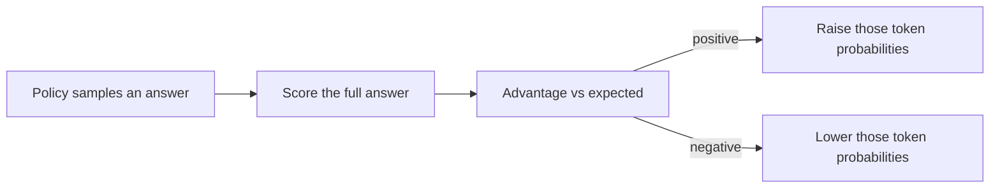

The **policy** is the model’s probability distribution over the next token given the current context. In alignment with RL, we want to raise the chance of actions that lead to higher reward.

If the last lesson said “token = action,” this lesson says *how* those actions get better: push probability toward the paths that scored well.

## Intuition

Core idea in one sentence:

> If a token choice helped produce a better final response, make that choice more likely next time.

That family of methods is called **policy gradient**. A classic sample-based version is **REINFORCE**: sample full answers (trajectories), score them, and update from those samples.

Classroom picture: the student writes a few essays, gets grades, then practices more of what worked — not by copying one gold essay, but by nudging the writing habits that led to good grades.

:::key
Positive advantage means “better than expected for this state.” Negative means “worse than expected.”
:::

## How it works

### What we optimize

We care about **expected total reward** for a whole response, not only one token in isolation.

In words: train the policy so good full answers become more probable.



### Why the raw signal is noisy

REINFORCE can be unbiased but **high variance** — the training signal jumps around. One lucky great answer, or one unlucky flop, can yank the update too hard.

Helpers:

| Idea | Plain meaning |
| --- | --- |
| **Baseline** | Subtract a reference level so you measure relative quality, not raw score alone |
| **Advantage** | How much better (or worse) an action was than expected for that state |

Advantage intuition:

- **Positive advantage** → that action was better than average for the situation → increase its probability
- **Negative advantage** → worse than expected → decrease its probability

Tiny numbers for the same prompt “Where is Kolkata?”

| Sampled answer | Reward | Expected for this prompt | Advantage |
| --- | --- | --- | --- |
| Accurate, short, useful | 9 | 6 | **+3** → push those tokens up |
| Vague ramble | 2 | 6 | **−4** → push those tokens down |

Without a baseline, “reward = 9” and “reward = 2” are just raw scores. Advantage asks: *better or worse than usual for this state?* That is why the update is less noisy.

### Keep the math light

You do not need to memorize the formula to use the idea. The practical message is:

1. Sample responses
2. Score them
3. Push probability up for better-than-expected choices
4. Use advantage/baseline so the push is less noisy

Tiny sketch (concept only):

```python
answer = policy.sample(prompt)          # one trajectory
reward = score(answer)                  # whole-response score
baseline = expected_score(prompt)       # typical quality for this state
advantage = reward - baseline           # + means better than expected

loss = -advantage * log_prob(policy, prompt, answer)
loss.backward()                         # raise or lower those tokens
```

If `advantage` is positive, this update makes the sampled tokens more likely. If negative, less likely. The baseline does not change the *direction of the average* idea; it mainly calms the jumps.

## What goes wrong

- Updating from a few lucky samples and calling it “aligned.”
- Ignoring variance — training looks random and unstable.
- Optimizing reward of one flashy phrase instead of the whole answer’s quality.

## One-line summary

Policy gradient methods increase the probability of token choices that earned positive advantage on the full response.

## Key terms

- **Policy** — Next-token probability distribution given context.
- **Policy gradient** — Update rule that follows reward-weighted log-probabilities.
- **REINFORCE** — Sample trajectories and estimate the gradient from them.
- **Advantage** — How much better an action was than expected.
- **Baseline** — A reference score used so you learn from relative quality, not raw score alone.
