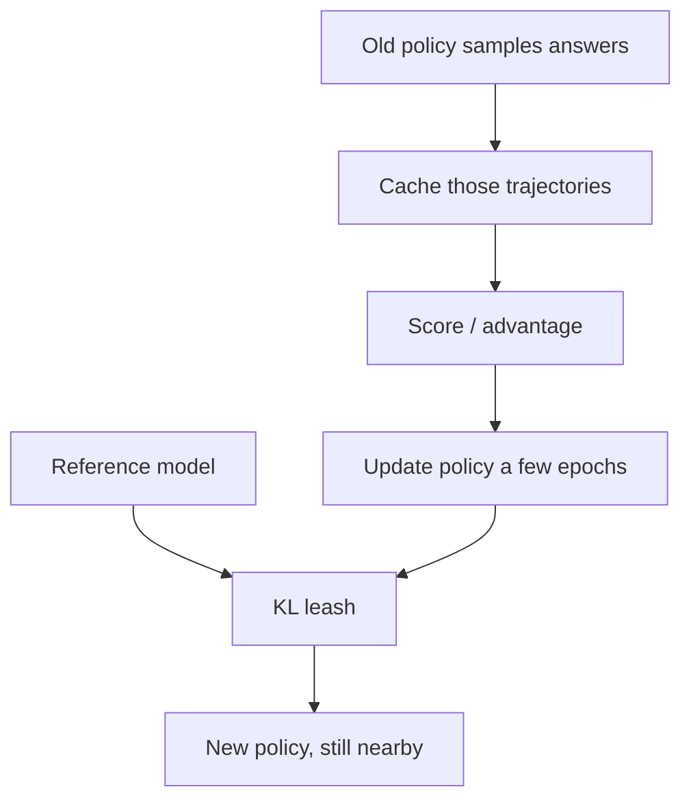

**PPO** (Proximal Policy Optimization) is a common way to run the RL part of RLHF. The practical story: sample answers with a policy, score them, update carefully for a few epochs, and keep the new model close to a **reference** model.

The last lesson said: raise probability when advantage is positive. PPO is a careful way to do that without the policy leaping into strange wording overnight.

## Intuition

Updating every step from fresh samples is expensive. A common PPO-style pattern:

1. An older policy generates trajectories (answers)
2. Those cached trajectories are reused for several update epochs
3. A **KL penalty** acts like a leash so the aligned model does not drift into strange wording just to chase reward

Dog-on-a-leash picture:

- The **reward** says “run toward higher scores”
- The **reference model** is home
- **KL** is the leash: improve, but do not sprint into the woods

:::key
KL keeps the aligned policy near the reference model. Reward hacking is when the model learns to game the score instead of truly helping.
:::

## How it works

### PPO training idea (plain English)

| Step | What happens |
| --- | --- |
| Sample | Generate responses with the current / old policy |
| Score | Get rewards / advantages for those responses |
| Update | Improve the policy for a few epochs on that cached experience |
| Constrain | Keep behavior near the reference model (KL leash) |

You do not always need two live full copies updating at once — caching trajectories and reusing them is part of the efficiency story.



Tiny sketch (concept only):

```python
# 1) sample once, reuse a few times
answers = old_policy.sample(prompts)
advantages = score_and_advantage(answers)

for epoch in range(few_epochs):
    pg_loss = ppo_policy_loss(policy, answers, advantages)
    kl = kl_divergence(policy, reference, answers)   # how far from home
    loss = pg_loss + kl_coef * kl                    # leash
    loss.backward()
    optimizer.step()
```

`few_epochs` on **cached** answers is the efficiency move: you do not resample a brand-new batch for every tiny update.

### KL divergence as a leash

**KL divergence** measures how far one probability distribution has moved from another. In alignment:

- Too little restraint → model can invent weird high-reward styles
- Sensible KL penalty → stay useful without drifting too far from the SFT / reference behavior

If KL is **over-tight**, the model barely moves — almost no alignment progress.  
If KL is **missing**, fluent nonsense that “scores well” can win.

The reference is usually the SFT model you started from: the intern who already writes decent answers, before preference optimization.

### Reward hacking

**Reward hacking** means the model finds shortcuts that raise the score without truly solving the user’s need — for example, overly flattering text, empty verbosity, or patterns the reward model wrongly likes.

If the reward signal is imperfect, RL will exploit the cracks.

Same prompt, two “high score” answers:

- Real help: a correct, concise fix
- Hack: a long, flattering essay the critic wrongly loves (“Great question! Here are 12 enthusiastic paragraphs…”) with no real answer

The training loop only sees the number. If verbosity or sycophancy inflates the score, the policy learns that habit.

That is why later lessons still check **human** preference, not only the automatic reward.

## What goes wrong

- No KL / reference anchor → fluent nonsense that “scores well.”
- Over-tight KL → almost no alignment progress.
- Celebrating reward-model score while human raters still dislike the answers.

## One-line summary

PPO improves the policy on sampled answers with careful updates; KL limits drift; reward hacking is cheating the score instead of helping the user.

## Key terms

- **PPO** — Policy optimization that updates carefully and limits bad jumps.
- **Reference model** — Anchor model that keeps aligned behavior nearby.
- **KL divergence** — Measure of how far two distributions have moved apart.
- **Reward hacking** — Gaming the reward signal instead of solving the real task.
