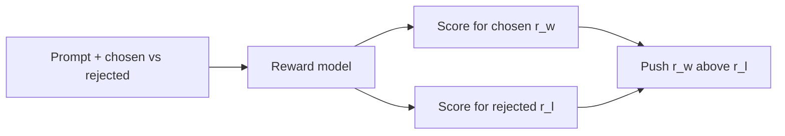

It is hard to give every possible answer a perfect universal number like `0.73`. People are much better at saying **which of two answers they prefer**. A **reward model** learns from those pairwise choices and outputs a single quality score for a prompt + response.

PPO needs a number. Humans do not like assigning `0.73`. They *will* pick “A is better than B.” The reward model is the translator.

## Intuition

- The **policy model** generates answers
- The **reward model** is the critic that scores them

During reward-model training, the **chosen** answer should get a higher score than the **rejected** answer for the same prompt.

:::key
Pairwise preferences are easier to collect than exact scores — that is why reward models train on chosen vs rejected pairs.
:::

## How it works

### Preference data shape

For one prompt:

- Response A (chosen / winner)
- Response B (rejected / loser)

Humans (or careful raters) pick which is better. Many such pairs teach the shape of preference.

Tiny example:

- Prompt: “Where is Kolkata?”
- Chosen: “Kolkata is in the Indian state of West Bengal.”
- Rejected: “Kolkata is a country in Europe.”

The critic should learn: first answer → higher score.



### Architecture (practical view)

Usually:

1. A language-model backbone
2. A small linear head that maps the final hidden state to **one scalar reward**

That scalar is not the answer text — it is a quality score for the answer.

### Bradley-Terry style loss (idea)

We want the winner’s score `r_w` above the loser’s score `r_l`.

In words: push `r_w - r_l` in the right direction. A common loss looks like:

`loss = -log(sigmoid(r_w - r_l))`

- If the winner already scores much higher, loss is small
- If the loser scores too high, loss grows and training separates them

What `(r_w - r_l)` is: the **score margin** that should favor the winning response.

Tiny numbers:

| `r_w` | `r_l` | `r_w - r_l` | What the loss does |
| --- | --- | --- | --- |
| 2.0 | 0.2 | **+1.8** | Winner already ahead → small push |
| 0.1 | 0.4 | **−0.3** | Loser is ahead → strong push to swap them |

`sigmoid` squashes that margin into a probability-like “chance the winner should beat the loser.” The minus-log then becomes a usual classification-style loss.

### Tiny code sketch (concept only)

```python
import torch.nn.functional as F

batch = tokenizer(
    [prompt + chosen, prompt + rejected],
    padding=True,
    return_tensors="pt",
)
scores = reward_model(**batch)  # one scalar per sequence
r_w, r_l = scores[0], scores[1]
loss = -F.logsigmoid(r_w - r_l)
loss.backward()
```

Both completions go through the model so we can score them separately and compare.

Why both strings are passed: one scalar for chosen, one scalar for rejected, then the difference trains the critic. That is the whole job of this stage — not generating new answers yet.

Later, RLHF will freeze (or hold) this critic and let the **policy** chase its scores. If the critic likes flattery, the policy will too. Garbage pairs → a confused critic.

## What goes wrong

- Noisy or inconsistent raters → a confused critic.
- Reward model overfits quirks (length bias, flattery) → later RL hacks those quirks.
- Using the reward model as if it were perfect ground truth forever.

## One-line summary

A reward model learns from chosen/rejected pairs and becomes a scalar critic that can guide RLHF.

## Key terms

- **Reward model** — Model that scores a response for a prompt.
- **Preference pair** — Chosen vs rejected answers for the same prompt.
- **Bradley-Terry loss** — Loss that pushes the winner’s score above the loser’s.
