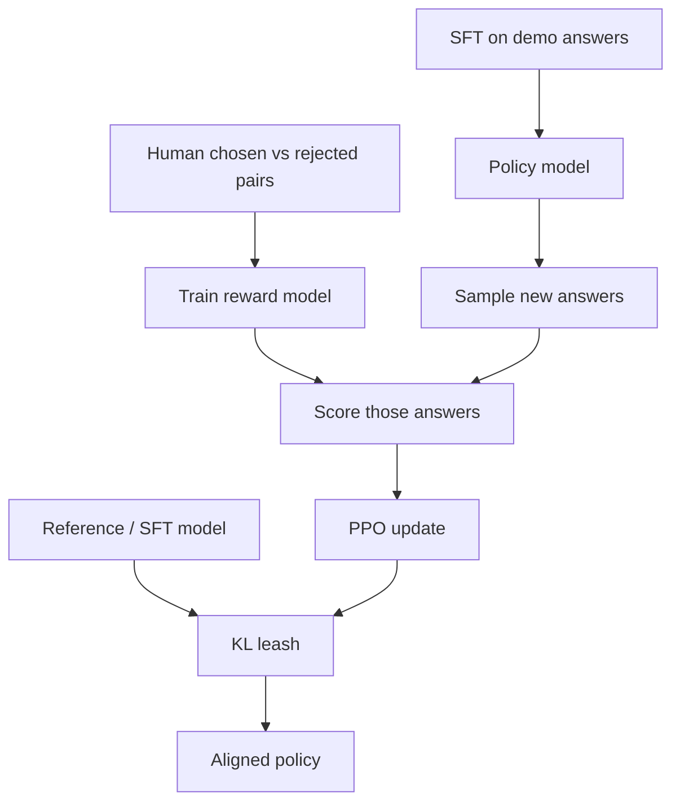

**RLHF** means **Reinforcement Learning from Human Feedback**. The big pipeline is:

1. Collect preference data (chosen vs rejected)
2. Train a **reward model**
3. Optimize the **policy** with RL (often PPO-style) under a reference / KL leash

The last few lessons were the parts. This lesson is the whole assembly line.

## Intuition

First teach demos with supervised fine-tuning. Then use human preferences to further shape *how* the model answers — not only what facts it can recite.

Cooking-school picture:

1. **SFT** = copy the chef’s demo plates
2. **Reward model** = a critic who tasted many “this plate vs that plate” votes
3. **RL / PPO** = the cook practices new plates and chases the critic’s score, with a leash so they do not invent a weird cuisine

:::key
RLHF = preferences → reward model → policy optimization. The model learns to answer more like a useful assistant.
:::

## How it works

### End-to-end path

| Stage | What you do |
| --- | --- |
| **SFT** | Train on high-quality instruction/demo answers |
| **Reward modeling** | Learn a critic from preference pairs |
| **RL optimization** | Update the policy so high-reward answers become more likely |
| **Reference / KL** | Keep the policy from drifting too far |



Tiny sketch of the *stages* (concept only — not a trainer you run as-is):

```python
# 1) SFT: copy good demos
sft_model = supervised_finetune(base_model, demo_answers)

# 2) Reward model: critic from pairwise votes
reward_model = train_reward_model(sft_model, chosen_rejected_pairs)

# 3) RL: policy chases the critic, stays near the SFT reference
aligned = ppo_align(
    policy=sft_model,
    reward_model=reward_model,
    reference=sft_model,
    kl_coef=0.1,
)
```

Read it as the pipeline, not as hidden magic: preferences become a critic; the critic grades samples; PPO updates the writer; KL keeps the writer near the SFT intern.

### InstructGPT / ChatGPT story (plain version)

- **InstructGPT** is the classic example: instruction fine-tuning, then preference-based alignment with RLHF.
- **ChatGPT-style** dialogue systems follow a similar idea: instruction-style training plus RLHF for conversational behavior.

The lesson is not “memorize product names.” The lesson is the training story: demos first, preferences second.

Without SFT, RLHF is trying to align a model that does not yet follow instructions well. Weak preference data means the critic has the wrong taste, so PPO chases the wrong thing.

### RLHF vs DPO at a glance

| Dimension | **RLHF** | **DPO** (next lesson) |
| --- | --- | --- |
| Main path | Preferences → reward model → RL | Preferences → direct policy update |
| Complexity | More moving parts | Fewer moving parts |
| Stability | Can be sensitive | Often simpler to train |
| What stays central | Reward model + RL loop | Pairwise prefs + reference policy |

Same human votes. RLHF builds a critic and then runs RL. DPO skips that control tower and trains the policy on the pairs directly.

## What goes wrong

- Skipping SFT quality and hoping RLHF fixes everything.
- Weak preference data → a reward model that teaches the wrong taste.
- Measuring only automatic reward while humans still dislike the answers.

## One-line summary

RLHF turns human preference pairs into a reward model, then uses RL to push the policy toward answers people prefer.

## Key terms

- **RLHF** — Reinforcement Learning from Human Feedback.
- **SFT** — Supervised fine-tuning on demonstrations before preference optimization.
- **Policy model** — The generator being aligned.
- **Reference model** — Anchor that limits drift during RL updates.
