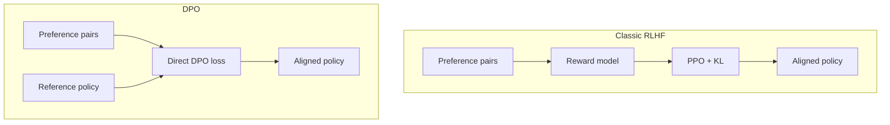

**DPO** (Direct Preference Optimization) is a simpler alternative to full PPO-style RLHF. Instead of fitting a separate reward model and then running RL, DPO uses preference data to move the policy toward the preferred answer **directly**.

Same votes as RLHF. Fewer moving parts.

## Intuition

DPO asks:

> Can we teach the policy what humans prefer without building a full RL control tower?

You still need:

- Preference pairs (chosen / rejected)
- A **reference** policy so training stays anchored

You usually **do not** need a separate live reward-model + PPO loop.

Two-path picture:

- **RLHF** = votes → critic → PPO (with a KL leash)
- **DPO** = votes go straight into the policy, compared against a frozen reference

:::key
DPO: preference data in → aligned policy out, with fewer moving parts than classic RLHF.
:::

## How it works

### Workflow

1. Start with preference data: prompt + chosen + rejected
2. Keep a reference model nearby
3. Train the policy so the chosen answer becomes more likely than the rejected one **relative to the reference**
4. That relative comparison is what keeps training grounded

“Relative to the reference” is the important phrase.

If you only raise `P(chosen)` and lower `P(rejected)`, the model can drift into odd wording. DPO asks: *compared with the reference intern, are you now more in favor of the winner than the loser?* The reference is the anchor — same job KL did in PPO, baked into the loss.



### Why people like it

| Benefit | Why it helps |
| --- | --- |
| Fewer components | Less wiring than reward model + RL |
| Often simpler training | Less tuning pain for many teams |
| Still preference-based | Uses the same chosen/rejected idea |

It does **not** remove labels. No pairs, no DPO. Dirty pairs → the wrong taste, same as a bad reward model.

### Tiny pseudocode (concept only)

```python
for prompt, chosen, rejected in preference_batch:
    loss = dpo_loss(policy, reference, prompt, chosen, rejected, beta=0.1)
    loss.backward()
    optimizer.step()
    optimizer.zero_grad()
```

Read this as the shape of the idea: compare chosen vs rejected under policy and reference, then update.

What the names are doing:

| Piece | Role |
| --- | --- |
| `policy` | The model you are aligning |
| `reference` | Frozen SFT-style anchor |
| `chosen` / `rejected` | The human (or rater) vote |
| `beta` | How strongly to stay near the reference (a KL-like strength) |

In words, the loss likes you more when:

- the policy assigns **higher** log-probability to the chosen answer than the reference did, and
- **lower** log-probability to the rejected answer than the reference did

That is “direct”: no separate critic scores `r_w` and `r_l`, then PPO. The preference is applied to the policy itself.

### Quick revision rules for this whole lesson group

1. Alignment makes the model answer the way humans prefer — not only how next-token prediction would go.
2. **RLHF** = preferences → reward model → policy optimization.
3. **PPO** = sample trajectories, use advantage, update carefully, stay near the reference.
4. **Reward hacking** = cheating the score instead of truly helping.
5. **DPO** = direct preference training without the full RL machinery.

## What goes wrong

- Assuming DPO needs no labels — it still needs preference pairs.
- No reference anchor → unstable or drifted style.
- Dirty preference data → both RLHF and DPO learn the wrong taste.

## One-line summary

DPO aligns a policy directly from chosen/rejected pairs and a reference model, skipping an explicit reward-model-and-RL loop.

## Key terms

- **DPO** — Direct Preference Optimization from pairwise preferences.
- **Reference policy** — Anchor distribution used during DPO training.
- **Preference data** — Prompt with chosen and rejected completions.
- **Beta** — Strength of staying near the reference in the DPO loss.
