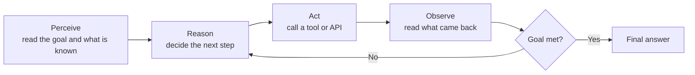

**Agentic AI** means a system that works towards a goal over several steps — it plans, uses tools, looks at what came back, and decides what to do next. A plain chat model answers once and stops.

## Intuition

Think about the difference between asking a colleague a question and giving them a task.

Ask a question and you get an answer: *"Our refund policy is 30 days."* Give them a task — *"find out why this customer was charged twice and fix it"* — and they do something quite different. They look up the account, read the payment log, notice a duplicate charge, issue a refund, and come back to tell you it is done.

Nothing about the second job needs more intelligence. It needs the ability to **take a step, look at the result, and choose the next step**. That loop is the whole idea behind an agent.

:::note Analogy
A chat model is a knowledgeable person on the phone. They can tell you anything they know, but they cannot get up from the chair.

An agent is the same person with a laptop, a phone line, and permission to use them. The knowledge has not changed — the ability to act on it has.

This is also why agents fail in a new way. A person who cannot act can give you wrong information. A person who can act can give you a wrong *refund*. The value and the risk arrive together, which is why the lessons keep returning to permissions and human approval.
:::

## How it works

### The loop

Every agent, no matter how it is built, runs some version of four steps:

| Step | What happens | Example |
| --- | --- | --- |
| **Perceive** | Take in the goal and current state | "Why was this customer charged twice?" |
| **Reason** | Pick the next useful action | "I should look up their recent payments" |
| **Act** | Call a tool | `get_payments(customer_id)` |
| **Observe** | Read the result | Two identical charges on 3 March |
| **Loop or stop** | Continue, or answer | Issue refund, then report back |

The model does not do the acting itself. It **requests** an action in a structured form, your code runs it, and the result comes back as new text in the conversation. That separation is what makes an agent controllable.

### What this chapter covers

1. **What makes something an agent** — the perceive, reason, act, observe loop above.
2. **Tool calling and governance** — how the model requests actions, and which ones it may take without asking a person.
3. **Single-agent and multi-agent patterns** — one worker versus a small team with separate jobs.
4. **Human-in-the-loop and evaluation** — where a person must approve, and how you tell whether the agent is actually working.

### Where the detailed lessons live

The full agent path — tools, memory, multi-agent orchestration, and the quizzes that go with it — is taught in **Module 2.9, Agentic AI and Multi-Agent Orchestration**. Study that chapter for depth.

This chapter's job is narrower: it connects those agent ideas to the vision and retrieval work in 4.1 to 4.3, so you can build agents that **see** as well as read.

:::key
An agent is a loop, not a bigger model. Perceive, reason, act, observe — repeat until the goal is met or a person steps in.
:::

## What goes wrong

- Calling any system with a tool attached an "agent" — without the observe-and-retry loop, it is a single function call with extra steps.
- Letting the loop run without a stop condition, so it keeps calling tools until it runs out of budget.
- Giving an agent permission to take actions with real consequences before you can see what it did and why.

## One-line summary

Agentic AI replaces a single answer with a loop that plans, acts, observes, and repeats until the goal is reached.

## Key terms

- **Agent** — A model running in a loop with tools and memory of what it has done.
- **Tool calling** — The model requesting a structured action that your code executes.
- **Agent loop** — Perceive, reason, act, observe, repeat.
- **HITL** — Human-in-the-loop; a checkpoint where a person approves before the agent continues.
