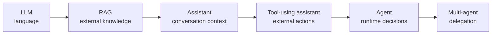
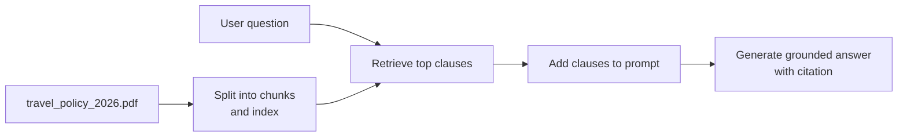

Consider one user goal:

> Plan my Paris trip for next week for four days, staying within the company travel policy and a ₹80,000 budget.

This sounds like one request. In reality, it combines private rules, live prices, hard constraints, and decisions that depend on earlier results.

## Intuition

### Why this is not a normal question

Four separate difficulties are hiding inside the sentence:

| Difficulty | What it means in this example |
| --- | --- |
| **Private knowledge** | The travel policy is an internal document. It was never part of the model's training data. |
| **Time-varying data** | Flight fares and hotel availability change every hour. Model weights cannot keep them current. |
| **Hard constraints** | The itinerary must satisfy both company policy and the ₹80,000 budget. Passing one is not enough. |
| **Unknown control flow** | If a policy check fails, the system must decide what to change and try again. |

A plain LLM can write a convincing Paris itinerary. It cannot know whether the flight is still available, whether the fare is real, or whether the trip follows the private policy.

:::note Analogy
Imagine asking a talented travel writer to act as your travel desk.

The writer knows Paris and can produce a beautiful four-day plan. But they cannot open your company's policy file, see today's fares, hold a seat, or notice that your departure is only five days away when policy requires seven.

Each new system capability is like giving that writer another part of the travel desk: first the policy folder, then memory of your conversation, then access to booking tools, and finally permission to decide what to do next.
:::

## The six stages

```mermaid
flowchart LR
    L[LLM<br/>language] --> R[RAG<br/>external knowledge]
    R --> A[Assistant<br/>conversation context]
    A --> T[Tool-using assistant<br/>external actions]
    T --> G[Agent<br/>runtime decisions]
    G --> M[Multi-agent<br/>delegation]
```

### 1. LLM: generate a language response

The base model can answer public, stable questions:

> **User:** What is the capital of France?
> **Model:** Paris.

That fact is public, stable, and likely present in training data.

Ask about the private travel policy and the same fluent model may invent a plausible rule:

> Employees may book business class on international routes...

Fluency is not evidence. The model has four limits here:

- **Knowledge cutoff** — it knows nothing added after training.
- **No private data** — it cannot see internal policies, wikis, or tickets.
- **Hallucination** — it may fill missing knowledge with convincing text.
- **No traceability** — it cannot point to the source behind the claim.

### 2. RAG: add external knowledge

Retrieval-Augmented Generation gives the model the relevant policy clauses before it answers.

```mermaid
flowchart LR
    P[travel_policy_2026.pdf] --> I[Split into chunks<br/>and index]
    Q[User question] --> S[Retrieve top clauses]
    I --> S
    S --> C[Add clauses to prompt]
    C --> G[Generate grounded answer<br/>with citation]
```

For example:

1. Ingest the 40-page policy and split it into 118 searchable chunks.
2. Retrieve clauses such as §4.2 for cabin class and §4.7 for the hotel cap.
3. Place those clauses beside the question.
4. Answer only from that evidence and cite the page and section.

The user can now see:

> Economy class only for flights under eight hours, and bookings must be made at least seven days in advance.
> *travel_policy_2026.pdf, page 12, §4.2*

The core principle is simple: **retrieve before you generate**.

### 3. Assistant: add conversation context

An assistant carries the thread across turns:

> **User:** I am travelling to Paris next week for four days. What does policy allow?
> **Assistant:** Economy class, booked at least seven days ahead.
> **User:** And the hotel?
> **Assistant:** Up to ₹8,000 per night in Paris.

The second question makes sense only because the assistant remembers Paris, four nights, and the earlier policy discussion.

### 4. Tool-using assistant: add capabilities

The next request is not a knowledge question:

> Find me a hotel under that limit.

The system must call a live hotel search tool. Retrieval cannot tell it today's rooms and prices.

### 5. Agent: add runtime decisions

An agent chooses the next step after seeing what the previous step returned. If the best itinerary fails policy, it decides whether to change dates, search again, or ask the user.

### 6. Multi-agent system: add delegation

As the goal grows, specialised workers can handle flights, hotels, meetings, and expenses, while an orchestrator combines their results.

| Stage | What was added | Paris example |
| --- | --- | --- |
| LLM | Language generation | Writes a plausible itinerary |
| RAG | External knowledge | Retrieves the travel policy |
| Assistant | Conversation context | Remembers dates and budget |
| Tool-using assistant | Tools | Calls flight and hotel APIs |
| Agent | Decisions | Replans after a compliance failure |
| Multi-agent | Delegation | Splits flights, hotels, meetings, and expenses |

:::key
Each stage keeps the capabilities below it. An agent still retrieves, remembers, and calls tools; it additionally chooses the next action at runtime.
:::

## What goes wrong

- Calling a fluent itinerary "planned" when no live prices or policy checks were used.
- Using RAG for live fares even though the answer belongs in an API, not a document store.
- Assuming conversation history gives the system tools; memory and capability are separate.
- Jumping to multiple agents before one agent can complete the trip reliably.

## One-line summary

LLMs generate, RAG retrieves, assistants remember, tools act, agents decide, and multi-agent systems delegate.

## Key terms

- **RAG** — Retrieves external evidence before the model writes an answer.
- **Assistant** — A conversational system that carries context across turns.
- **Tool-using assistant** — A system whose application code can execute model-requested tools.
- **Agent** — A system that chooses and revises its own next step from observations.
- **Multi-agent system** — Several specialised agents coordinated around one larger goal.
