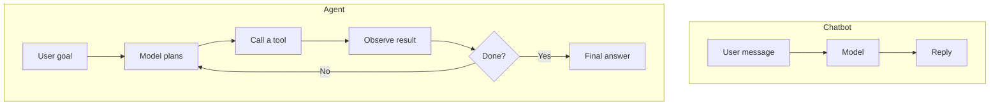

A **chatbot** goes: user message → model reply → done.
An **agent** goes: user goal → plan → tool call → observe → maybe plan again → final answer.

The difference is not how clever the model is. It is whether the system is allowed to take a step, look at the result, and keep going.

## Intuition

Consider one request: *"Has my order shipped?"*

A chatbot can explain how shipping works, what the tracking email looks like, and how long delivery usually takes. Everything it says may be correct and none of it answers the question, because the answer lives in a database it cannot reach.

An agent looks up the order, sees it shipped on Tuesday, and says so.

:::note Analogy
A chatbot is a well-briefed receptionist working from a printed manual. Ask anything covered by the manual and you get a fast, accurate answer. Ask something that requires checking a system and the manual cannot help, however thick it is.

An agent is a receptionist with access to the booking system. Slower, and you have to be careful what they are allowed to change — but they can answer questions whose answers are not in any manual.

Adding more pages to the manual never turns the first into the second. That is the mistake behind most "why doesn't our chatbot know this?" complaints: the problem is reach, not knowledge.
:::

## How it works

### Side by side

| | Chatbot | Agent |
| --- | --- | --- |
| Steps per request | One | As many as the task needs |
| Can reach live data | No | Yes, through tools |
| Can cause side effects | No | Yes — this is the risk |
| Cost per request | Predictable | Varies with how long the loop runs |
| Main failure | Confidently wrong text | Confidently wrong **action** |

### When you need an agent

- **Multi-step workflows** — search, then calculate, then file a ticket. No single reply can do all three.
- **Fresh data behind an API or database** — order status, stock levels, today's prices.
- **Actions with real effects** — issuing a refund, sending an email, updating a record.

### When a chatbot is enough

- **FAQ and drafting** where everything needed is already in the prompt.
- **Single-turn summarisation** of text you have already supplied.
- **Anything where a wrong action would be expensive** and the task does not truly need one.

The honest default is the simpler one. An agent adds cost, latency, and a category of failure that chatbots cannot have — so reach for it when the task genuinely requires acting, not because it sounds more advanced.

:::key
Agents add loops, tools, and state. Chatbots generate the next reply. Choose based on whether the answer requires *doing* something.
:::

## What goes wrong

- Building an agent for a job a well-prompted chatbot handles, and paying for the loop every request.
- Building a chatbot for a job that needs live data, then trying to fix it by stuffing more text into the prompt.
- Giving the loop no step limit, so a confused agent keeps calling tools.

## One-line summary

Agents loop, use tools, and change things; chatbots reply — pick the agent only when the task needs action, not just words.

## Key terms

- **One-shot** — A single generate step with no follow-up action.
- **Agent loop** — Repeated reason, act, observe until a stop condition.
- **Side effect** — A change the agent makes in a real system.
