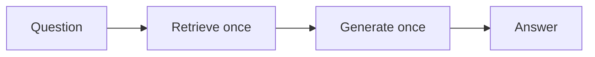
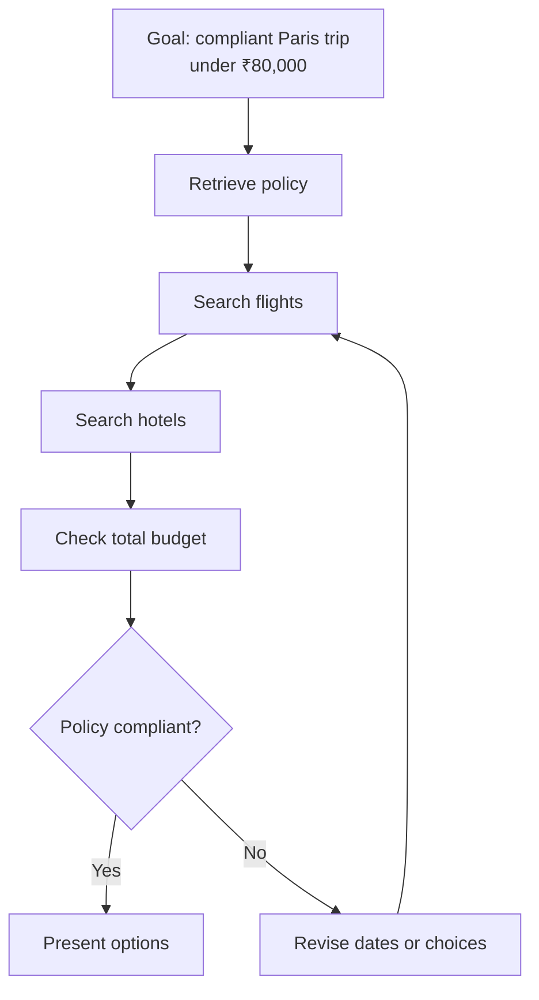

RAG can answer:

> What does our policy allow for flights to Paris?

It cannot, by itself, complete:

> Plan my Paris trip for next week for four days, within policy and ₹80,000.

The second request needs more than evidence. It needs decisions, actions, and a way to recover when a choice fails.

## Intuition

### Change one word, change the system

The first request is a **question**. One retrieval and one answer may be enough.

The second request is a **goal**. To reach it, the system may need to:

1. Retrieve the travel policy.
2. Search live flights.
3. Search live hotels.
4. Compare prices with the budget.
5. Check policy constraints.
6. Revisit earlier choices if the check fails.
7. Present a recommendation for approval.

There is no guaranteed straight line through those steps. A compliance failure near the end may send the system back to the flight search with different dates.

:::note Analogy
RAG is like asking a librarian, "What does this rulebook say?"

An agentic task is like asking an event planner, "Use that rulebook, today's prices, and my budget to arrange the event."

The librarian's job ends when the correct passage is found and explained. The planner's job ends only when all the pieces fit together — and if the venue is unavailable, the planner must change the plan rather than repeat the rulebook.
:::

## Answering a question versus completing a task

| | Question answering | Task completion |
| --- | --- | --- |
| **Input** | A question | A goal plus constraints |
| **Work** | Usually one retrieval and one generation | Many steps, with order chosen at runtime |
| **Output** | Text | A decision or a change in the world |
| **Failure** | A wrong sentence | A booking that breaks policy |
| **Ends when** | The model stops generating | The goal is satisfied or judged impossible |

Three capabilities appear only on the task side:

- **Actions** — call external tools such as flight search or calendar APIs.
- **Decisions** — select which action should happen next.
- **Interaction** — ask the user for missing information or approval.

## Why a fixed RAG pipeline breaks

A basic RAG flow is predictable:

```mermaid
flowchart LR
    Q[Question] --> R[Retrieve once]
    R --> G[Generate once]
    G --> A[Answer]
```

That is the right design when the user wants an answer from documents.

The travel goal behaves differently:

```mermaid
flowchart TB
    G[Goal: compliant Paris trip<br/>under ₹80,000] --> P[Retrieve policy]
    P --> F[Search flights]
    F --> H[Search hotels]
    H --> B[Check total budget]
    B --> C{Policy compliant?}
    C -->|Yes| O[Present options]
    C -->|No| R[Revise dates or choices]
    R --> F
```

The backward arrow is the important part. A pipeline runs forward. An agent can loop.

### The policy check that changes everything

Suppose the first search finds:

- Flight: ₹38,400
- Hotel: ₹6,800 × four nights = ₹27,200
- Total: ₹65,600

The trip is ₹14,400 below budget, so a price-only system declares success.

Then the policy checker finds that departure is five days away, but company policy requires booking seven days ahead. The itinerary is affordable and invalid.

A fixed retrieve-search-return design has no answer for this new observation. An agent can decide to shift the dates and search again.

:::key
RAG answers from evidence. An agent works toward a goal and can change its next action when new evidence invalidates the current plan.
:::

## When RAG is exactly enough

Do not turn every RAG application into an agent.

Use ordinary RAG when:

- The user wants an answer, summary, or citation.
- One retrieval step is normally enough.
- The system does not need to act on external services.
- The work ends after grounded text is produced.

Add agent behavior when:

- The number or order of steps depends on results.
- Tools can fail and recovery must be chosen dynamically.
- A later check can invalidate an earlier decision.
- The system must stop based on a real goal, not merely the end of a response.

## What goes wrong

- Adding an agent loop to simple policy Q&A and making a cheap, predictable request slower and less reliable.
- Calling a fixed seven-step script an agent even though the model never chooses the order.
- Checking the budget but forgetting that several constraints must hold at the same time.
- Treating "the model finished writing" as proof that the task is complete.

## One-line summary

RAG is enough for grounded answers; task completion needs actions, runtime decisions, feedback, and a goal-based stopping condition.

## Key terms

- **Question answering** — Producing grounded text in response to a question.
- **Task completion** — Taking enough steps to satisfy a goal and its constraints.
- **Control flow** — The order in which steps run.
- **Hard constraint** — A condition that must be satisfied, not merely preferred.
- **Replanning** — Changing earlier choices after a new observation or failure.
