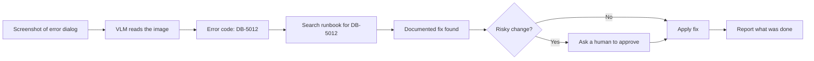

A **multimodal agent** is an agent whose inputs are not only text. It can look at a screenshot, a scanned form, or a photo, and then take action based on what it saw.

This chapter is where Module 4 comes together: the eyes from 4.1 and 4.2, the retrieval from 4.3, and the agent loop from 4.4.

## Intuition

Picture a support engineer handling a ticket that arrives as a screenshot of an error dialog.

They read the error code off the image, search the internal runbook for that code, find the documented fix, and either apply it or hand it to someone who can. Four steps, two of which need eyes.

A text-only agent cannot start this task at all — the first piece of information is a picture. A vision model alone can read the dialog but cannot then go and find the runbook. You need both.

:::note Analogy
Think of vision and tools as eyes and hands.

Eyes without hands gives you a very good describer: it tells you precisely what the error says and can do nothing about it. Hands without eyes gives you a capable worker who cannot see the problem and has to be told what is wrong in words first.

Most real work — reading a form and filing it, spotting a defect and flagging it, seeing an error and fixing it — needs both in the same loop, because what the eyes find decides what the hands do next.
:::

## How it works

### A worked example

The ticket is a screenshot. The agent runs the ordinary loop, but the first perception step is visual:

| Step | Which part of Module 4 does it | Why it is needed |
| --- | --- | --- |
| Read the dialog | VLM with OCR strength, chapter 4.1–4.2 | The input is pixels, not text |
| Find the runbook page | Multimodal retrieval, chapter 4.3 | The fix lives in a document, not the model |
| Decide and act | Agent loop, chapter 4.4 | Something has to actually change |
| Ask before risky steps | Human-in-the-loop | Wrong actions cost more than wrong answers |

### The building blocks

- **A vision model or vision tool** to answer "what is on this screen?" Prefer a grounded, high-resolution model when the evidence is small text, as in chapter 4.2.
- **Retrieval** so the agent can look things up rather than recalling them from training, using the multimodal RAG ideas from chapter 4.3.
- **Text tools** for search, tickets, code, and APIs.
- **Policies** stating plainly which actions the agent may take on its own and which need a person to approve.

### Why grounding matters more here

In a text agent, a misread means the model quotes the wrong sentence. In a multimodal agent, a misread means the model acts on something it never actually saw.

If the VLM reads `DB-5012` as `DB-5Ol2`, every step afterwards is confidently wrong — the same compounding error described in the visual reasoning lesson, except now it ends in an action rather than a sentence.

Practical consequence: have the agent **state what it saw** before acting on it. A visible line like *"Read error code DB-5012 from the dialog"* costs nothing and makes the one failure that matters reviewable.

:::key
Multimodal agents use eyes (vision) plus hands (tools). The risk is that a misread image turns into a wrong action, so make the visual observation visible before the agent acts on it.
:::

## What goes wrong

- Trusting an OCR read of a code, amount, or name without showing it for review.
- Using a low-resolution vision path for small text, then wondering why the agent acts on the wrong value.
- Letting the agent both read the screen and take irreversible action with no approval step.
- Expecting the model to recall internal documentation instead of retrieving it.

## One-line summary

A multimodal agent reads images, retrieves what it needs, and acts — so the visual observation must be exposed and checked before it becomes an action.

## Key terms

- **Multimodal agent** — An agent that takes in non-text inputs such as images or scans.
- **Grounding** — Tying actions to observed evidence from an image, document, or API.
- **Human-in-the-loop** — A required approval point before a risky action.
