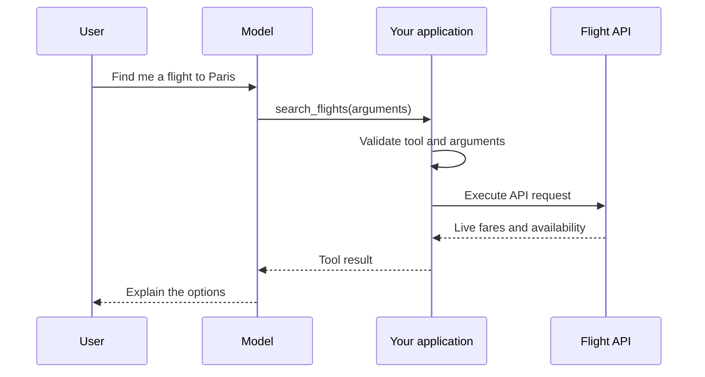
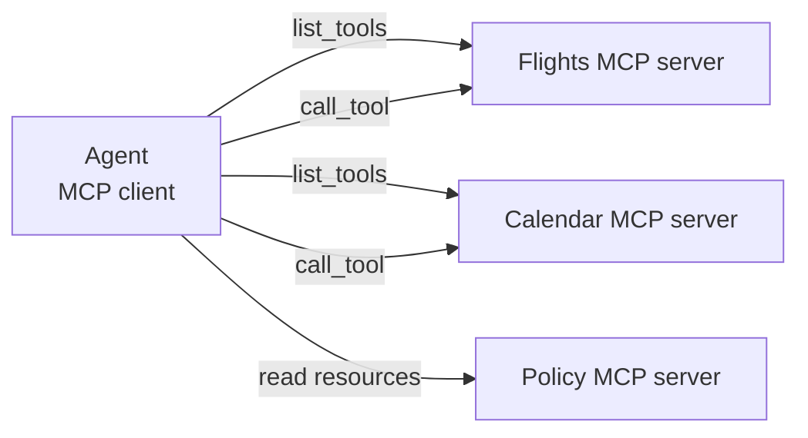

RAG gives an answer from external knowledge. An **assistant** carries that knowledge through a conversation. A **tool-using assistant** can also request actions from the outside world.

These are separate upgrades: knowledge, context, and capabilities.

## Intuition

### Context makes follow-up questions possible

Consider this conversation:

> **User:** I am travelling to Paris next week for four days. What does the policy allow?
> **Assistant:** Economy class, and booking must be at least seven days ahead. [§4.2]
> **User:** And the hotel?
> **Assistant:** Up to ₹8,000 per night in Paris. [§4.7]
> **User:** Find me one under that.

The phrase **"the hotel"** means a hotel in Paris, for four nights, below ₹8,000 per night. None of that appears in the last sentence. It comes from earlier turns.

Turn three is impossible without turn one. That is why context is **state**, not merely "a longer prompt."

### Context still cannot search a hotel

Even after remembering the full conversation, the assistant has no live hotel inventory. Memory tells it *what* to search for. A tool gives it the capability to perform the search.

:::note Analogy
Knowledge, context, and tools are like three things a human assistant needs.

- The **policy binder** tells them the rules.
- Their **notebook** remembers what you already discussed.
- Their **phone and booking system** let them check what is available.

Giving them a bigger notebook does not create a phone. Giving them a phone does not teach the company policy. A reliable assistant needs the right combination.
:::

## Three layers

| Layer | What it adds | Paris example |
| --- | --- | --- |
| **Knowledge** | Retrieval over trusted documents | Finds cabin and hotel rules |
| **Context** | State carried across turns | Remembers Paris, dates, and budget |
| **Capabilities** | Tools that reach outside systems | Searches live flights and hotels |

## How tool calling actually works

The model never directly touches the flight API.

It emits a structured request:

```json
{
  "name": "search_flights",
  "arguments": {
    "origin": "BOM",
    "dest": "CDG",
    "date": "2026-08-22",
    "cabin": "economy"
  }
}
```

Your application code validates the request, runs the API call using real credentials, and returns the result to the model.


```mermaid
sequenceDiagram
    participant U as User
    participant M as Model
    participant H as Your application
    participant F as Flight API
    U->>M: Find me a flight to Paris
    M->>H: search_flights(arguments)
    H->>H: Validate tool and arguments
    H->>F: Execute API request
    F-->>H: Live fares and availability
    H-->>M: Tool result
    M-->>U: Explain the options
```

The `cabin: economy` argument is important. The user did not say "economy." The model filled it from the retrieved policy. Knowledge is now shaping an action.

:::key
The model proposes a tool call; your application validates and executes it. The model never receives raw authority or secret API credentials.
:::

## The problem with hand-written tool schemas

Without a standard interface, developers describe every tool inside the application:

```python
tools = [{
    "name": "search_flights",
    "description": "Search current flight fares",
    "parameters": {
        "origin": "string",
        "dest": "string",
        "date": "string",
        "cabin": ["economy", "business"]
    }
}]
```

For one tool this is manageable. With dozens of changing tools:

- Schemas are copied into several agents.
- A field change requires code and prompt updates.
- Adding a tool usually means redeploying the application.
- Each integration invents its own connection style.

## MCP: one standard interface

The **Model Context Protocol (MCP)** makes tools and resources discoverable through a common interface.


```mermaid
flowchart LR
    A[Agent<br/>MCP client] -->|list_tools| F[Flights MCP server]
    A -->|list_tools| C[Calendar MCP server]
    A -->|read resources| P[Policy MCP server]
    A -->|call_tool| F
    A -->|call_tool| C
```

The server owns the schemas. The client asks what is available at runtime:

```python
session = connect("travel.corp/mcp")
tools = session.list_tools()

result = session.call_tool(
    "search_flights",
    {"origin": "BOM", "dest": "CDG"}
)
```

Add a new tool to the server and it appears during discovery. The agent application does not need a hand-copied schema or a redeploy simply to learn that the tool exists.

### What MCP changes — and what it does not

MCP standardises **how capabilities are exposed and called**. It does not decide:

- Whether a tool is safe for this user.
- Whether arguments satisfy company policy.
- Whether a write action needs approval.
- Which tool should be called next.

Those remain responsibilities of your application and agent design.

## What goes wrong

- Saying "the model called the API" and hiding the application code that actually owns execution and security.
- Trusting model-generated arguments without schema and business-rule validation.
- Giving a tool secrets in the prompt instead of keeping credentials in the host application.
- Treating MCP as a safety layer; it standardises connections, not permissions or policy.
- Returning huge tool results that fill the context window.

## One-line summary

Context remembers the thread, tools reach the outside world, your code executes every action, and MCP provides a standard way to discover and call capabilities.

## Key terms

- **Conversation state** — Information carried across turns in one thread.
- **Tool call** — A structured action request emitted by the model.
- **Host application** — Code that validates and executes tool requests.
- **MCP** — Model Context Protocol, a standard interface for tools and resources.
- **Tool discovery** — Asking a connected server which capabilities are available.
- **Resource** — Readable context, such as policy documents, exposed by an MCP server.
