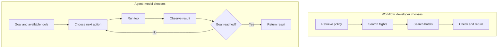
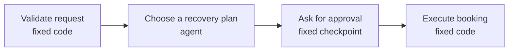

A tool-using assistant and an agent may use exactly the same model and exactly the same tools.

The difference is **who chooses the order of work**.

## Intuition

### The only difference that matters

In a workflow, the developer chooses the sequence while writing the application:

```text
retrieve_policy()
search_flights()
search_hotels()
rank_and_return()
```

The model may fill in arguments, summarise results, or write the final response. It does not decide what step comes next.

In an agent, the model chooses the next action during the run:

```text
goal + tools
    ↓
decide
    ↓
act and observe
    ↓
decide again
```

:::note Analogy
A workflow is a railway line. Every train follows the same stations in the same order. This is efficient, predictable, and easy to inspect.

An agent is a taxi driver. The destination is fixed, but the route changes with traffic, road closures, and what happens along the way.

Do not hire a taxi to run a train route. Do not lay railway tracks for a journey whose roads change every hour.
:::

:::key
If you can draw the complete flowchart before the request arrives, you probably need a workflow, not an agent.
:::

## Side-by-side control flow



| Question | Workflow | Agent |
| --- | --- | --- |
| Who decides the order? | Developer at build time | Model at runtime |
| Are steps predictable? | Yes | Not always |
| Can it loop after a surprise? | Only if the loop was coded | Yes, within allowed tools and budgets |
| Cost and latency | Easier to bound exactly | Varies by number of steps |
| Audit path | Stable and repeatable | Requires detailed traces |
| Main risk | Cannot handle an unplanned branch | Can choose an unnecessary or harmful action |

## Use a workflow when

- The steps are the same for every input.
- Auditors need the same path every time.
- Latency and cost must be bounded exactly.
- A wrong extra call is expensive or irreversible.
- Every expected failure and retry can be written in ordinary code.

**Example:** monthly expense-report generation. Import the file, validate rows, total expenses, create the report, and send it for approval. The order does not need a model.

## Use an agent when

- The number of steps depends on the data.
- A later result can invalidate an earlier choice.
- Tools fail in different ways and recovery must be selected dynamically.
- The input space is too open-ended to list every path.
- The task may require clarification, a different query, or replanning.

**Example:** planning the Paris trip. A failed booking-window check means the agent must decide whether to change dates, choose a different itinerary, or ask the user.

## Most real systems use both

You do not have to choose an entirely deterministic application or an entirely autonomous agent.

A safer design is often:



Use deterministic code for the parts you can name in advance. Add an agent only where the path is genuinely unknown.

### Why this hybrid design is safer

- Validation does not depend on model judgment.
- The agent cannot bypass the approval checkpoint.
- The final write action has predictable code and permissions.
- Only the uncertain planning step pays the cost of an agent loop.

## A practical decision test

Before building, answer these questions:

1. Can I list every step now?
2. Is the order always the same?
3. Can ordinary `if` statements handle all expected failures?
4. Would an extra tool call create cost or risk?
5. Does the next step truly depend on unstructured results?

If the first four answers point to predictability, start with a workflow. If the fifth is the heart of the task, an agent may be justified.

## What goes wrong

- Calling a workflow an agent because one step contains an LLM.
- Replacing reliable application logic with model decisions for marketing value.
- Giving an agent freedom around irreversible actions that should remain fixed checkpoints.
- Hard-coding a long workflow for a genuinely open-ended task, then adding hundreds of fragile branches.
- Assuming agents remove orchestration code; they move some control decisions into the model but still need budgets, permissions, and state.

## One-line summary

A workflow follows the developer's fixed route; an agent chooses the next step from runtime observations, and practical systems often combine both.

## Key terms

- **Workflow** — A predefined sequence or graph of steps.
- **Agent** — A system whose model chooses the next action at runtime.
- **Deterministic** — The same state follows the same coded path.
- **Runtime decision** — A choice made while the task is executing.
- **Hybrid system** — Fixed workflow stages with an agent only where the route is unknown.
