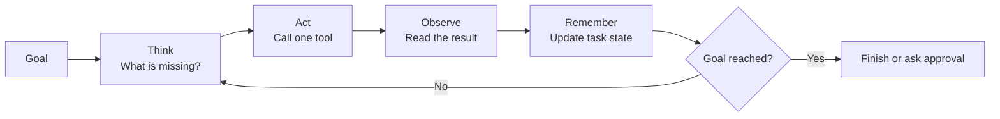
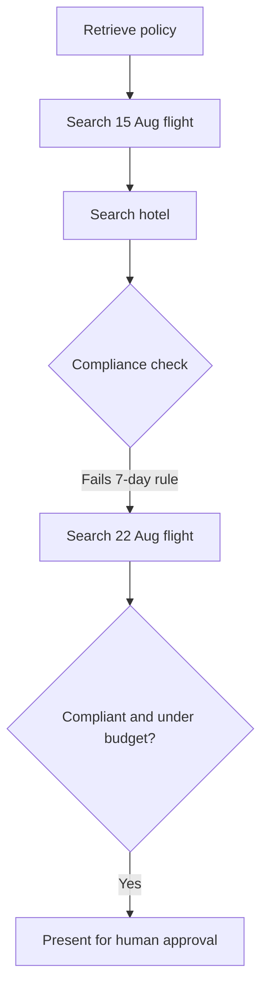

An agent is a **closed loop**, not a one-way pipeline.

It chooses one action, reads the result, updates its state, and chooses again until the goal is reached, judged impossible, or stopped.

## Intuition

### Why the loop is the whole idea

A plan written before any evidence arrives is only a guess. Live tools return prices, errors, empty results, and policy failures that were impossible to know in advance.

The agent therefore plans a little, acts, and then plans again from the new information.

:::note Analogy
Driving with turn-by-turn navigation is an agent loop.

The app does not hand you one permanent route and switch off. It watches where you are, notices traffic or a missed turn, and calculates the next instruction again.

The destination remains the same. The plan is disposable.
:::

## The closed loop



| Step | Simple question |
| --- | --- |
| **Think** | What information or action is needed next? |
| **Act** | Which allowed tool should be called? |
| **Observe** | What actually came back? |
| **Remember** | What changed, and what remains unfinished? |
| **Stop check** | Is the goal satisfied, impossible, or awaiting approval? |

The plan is regenerated after each observation. That is what makes the loop different from a pipeline.

## The Paris agent, step by step

Goal:

> Plan a four-day Paris trip from Mumbai within company policy and ₹80,000.

### Step 1: constraints first

**Think:** I cannot judge any flight or hotel until I know the rules.  
**Act:** `retrieve_policy("international flights, Paris hotels")`  
**Observe:**

- Economy class only.
- Hotel must cost no more than ₹8,000 per night.
- Booking must be at least seven days ahead.

**Remember:** Add these three items as hard constraints.

### Step 2: search flights inside policy

**Think:** The cabin is now known, so search economy fares.  
**Act:** `search_flights("BOM", "CDG", "15 Aug", "economy")`  
**Observe:** Four fares from ₹38,400 to ₹61,200.

**Remember:** The cheapest fare leaves ₹41,600 for hotel and other trip costs.

### Step 3: search hotels inside the remaining limits

**Think:** Search four nights below the policy cap and remaining budget.  
**Act:** `search_hotels("Paris", nights=4, max_per_night=8000)`  
**Observe:** Six hotels from ₹5,900 to ₹7,800 per night.

Choose a ₹6,800 option:

```text
Flight             ₹38,400
Hotel 4 × ₹6,800   ₹27,200
Total              ₹65,600
Budget remaining   ₹14,400
```

The trip is affordable. It is not yet valid.

### Step 4: verify compliance

**Think:** Price is only one constraint. Check the complete itinerary against policy.  
**Act:** `check_policy(itinerary)`  
**Observe:** **FAIL** — departure is five days away; policy requires seven days.

This is the moment that explains why an agent is needed. The budget was never the problem. New evidence invalidated an earlier plan.

### Step 5: replan from the failure

**Think:** Keep the destination and policy-compliant cabin, but move the dates.  
**Act:** `search_flights("BOM", "CDG", "22 Aug", "economy")`  
**Observe:** ₹34,900, departing in eight days.

### Step 6: finish with approval

**Think:** The updated trip satisfies booking notice and remains under budget.  
**Act:** `draft_itinerary()`  
**Observe:** A compliant plan, ₹17,900 below budget.

The agent presents it to the user. It does **not** purchase anything without approval.



:::key
Step 4 is the reason agents exist: an observation can invalidate the current plan, and the system chooses a new action instead of returning a failed result.
:::

## A tiny loop in code

This is control-flow pseudocode, not a production agent:

```python
state = {"goal": goal, "steps": 0}

while state["steps"] < 8:
    action = model.choose_next_action(state, allowed_tools)
    observation = run_validated_tool(action)
    state = update_state(state, action, observation)

    if goal_is_satisfied(state):
        return ask_user_to_approve(state)

return {"status": "stopped", "reason": "step budget reached"}
```

The important logic is outside the model:

- Only allowed tools can run.
- Arguments are validated.
- State is updated after every observation.
- A step budget stops endless loops.
- A human approves the final booking.

## Three requirements for a production loop

### Bounded

Set a step budget, time limit, and cost ceiling. Without limits, a confused agent can retry forever.

### Observable

Log each action, its arguments, the result, duration, and state change. A run should be replayable during debugging.

### Recoverable

Treat a tool failure as an observation, not an application crash. The agent may retry, select another tool, ask for help, or stop.

## What goes wrong

- Declaring success after the budget check while skipping policy verification.
- Feeding an error back as unstructured text that the model cannot reliably interpret.
- Letting the model decide its own permissions or increase its own step budget.
- Hiding thoughts and tool calls from operational traces, making failures impossible to replay.
- Allowing a booking action before the user approves the proposed itinerary.

## One-line summary

An agent repeatedly thinks, acts, observes, and remembers; the Paris example becomes agentic when a failed compliance check causes a new search.

## Key terms

- **Agent loop** — Repeated think, act, observe, and update steps.
- **Observation** — Data or an error returned by a tool.
- **Task state** — The record of completed work, results, and remaining steps.
- **Step budget** — Maximum number of loop iterations.
- **Recovery** — Choosing a safe next step after a tool or plan fails.
