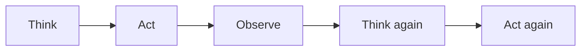
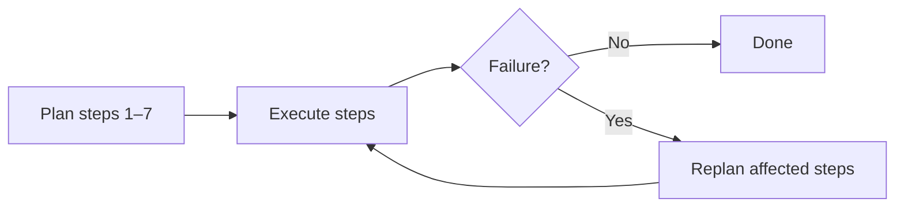
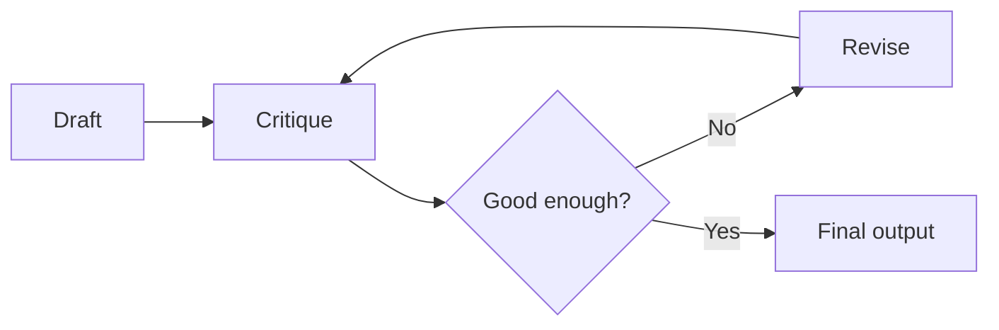

The basic loop stays the same, but agents can organise it in different ways.

The design choice is **how far ahead the model plans** and how much context each new step must carry.

## Intuition

An agent appears to remember a run, but the model itself is normally stateless. On every step, the application sends the goal, available tools, and relevant history again.

At step eight, the prompt may contain steps one through seven. The system pays for old information repeatedly.

:::note Analogy
Imagine a new shift worker taking over after every single action.

Before doing the next step, they must reread the goal, the handbook, and the complete log written by all earlier workers. The eighth worker reads far more than the first.

Agent context works the same way. The model does not wake up remembering step seven; your application reconstructs that memory and sends it again.
:::

## Why cost grows quickly

```text
Step 1 sends: goal + tools
Step 2 sends: goal + tools + step 1
Step 3 sends: goal + tools + steps 1–2
...
Step 8 sends: goal + tools + steps 1–7
```

Each step pays for much of the earlier run again. Doubling the step budget can more than double the token bill.

Verbose tool output is often the real limit. A flight API returning 500 options or a retrieval tool returning complete documents can fill the context window before the agent reaches its step limit.

### Context controls

- **Truncate observations** — keep the fields needed for the next decision.
- **Summarise superseded steps** — preserve decisions, not every sentence.
- **Keep only the last N steps in full** — older details become a compact record.
- **Store artifacts outside the prompt** — keep a file or database reference instead of repeating large content.
- **Separate state from transcript** — structured fields are cheaper and safer than rereading a conversation.

:::key
The model is stateless. Agent memory is context rebuilt by the application, so context size must be managed deliberately.
:::

## Three shapes of the same loop

### 1. ReAct: decide one step at a time

**ReAct** interleaves reasoning and action:



Paris example:

```text
THINK  Need the policy first
ACT    retrieve_policy()
OBS    Economy; book at least 7 days ahead
THINK  Now search allowed fares
ACT    search_flights(15 Aug)
OBS    Departure is only 5 days away
THINK  Shift the dates
```

**Strengths**

- Cheapest and simplest pattern.
- Every next action uses the latest evidence.
- Easy to inspect one decision at a time.

**Weakness**

- It can wander on long tasks because there is no full plan keeping it on course.

Use it for the Paris loop and other tasks where each result strongly determines the next step.

### 2. Plan-and-execute: plan first, then run

The model drafts the larger plan before executing it:



Paris example:

```text
PLAN  1 policy · 2 flights · 3 hotels · 4 budget · 5 compliance
EXEC  Run the plan
FAIL  Compliance is two days short
PLAN  Replan the flight and later steps
EXEC  Run the changed tail
```

**Strengths**

- Independent steps may run in parallel.
- Cost and duration are easier to estimate.
- Better structure for long research or batch work.

**Weakness**

- The first plan is written before evidence arrives and can be wrong.

Use it for deep research or work where several planned searches can happen together.

### 3. Reflection: critique and revise the output

Reflection loops on a draft rather than on the whole task:



Paris example:

```text
DRAFT     Four-day itinerary
CRITIQUE  Departure is in 5 days; policy needs 7
REVISE    Move departure to 22 Aug
CRITIQUE  New fare ₹34,900; compliant
DONE      Present the itinerary
```

**Strength**

- Produces a visible quality improvement for writing, plans, and code.

**Weakness**

- A critique and revision can double or triple token use.
- A model may repeat the same blind spot while sounding more careful.

Use it when final output quality matters enough to pay for another pass.

## Choosing a pattern

| Need | Good starting pattern |
| --- | --- |
| Short task, next action depends on latest result | ReAct |
| Long task with parallel or predictable substeps | Plan-and-execute |
| Improve a draft, report, itinerary, or code change | Reflection |
| High-stakes work | Any pattern plus deterministic checks and human approval |

Patterns can be combined. A plan-and-execute agent may use ReAct inside one difficult step and reflection for the final report.

## What goes wrong

- Sending complete raw tool output at every step until the context window fills.
- Treating the transcript as the only state store.
- Using reflection on every response and tripling cost with no measured quality gain.
- Planning too far ahead for tools whose results are unpredictable.
- Letting ReAct wander without a goal check and step budget.
- Summarising old state so aggressively that a hard constraint disappears.

## One-line summary

ReAct decides one step at a time, plan-and-execute prepares a route, reflection revises a draft, and all three need disciplined context management.

## Key terms

- **ReAct** — Interleave reasoning, action, and observation.
- **Plan-and-execute** — Draft a plan, run it, and replan on failure.
- **Reflection** — Critique and revise an output.
- **Context window** — Maximum input the model can process in one call.
- **Context engineering** — Selecting, compressing, and organising what each step receives.
