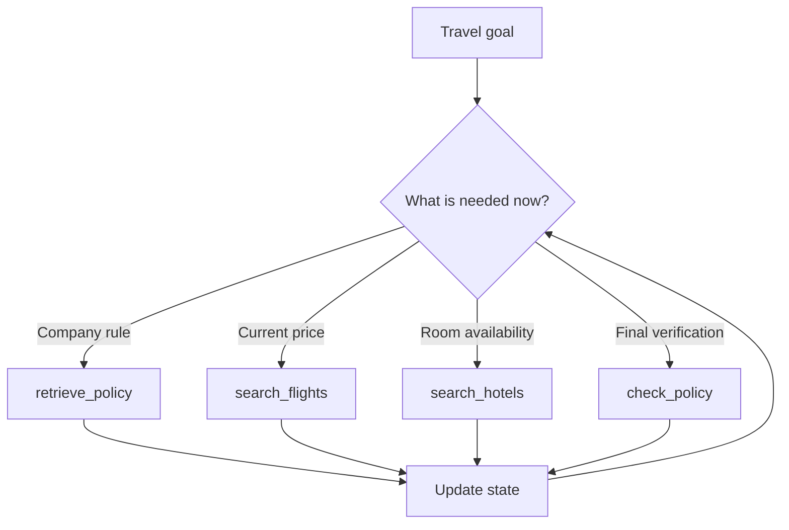
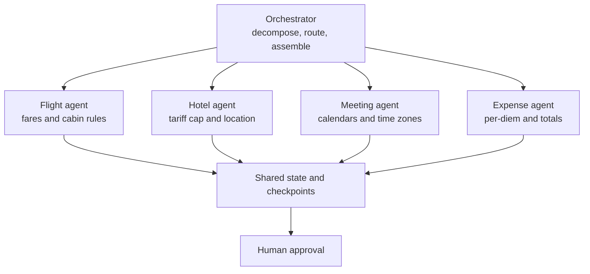

An agent does not replace RAG. It turns retrieval into **one tool among several** and decides when, how, and whether to use it.

As the task grows, the agent also needs clear state. Only then should you consider splitting the work across specialised agents.

## Intuition

In basic RAG, retrieval is fixed:

```text
query → retrieve once → augment prompt → generate once
```

Inside an agent, retrieval is a choice:

```text
goal → decide → retrieve or call another tool → observe → decide again
```

The agent may retrieve policy first, call a live fare API next, and return to the policy later for verification.

:::note Analogy
Basic RAG is a student who is always told, "Open the textbook once, then answer."

An agent is a student sitting at a desk with a textbook, calculator, calendar, and web search. They choose which one to use for each part of the problem.

The freedom is useful only if their notebook records what they already learned. Without state, they repeatedly open the same page and forget why.
:::

## Retrieval becomes a tool



### 1. Rewrite the retrieval query

The user's complete request is a poor search query:

> Plan my Paris trip for next week.

The agent can produce a focused query:

> international cabin class and advance-booking policy

Focused retrieval finds the right clause more reliably.

### 2. Retrieve more than once

The agent may retrieve:

- Cabin and hotel rules before searching.
- Per-diem rules when the running total changes.
- The booking clause again during final verification.

### 3. Skip retrieval when it cannot help

No policy document answers:

> What is today's fare?

The agent should call the flight API instead of searching the vector index.

### 4. Verify against the source

After drafting the itinerary, the agent can re-retrieve the relevant clauses and check the final plan line by line.

:::key
RAG still supplies trusted knowledge, but the agent chooses the query, timing, and number of retrieval calls.
:::

## Three things the agent must remember

### 1. Conversation state

**Lifetime:** one conversation thread.

It records what the user said and what the assistant replied:

- "Next week" means 22–26 August.
- The user prefers direct flights.
- The user approved a ₹80,000 ceiling.

Conversation state lets follow-up language such as "that hotel" make sense.

### 2. Task state

**Lifetime:** one active run.

It is the working record:

```text
policy retrieved       yes
selected flight        ₹34,900
budget remaining       ₹45,100
hotel search           complete
compliance check       pending
```

Without task state, there is no reliable loop. The question "what is still missing?" can only be answered against a record of completed work.

### 3. Long-term memory

**Lifetime:** across sessions.

It stores durable facts worth keeping after this trip:

- Employee grade is L4.
- Home airport is BOM.
- The previous trip was rejected for late booking.

Long-term memory should be selective, permission-aware, and updateable. Today's live fare does not belong there.

| State type | Lifetime | Example |
| --- | --- | --- |
| Conversation | One thread | User prefers direct flights |
| Task | One run | Compliance re-check is pending |
| Long-term | Across sessions | Home airport is BOM |

## When one agent becomes crowded

The request grows:

> Plan the entire trip — flights, hotel, three client meetings, and the expense estimate.

One agent now has:

- Fourteen tools to choose from.
- Meeting notes competing with policy clauses for context space.
- One prompt asking it to be a flight expert, scheduler, and accountant.
- A single failure domain where a calendar timeout can block fare search.

Tool selection often gets worse as the list grows.

## Split the goal, not the model

A multi-agent design assigns clear parts of the goal:



The **orchestrator** breaks down the goal, gives each specialist a narrow tool set, and assembles typed results.

### Why specialisation can help

- The flight agent sees flight tools, not all fourteen tools.
- Calendar failures do not need to stop fare search.
- Each agent receives only the context relevant to its task.
- Outputs can be checked independently before assembly.

### Why it can hurt

Every handoff is a chance to lose:

- A date or budget constraint.
- The source behind a policy claim.
- Units or currency.
- Ownership of the next step.

Multi-agent systems also multiply model calls, traces, and failure paths.

:::tip
Start with one agent. Split only after measurements show that tool overload, context crowding, or independent failure domains are causing a real problem.
:::

## Safe shared state

Agents should exchange structured artifacts, not vague chat messages:

```json
{
  "flight_total_inr": 34900,
  "departure_date": "2026-08-22",
  "policy_checks": {
    "cabin": "pass",
    "advance_booking": "pass"
  },
  "source": "travel_policy_2026.pdf §4.2"
}
```

Typed fields preserve amounts, dates, status, and source references better than "I found a suitable flight."

## What goes wrong

- Searching policy documents for live prices instead of using the right tool.
- Keeping only conversation text and losing explicit task state.
- Saving temporary fares as long-term memory.
- Adding agents because the task sounds impressive, not because one agent has a measured limitation.
- Passing free-form summaries between agents and dropping constraints during handoffs.
- Sharing state without tenant and permission boundaries.

## One-line summary

Inside an agent, retrieval is a chosen tool, task state keeps the loop coherent, and multiple agents are justified only when clear specialised subgoals outweigh handoff cost.

## Key terms

- **Agentic RAG** — Retrieval used dynamically inside an agent loop.
- **Conversation state** — Information remembered within one dialogue thread.
- **Task state** — Working record for one active run.
- **Long-term memory** — Durable facts retained across sessions.
- **Orchestrator** — Component that decomposes, routes, and assembles multi-agent work.
- **Handoff** — Transfer of a task and its context from one agent to another.
