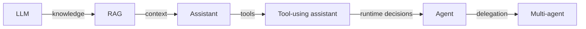

Frameworks provide ready-made loops, state stores, tool connections, tracing, and handoffs.

They can save engineering time. They do not decide whether your product needs an agent, make unsafe tools safe, or repair poor retrieval.

## Intuition

The small loop from the previous lessons can be written without a framework:

```text
think → act → observe → remember → repeat
```

The difficult production work sits around it:

- Saving state so a run can pause and resume.
- Connecting and validating tools.
- Tracing every decision and action.
- Applying budgets and stop conditions.
- Pausing for human approval.
- Coordinating specialised agents.

Frameworks package some of this work.

:::note Analogy
An agent framework is like a kitchen fitted with standard ovens, counters, and safety switches.

It saves you from building the kitchen before cooking. It does not choose the menu, check whether the ingredients are fresh, or make the chef competent.

A poor recipe cooked in an expensive kitchen is still a poor meal.
:::

## Framework landscape

The session presents this 2026 landscape:

| Framework | What changed or stands out | Ecosystem |
| --- | --- | --- |
| **Microsoft Agent Framework 1.0** | Semantic Kernel and AutoGen brought into one runtime in April 2026 | Azure / .NET |
| **OpenAI Agents SDK** | Handoffs, guardrails, and tracing as first-class parts | OpenAI |
| **Claude Agent SDK** | Hierarchical subagents, MCP-native design, safety-first defaults | Anthropic |
| **Google ADK** | Hierarchical agent trees, built-in development UI, A2A support | Google Cloud |
| **Pydantic AI v2** | Typed inputs and outputs, model-agnostic; v2 stable in June 2026 | Python-first |
| **Strands, Mastra, Agno** | AWS-native, TypeScript-native, and lightweight open-source choices | AWS / TypeScript / OSS |

Framework names and versions change quickly. The architecture from this chapter changes much more slowly.

### Three selection rules

1. **Pick by your stack, not a benchmark headline.** Existing cloud, language, deployment, and team skills usually matter more.
2. **The loop is portable; the state store is not.** Moving prompts is easy compared with migrating checkpoints, memory, and traces.
3. **Protocol layers may outlive SDKs.** A common connection standard such as MCP can reduce dependence on one framework.

:::key
Treat frameworks as replaceable infrastructure around a stable design: goals, tools, state, budgets, approval, and evaluation.
:::

## The same request, six times

| Stage | Request it can handle | System capability | What changed |
| --- | --- | --- | --- |
| **LLM** | "What is the capital of France?" | Language generation | Nothing external |
| **RAG** | "What is our international travel policy?" | Retrieve, then generate | External knowledge |
| **Assistant** | "I am in Paris next week — what does it allow?" | Knowledge plus context | State across turns |
| **Tool-using assistant** | "Find flights to Paris." | Calls an external service | It can act |
| **Agent** | "Plan my trip within policy and ₹80,000." | Retrieval, tools, state, decisions | It chooses the order |
| **Multi-agent** | "Plan the trip, meetings, and expenses." | Coordinated specialists | The task is decomposed |



Nothing below is thrown away. The agent still chunks documents, creates embeddings, retrieves policy, maintains conversation context, and calls tools.

## Five things to carry forward

### 1. RAG answers; agents finish

The dividing line is task completion, not intelligence.

- "What does policy say?" → RAG.
- "Plan a compliant trip" → agent.

### 2. Control flow is the definition

If the full flowchart can be drawn before the request arrives, build a workflow.

Use an agent when the next step genuinely depends on what just happened.

### 3. The loop is small

The core can fit in a few lines:

```python
while not done and within_budget:
    action = choose_next_action(state)
    observation = run_allowed_tool(action)
    state = remember(state, observation)
```

Frameworks make the surrounding state, tooling, and operations easier. They do not change the basic loop.

### 4. RAG lives inside the agent

Retrieval becomes a tool the agent can call, skip, repeat, and verify.

This also raises the stakes of retrieval quality. A weak chunk is no longer only a weak answer source; it may shape a real action.

### 5. State is the hard part

Reliable agents need:

- Durable checkpoints.
- Clear task status.
- Context that does not grow without control.
- Typed handoffs.
- A human before anything irreversible.

## A beginner's build order

Do not begin with a multi-agent framework.

1. Write the goal and success condition.
2. Build a deterministic workflow if the route is known.
3. Add one safe, narrow tool.
4. Add state and traces.
5. Add an agent loop only where decisions are genuinely dynamic.
6. Add human approval before write actions.
7. Split into multiple agents only after one-agent evaluation reveals a clear need.

## What goes wrong

- Choosing a framework before defining the task and control flow.
- Rewriting the product whenever a new SDK becomes popular.
- Assuming built-in "guardrails" replace server-side permissions and validation.
- Allowing framework abstractions to hide prompts, tool arguments, or state changes.
- Measuring a demo instead of task success, cost, latency, and unsafe-action rate.
- Starting with a team of agents before one bounded loop works.

## One-line summary

Choose frameworks for operational fit, keep the core architecture portable, and remember that state, controls, and task success matter more than the SDK name.

## Key terms

- **Agent framework** — Library or runtime for loops, tools, state, traces, and handoffs.
- **Guardrail** — Control that limits or checks model behavior.
- **Tracing** — Recording model decisions, tool calls, results, and timing.
- **Checkpoint** — Saved state from which a run can safely resume.
- **A2A** — Agent-to-agent communication support.
- **Portable core** — Product logic and evaluations kept independent of one framework.
