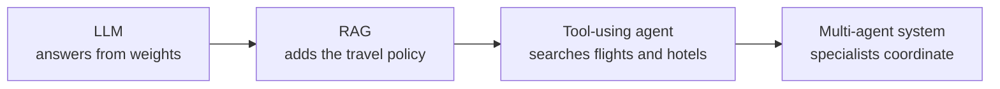
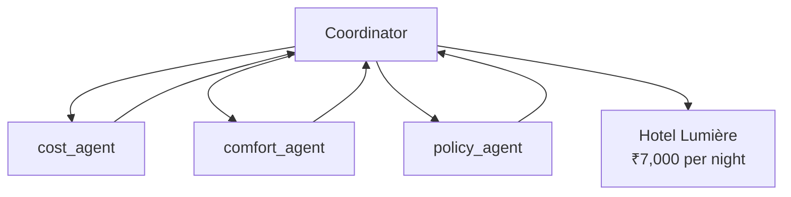
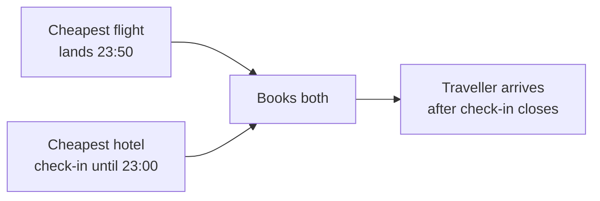
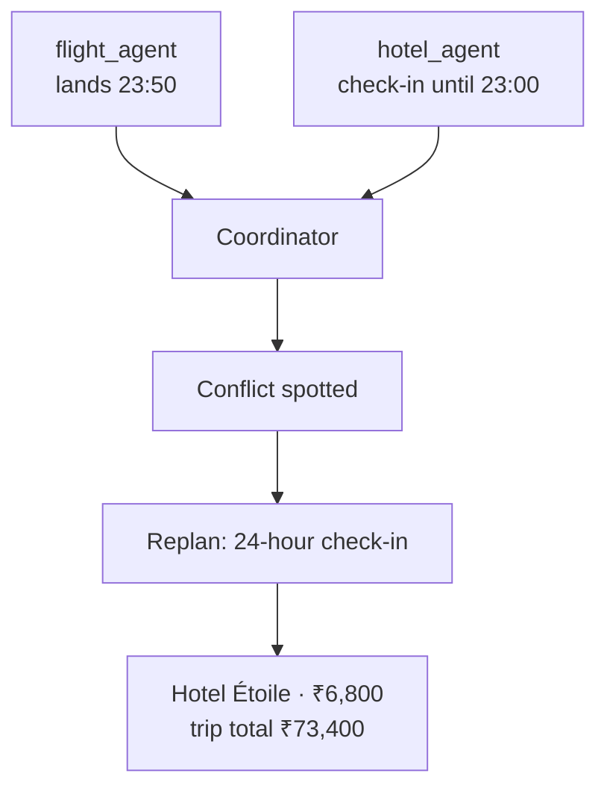

The same Paris request from Chapter 4.4 now grows one step further:

> Plan my Paris trip for next week, within travel policy and ₹80,000.

Chapter 4.4 stopped at **one agent** that retrieves policy, calls tools, and decides the next step. This chapter asks a new question: **when does that one agent become a team?**

## Intuition

### The four-stage picture

| Stage | What it can do | What it still cannot do well |
| --- | --- | --- |
| **LLM** | Write a fluent itinerary | Know private policy or live fares |
| **RAG** | Quote the travel policy | Search today's flights |
| **Tool-using agent** | Search, check, and replan | Hold several goals without one of them quietly losing |
| **Multi-agent system** | Give each goal an owner, then combine | Nothing extra unless coordination is designed |

A team is not a bigger model. It is **several small agents with clear jobs**, plus one coordinator that owns the overall goal.

:::note Analogy
One talented travel assistant can book a trip. Ask them to find a hotel that is cheapest, comfortable, **and** within policy, and they will still return one hotel.

You cannot see which goal they sacrificed. Maybe they picked cheap and dropped comfort. Maybe they stayed inside policy and dropped location. The answer looks finished, but the trade-off is hidden inside one person's head.

A team puts each goal on a separate desk. Cost, comfort, and policy each produce a result. The coordinator then lays those results on the table so you can see what you are paying for.
:::

## Where one agent breaks

Give one agent this prompt:

> Find a hotel that is cheapest, comfortable, and within policy.

It returns:

> Hotel Rivoli, ₹6,900 per night. 45 minutes from the venue. No breakfast.

Which goal gave way? You cannot tell. Cheap may have won. Comfort may have lost. Policy may have been checked, or only mentioned.

Now split the same work:

| Agent | Result |
| --- | --- |
| **cost_agent** | Étoile · ₹6,800 · 50 minutes away |
| **comfort_agent** | Grand · ₹9,500 · 5 minutes away |
| **policy_agent** | Nightly cap is ₹7,000, so Grand fails |
| **coordinator** | Hotel Lumière, ₹7,000 per night |

The coordinator can now say something one agent rarely says clearly:

> Paying ₹200 more than the cheapest option buys a 35-minute shorter commute, and it still fits policy.

Every trade-off is on the table.

## When sub-tasks collide

One agent working in a single pass can also miss clashes between good individual choices.

What went wrong:

1. The cheapest flight lands at 23:50.
2. The cheapest hotel accepts check-in only until 23:00.
3. Both look fine alone, so both get booked.
4. The traveller arrives after the desk has closed.

The flight was fixed **before** the hotel was chosen. No step compared the two results.

A coordinator can catch this:

The specialists still do their jobs. The coordinator's extra job is **reconciliation**: look across results before anything is booked.

## One agent versus a team

| | Single agent | Multi-agent system |
| --- | --- | --- |
| **Ownership** | One agent plans and executes | Coordinator owns the goal; specialists own sub-tasks |
| **Context** | One large working context | Small contexts linked by explicit messages |
| **Work** | Mostly sequential tool calls | Independent sub-tasks can run in parallel |
| **Failure** | One agent must recover | Coordinator retries, replaces, or reassigns |
| **Ends when** | The agent reaches a decision | Coordinator judges the goal met or impossible |

:::key
Split work when one agent would hide a trade-off, miss a clash between results, or try to hold too many jobs in one prompt.
:::

## What goes wrong

- Calling a system "multi-agent" because it uses several tools. Several tools can still belong to one agent.
- Adding specialists before checking whether one agent already fails in a visible way.
- Combining specialist results without a comparison step, then repeating the late-arrival problem.
- Treating the team's extra cost as free. More agents mean more messages, more tokens, and more places to fail.

## One-line summary

One agent can search and replan; a team is useful when goals clash or results must be compared, because a coordinator can show trade-offs instead of hiding them.

## Key terms

- **Single agent** — One loop that plans, calls tools, and finishes the whole goal.
- **Multi-agent system** — Specialists plus a coordinator that combines their work.
- **Trade-off** — A choice where improving one goal makes another worse.
- **Reconciliation** — Checking specialist results against each other before deciding.
- **Coordinator** — The agent that owns the overall goal and assigns sub-tasks.
