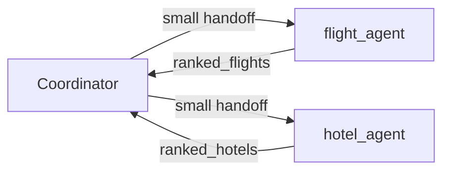

The last lesson showed *why* a team can help. This lesson covers *how* to split the work without creating a messy crowd.

The rule is simple: **every agent needs a precise job and a clear interface.**

## Intuition

### Four reasons to split

| Reason | What it buys in the Paris trip |
| --- | --- |
| **Specialisation** | The flight agent thinks only about fares and routes. |
| **Parallelism** | Flight and hotel searches can run at the same time. |
| **Context isolation** | The policy agent sees only the relevant clauses, not the whole chat. |
| **Verification** | A budget agent checks numbers before anyone books. |

If none of these four apply, keep one agent.

:::note Analogy
A restaurant kitchen works because the grill cook is not also taking payments.

You do not shout "handle the dinner" at one person and hope. You say "grill the steaks" and "check the bill." Each station has a job, a small set of tools, and a known way to pass a plate to the next station.

An agent team fails in the same way a kitchen fails: vague jobs, overlapping stations, and plates passed with no ticket saying what was ordered.
:::

## Precise roles

Hard to delegate:

> `travel_agent`: handle the trip

Problems:

- Responsibilities overlap with every other agent.
- Inputs and outputs are unclear.
- The coordinator cannot tell when to call it.

Easy to delegate:

> `flight_agent`: find economy flights BOM→CDG under the remaining budget

This version:

- States exactly what it owns.
- Returns ranked options in a known format.
- Stays distinct from hotel, policy, and budget agents.

:::key
If you cannot finish the sentence "this agent owns X and returns Y," the role is not ready to delegate.
:::

## What is an agent?

In this chapter, an agent is not "a clever model." It is a small package with five parts:

| Part | Meaning |
| --- | --- |
| **Role** | What it is responsible for |
| **Model** | The language model that reasons for it |
| **Tools** | The only functions it may call |
| **State** | What it keeps between its own steps |
| **Contract** | What it accepts, returns, and promises |

```json
{
  "role": "Find flights to Paris",
  "model": "small-llm",
  "tools": ["search_flights"],
  "state": {"shortlist": []},
  "contract": {
    "input": {"date": "date", "max_price": "number"},
    "output": "ranked_flights (top 3)",
    "limits": ["economy", "read-only"]
  }
}
```

Read that file as a job description:

- It may search flights, nothing else.
- It expects a date and a price ceiling.
- It returns three ranked flights.
- It stays economy and read-only. It cannot book.

The **contract** is the important part. It is the interface other agents rely on.

## Handoffs

A **handoff** is the message that starts a specialist's work. It should carry only what that specialist needs.

```json
{
  "task_id": "paris_17",
  "goal": "Find a compliant flight",
  "constraints": {
    "date": "2026-10-15",
    "remaining_budget": 50000
  },
  "return_format": "ranked_flights"
}
```

Three design rules:

| Rule | Why it matters |
| --- | --- |
| **Only what is needed** | Send the goal, constraints, and inputs — not the whole conversation. |
| **Structured output** | Ask for a fixed shape the coordinator can compare and check. |
| **Clear ownership** | Say who may change a decision, and who may only recommend. |



If the flight agent also received the user's jokes, the full policy PDF, and yesterday's hotel debate, two things happen: cost rises, and the specialist is more likely to wander.

## What goes wrong

- Creating a `travel_agent` that can do everything, then wondering why the coordinator never knows when to call it.
- Passing the entire chat history into every specialist.
- Letting two agents both believe they can change the final hotel.
- Asking for "a nice summary" instead of a ranked list with prices and times.
- Giving a specialist tools that sit outside its contract, such as a booking tool on a search-only flight agent.

## One-line summary

Split work only when a specialist, a parallel search, a smaller context, or a checker helps; then give each agent a role, a contract, and a small structured handoff.

## Key terms

- **Role** — The one job an agent is responsible for.
- **Contract** — The agreed inputs, outputs, and limits of that job.
- **Handoff** — The small structured message that starts a specialist task.
- **Context isolation** — Giving an agent only the information it needs.
- **Ownership** — Who may change a decision versus who may only recommend.
