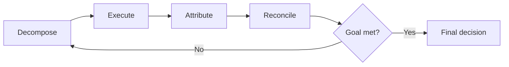
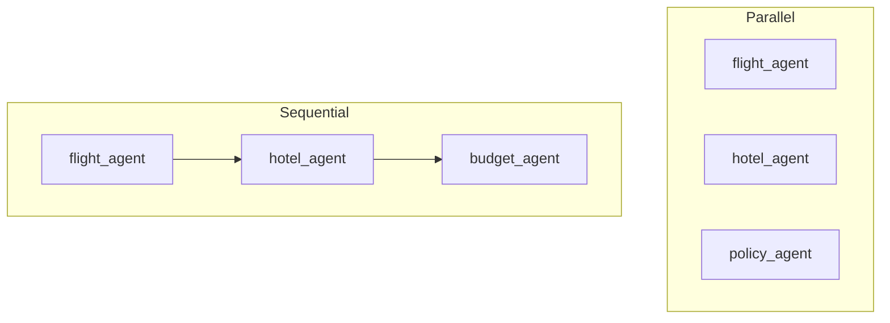

A multi-agent system is not a one-way assembly line.

The coordinator splits the goal, specialists work, results come back, and the coordinator decides whether to finish, retry, or send more work.

That repeating path is the **coordination cycle**.

## Intuition

One agent thinks, acts, observes, and remembers.

A team needs an extra layer around that:



| Step | What happens |
| --- | --- |
| **1. Decompose** | The coordinator splits the goal into bounded tasks. |
| **2. Execute** | Specialists run, in parallel where possible. |
| **3. Attribute** | Each result is tagged with its agent and task id. |
| **4. Reconcile** | The coordinator combines, checks, and decides. |

If something still conflicts, the cycle repeats.

:::note Analogy
A film shoot works this way.

The director breaks the day into scenes. Camera, sound, and lighting work, sometimes at the same time. Every take is labelled: scene, camera, take number. Then the director watches the takes together and decides whether to print them or reshoot.

Without labels, nobody knows which take belongs to which scene. Without a director, the crew can film excellent pieces that do not fit the same movie.
:::

## Iterate until done

The loop in code is small. The design lives in the stop conditions, not in extra frameworks.

```python
while not goal_satisfied(state):
    tasks = coordinator.delegate(state)
    results = await run_agents(tasks)
    state.merge(results)
    if conflict(state):
        state = coordinator.replan(state)

return coordinator.final_decision(state)
```

Three facts make this a loop rather than a script:

- **No fixed sequence.** A policy conflict can send work back to the flight or hotel agent.
- **State carries over.** Each result changes what later agents receive.
- **It stops on a decision.** A validated plan, or a clear reason it cannot be done.

:::key
The plan is rewritten after observations. Specialists do not need to know the whole trip; they need a fresh task built from the latest shared state.
:::

## Bounding the loop

Without limits, two agents can undo each other forever: the flight agent picks a late arrival, the hotel agent rejects it, the flight agent picks it again.

```python
MAX_ROUNDS, MAX_TOKENS = 3, 10_000
rounds = 0

while not goal_satisfied(state):
    if rounds >= MAX_ROUNDS:
        return escalate(state, "round limit")
    if state.tokens > MAX_TOKENS:
        return escalate(state, "over budget")
    if repeats_conflict(state):
        return escalate(state, "deadlock")

    tasks = coordinator.delegate(state)
    state.merge(await run_agents(tasks))
    rounds += 1

return coordinator.final_decision(state)
```

| Limit | What it means here |
| --- | --- |
| **Round limit** | At most three delegation rounds |
| **Cost budget** | Stop before 10,000 tokens |
| **Deadlock check** | The same conflict twice means agents are undoing each other |
| **Escalate** | Hand the partial plan and the conflict to a person |

Escalation is a success of sorts. The system stopped honestly instead of booking a broken trip.

## Parallel versus sequential

### Parallel

Use it when tasks do **not** need each other's output.

```python
flight, hotel, policy = await gather(
    flight_agent.run(f_task),
    hotel_agent.run(h_task),
    policy_agent.run(p_task),
)
```

**Risk:** wasted work if a later check fails. The hotel search may finish, then policy says the dates are invalid.

### Sequential

Use it when one agent needs another agent's result.

```python
flight = await flight_agent.run(f_task)
hotel = await hotel_agent.run(h_task)
budget = await budget_agent.run(combine(flight, hotel))
```

**Risk:** waiting time adds up. Each agent sits idle until the previous one finishes.



A practical Paris design often mixes both: search flights and hotels together, then run budget and policy checks on the combined pair.

## What goes wrong

- Running the cycle with no round or token limit.
- Treating a repeated conflict as "try again" instead of a deadlock.
- Running every specialist in sequence when the searches do not depend on each other.
- Running everything in parallel when a later agent needs an earlier result.
- Forgetting to tag results, so the coordinator cannot say which agent produced a bad fare.

## One-line summary

The coordinator decomposes, delegates, attributes, and reconciles in a bounded loop; parallelise independent searches and escalate when rounds, cost, or a repeated conflict say stop.

## Key terms

- **Coordination cycle** — Decompose, execute, attribute, reconcile, repeat.
- **Attribution** — Tagging a result with the agent and task that produced it.
- **Round** — One pass of delegation and merge.
- **Deadlock** — Agents repeatedly undo each other's decisions.
- **Escalate** — Stop the loop and hand a partial plan to a person.
