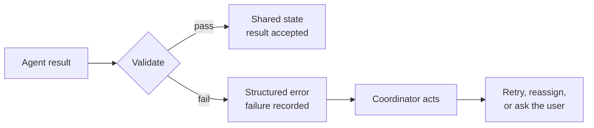
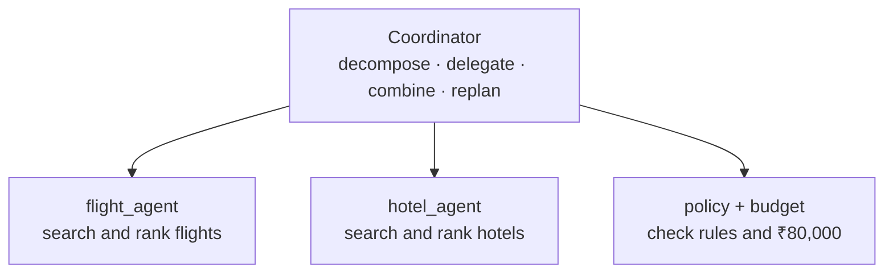
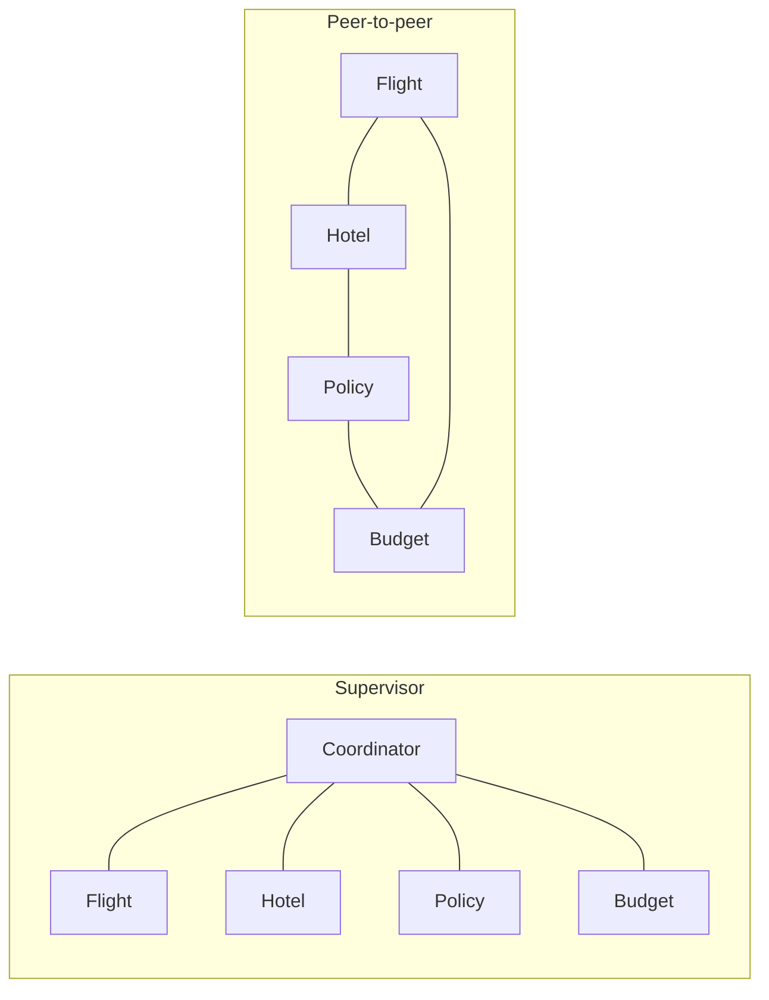
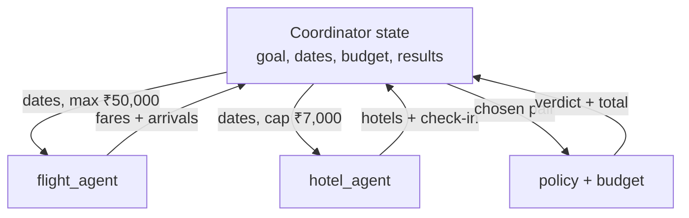

Once specialists start returning results, three design choices decide whether the team stays reliable:

1. What happens when a result is wrong.
2. Who talks to whom.
3. What each agent is allowed to see.

## Intuition

A specialist result is not automatically true. It is a claim that must pass checks before it joins the shared plan.

:::note Analogy
Think of a newspaper newsroom.

Reporters file stories. A copy desk checks names, numbers, and whether the story actually answers the assignment. The editor holds the whole edition. Reporters do not rewrite each other's pages unless the editor asks.

If every reporter could edit every page, and no one checked figures, the paper would still look busy. It would not be trustworthy.
:::

## Failures and validation



Validation should check more than grammar:

- Does the result match the expected **schema**?
- Are required fields present?
- Does the total stay under the ₹80,000 ceiling?
- Do times and dates line up with other accepted results?

A failed result must become a **structured error**. Hide it, and the coordinator cannot retry, reassign, or ask the user.

```text
{
  "source": "hotel_agent",
  "ok": false,
  "reason": "nightly_rate 9500 exceeds cap 7000"
}
```

That is useful. "Hotel search failed" is not.

## Supervisor–worker

The default pattern here is **supervisor–worker**.



Why this pattern is easy to run:

| Property | What you get |
| --- | --- |
| **Clear ownership** | One coordinator holds the global goal. |
| **Specialised work** | Each sub-task has a focused prompt, tool set, and context. |
| **Traceable** | Every delegation and result can be logged. |

The coordinator does not search flights. The flight agent does not decide the whole trip.

## Supervisor versus peer-to-peer

| | Supervisor | Peer-to-peer |
| --- | --- | --- |
| **Shape** | All specialists talk through one hub | Specialists talk to each other |
| **Strength** | Simple governance, easy tracing | Flexible, fewer hops |
| **Weakness** | Every message passes through one coordinator | Communication paths are harder to control |
| **Examples** | Support triage, research orchestrators, coding planners | Multi-agent debate, simulations, writer–reviewer loops |



For the Paris booking desk, supervisor–worker is the safer start. Peer-to-peer is useful when agents must argue or review one another, not when money is about to be spent.

:::key
Start with one coordinator. Let specialists talk to each other only when you can still see who decided what.
:::

## Shared state

The coordinator keeps the full picture. Each specialist receives **a slice**, then returns an update.

```python
state = {
    "goal": "Paris trip",
    "dates": "15–19 Oct",
    "budget": 80000,
    "hotel_cap": 7000,
    "results": {},
    "decisions": [],
}
```

| Agent | Slice sent | Update returned |
| --- | --- | --- |
| **flight_agent** | dates · remaining budget ≤ ₹50,000 | 3 fares + arrival times |
| **hotel_agent** | dates · ≤ ₹7,000 per night | hotels + check-in times |
| **policy + budget** | chosen flight + hotel | verdict + total cost |



Do not send the whole state to every agent. The policy agent does not need every discarded fare. Extra context raises cost and makes it easier to follow a poisoned or noisy field.

## What goes wrong

- Accepting a specialist result because it is fluent, without schema or budget checks.
- Swallowing errors as empty text, so the coordinator thinks nothing happened.
- Letting every specialist read and write the full state.
- Switching to peer-to-peer because it looks more "advanced," then losing the audit trail.
- Storing final decisions only in chat text instead of a `decisions` list the next round can read.

## One-line summary

Validate every result before it enters shared state, keep one coordinator unless peer review is the actual job, and send each specialist only the slice it needs.

## Key terms

- **Validation** — Checking a result against schema, required fields, and constraints.
- **Structured error** — A recorded failure the coordinator can act on.
- **Supervisor–worker** — One coordinator delegates to specialists.
- **Peer-to-peer** — Specialists exchange messages without a single hub.
- **State slice** — The subset of shared state one agent is allowed to see.
