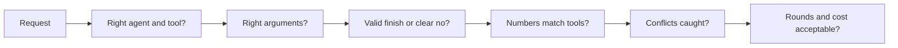
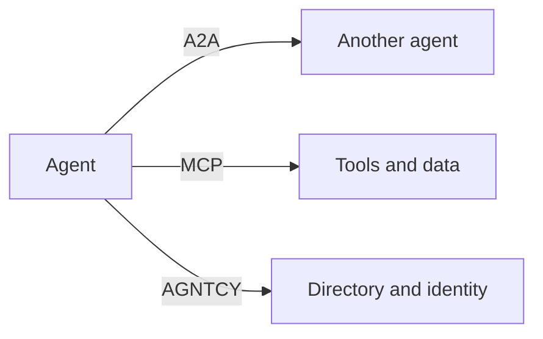

More agents do not automatically mean a better trip. They mean more messages, more waiting, and more bills.

Before you add another specialist, you need a way to count cost, judge quality, and know how agents are supposed to talk to one another.

## Intuition

Each extra agent is another person you have briefed, waited for, and paid.

:::note Analogy
Hiring four contractors for a home repair can be faster than hiring one, if they work at the same time and someone checks the joins.

It can also be slower and more expensive: four kickoff meetings, four invoices, and a week spent fixing a door that no longer matches the floor.

Multi-agent systems have the same arithmetic. The team is worth it only if the extra coordination buys a better, safer result.
:::

## The cost of every agent

A simple cost picture:

| Extra cost | What it means |
| --- | --- |
| **4 specialist tasks** | Typical number of tasks in one coordination round |
| **2× messages** | Each specialist receives a task and returns a result |
| **~2 seconds extra** | Waiting cost if those specialists run one after another |
| **$** | Each agent has its own model calls and tool calls |

```text
one round ≈ 4 tasks × (task message + result message)
          = 8 model-facing messages
          + every tool those specialists call
```

Parallel search reduces waiting time. It does **not** remove the token bill. Four cheap specialists can still cost more than one careful agent if they retry, replan, or dump large tool results back to the coordinator.

## Evaluating multi-agent systems

Do not judge the team only by whether the final paragraph sounds polished.

| Metric | What it checks | Paris example |
| --- | --- | --- |
| **Selection accuracy** | Right agent and tool for the request | `search_flights`, not `search_trains` |
| **Argument correctness** | Filled-in parameters are actually right | date = next week, not today |
| **Task completion** | Ends in a valid booking or a clear refusal | Booked under ₹80,000, or explained why not |
| **Groundedness** | Every number traces to a tool result | ₹46,200 matches the fare returned |
| **Conflicts caught** | Clashes found before booking | 23:50 arrival versus 23:00 check-in |
| **Rounds + cost to finish** | How much coordination it took | 2 rounds · about 5,300 tokens |



A team that books a legal trip in two rounds is better than a team that books the same trip in eight rounds after missing a check-in clash on the first try.

:::key
A fluent itinerary is not a passing score. The team must pick the right tools, keep numbers grounded, catch clashes, and finish at a cost you can afford.
:::

## Standards for agent-to-agent communication

These names describe **how systems connect**, not which model is smartest.

| Standard | Connects | Key idea | Status here |
| --- | --- | --- | --- |
| **A2A** | Agent ↔ agent | Agent Cards for discovery; tasks with a lifecycle | v1.0 · Agentic AI Foundation |
| **MCP** | Agent ↔ tools and data | Complements A2A: reaches tools, not peers | Agentic AI Foundation |
| **ANP** | Agent ↔ agent on the open web | Decentralised IDs; agents negotiate the protocol | Proposed |
| **AGNTCY** | Discovery, identity, messaging | Agent directory and secure messaging; uses A2A + MCP | Linux Foundation project |



Remember the split from Chapter 4.4:

- **MCP** helps an agent find and call tools.
- **A2A** helps one agent find and assign work to another agent.

Neither standard makes a booking safe. Permissions, validation, and human approval still belong to your application.

Names and versions move quickly. The design underneath does not: discover a capability, send a bounded task, receive a structured result, keep an identity and a log.

## What goes wrong

- Adding agents because the architecture diagram looks impressive, then paying four model bills for work one agent already did well.
- Scoring only "did it produce an itinerary?" and missing wrong dates or uncaught conflicts.
- Treating A2A or MCP as a safety layer.
- Running specialists in sequence when they could run together, then blaming "multi-agent" for the delay.
- Allowing numbers in the final answer that no tool actually returned.

## One-line summary

Count messages, time, and money before adding agents; score the team on correct tools, grounded numbers, caught conflicts, and finish cost; use A2A between agents and MCP between an agent and its tools.

## Key terms

- **Selection accuracy** — Choosing the right agent and tool.
- **Groundedness** — Every number can be traced to a tool result.
- **A2A** — A standard for agent-to-agent task passing.
- **MCP** — A standard for connecting an agent to tools and data.
- **Agent Card** — A discovery description of what another agent can do.
