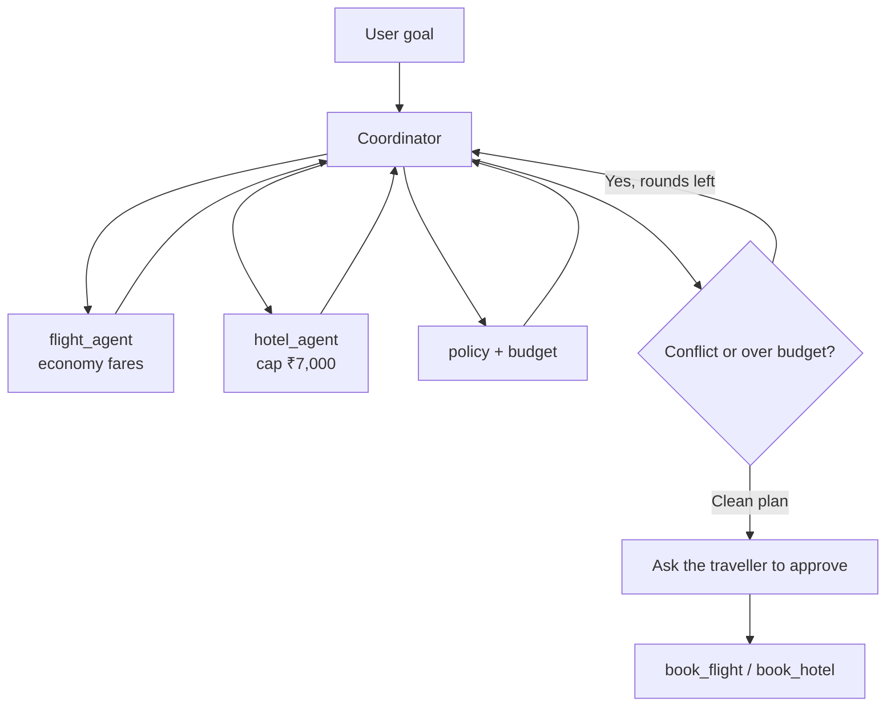

This chapter ends with five rules. They are the whole chapter in short form.

If you remember only these, you can still decide whether to split work, how to brief a specialist, and when to stop the team.

## Intuition

A multi-agent system is an organisation, not a smarter brain.

The organisation works when jobs are narrow, messages are small, and someone owns the final yes or no.

:::note Analogy
The five rules are the same advice a good office manager already follows.

Hire specialists, not one person titled "do everything." Write down what each person receives and returns. Hold a short stand-up, assign work, collect results, and redo what clashed. Pass a one-page brief, not the entire filing cabinet. And do not hand junior staff the company credit card.

That is the chapter. The Paris trip is only the example that makes each rule visible.
:::

## The five rules

### 1. Specialise the work

Split when roles, context, or parallelism help.

Keep one agent when a single loop already shows its trade-offs and catches clashes.

### 2. Give every agent a contract

Write down:

- role
- inputs
- outputs
- constraints
- permissions

`flight_agent` finds economy flights under a remaining budget and returns a ranked list. It does not book.

### 3. Coordination is the core loop

```text
decompose → delegate → observe → merge → replan
```

Specialists do not need a private copy of the whole plan. They need a fresh task from the latest shared state.

### 4. Keep handoffs small

Pass only the relevant context. Validate what comes back. Keep provenance so you know who produced each number.

### 5. More agents, more risk

Every extra agent adds:

- another permission surface
- another communication path
- another model and tool bill
- another place a write action could fire

Control those four on purpose.

:::key
Specialise only when it helps, contract every agent, loop through a coordinator, keep handoffs small, and treat extra agents as extra risk.
:::

## One Paris walkthrough

Put the five rules on the original request:

> Plan my Paris trip for next week, within travel policy and ₹80,000.



1. The coordinator owns the trip. Specialists own fares, rooms, and checks.
2. Each specialist gets a small contract and a small handoff, not the full chat.
3. Flight and hotel can search together. Policy and budget run after a pair is chosen.
4. A 23:50 arrival versus a 23:00 check-in is a conflict to reconcile, not a booking to celebrate.
5. A poisoned "ignore the budget" line is rejected as untrusted data.
6. After two rounds the plan is under ₹80,000, or the system escalates.
7. A person confirms before any booking tool runs.

That is a team. It is still the same Paris goal from Chapter 4.4. The new skill is **organisation**.

## A beginner's build order

1. Make one agent finish the trip with traces and a step budget.
2. Split only the job that is hiding a trade-off or blocking parallelism.
3. Write a contract before writing the specialist prompt.
4. Validate schema, money, and times on every result.
5. Keep write tools behind human approval.
6. Measure selection, completion, groundedness, conflicts caught, and cost.

Do not start with four agents and a peer-to-peer mesh.

## What goes wrong

- Memorising framework names and skipping the five rules.
- Splitting into a team before one agent has been measured.
- Writing beautiful role descriptions with no input/output contract.
- Passing the whole conversation at every handoff.
- Adding agents without adding permissions, logs, or a round limit.

## One-line summary

Specialise when it helps, contract every agent, coordinate in a bounded loop, keep handoffs small and checked, and treat every extra agent as extra risk.

## Key terms

- **Specialisation** — Giving one agent one job so its prompt, tools, and context stay small.
- **Contract** — The written interface of an agent.
- **Coordination loop** — Decompose, delegate, observe, merge, replan.
- **Small handoff** — Passing only the context the next agent needs.
- **Coordination risk** — Extra permissions, paths, cost, and approval points created by more agents.
