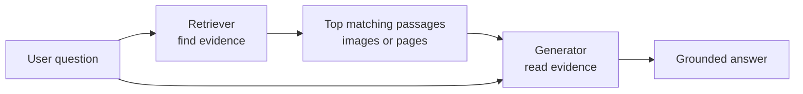
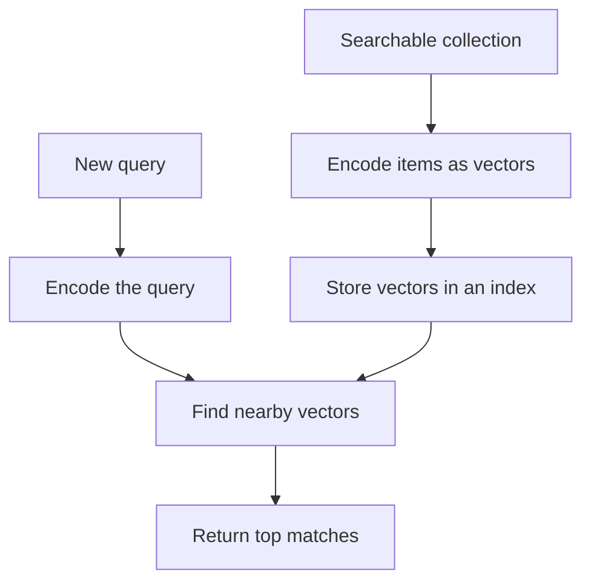

Imagine asking an AI:

> What was our Q3 revenue growth?

The answer may be inside a paragraph, a table, or a bar chart. The model should not guess from memory. It should first **find the right evidence**, then answer from it.

That is the idea behind **Retrieval-Augmented Generation (RAG)**.

## Intuition

RAG has two separate jobs:

1. **Retrieval** finds useful existing material.
2. **Generation** reads that material and writes an answer.

:::note Analogy
Think of a lawyer preparing for a hearing.

A model without retrieval is a lawyer arguing from memory — fluent, confident, and occasionally citing a case that does not exist, because recall is imperfect and the pressure to produce an answer is high.

RAG is the same lawyer with a paralegal who fetches the actual documents first. The lawyer's skill has not changed; what changed is that the argument is now built on paper that can be checked.

And the limits are the same too. If the paralegal brings the wrong file, an excellent lawyer will still produce an excellent argument for the wrong conclusion.
:::

:::key
A fluent model cannot repair missing evidence. If retrieval returns the wrong page, even a strong generator is likely to give the wrong answer.
:::

## Text RAG and multimodal RAG

| System | What it can retrieve |
| --- | --- |
| Text-only RAG | Text passages |
| Multimodal RAG | Text, images, tables, charts, audio, video, or complete pages |

Real documents are visual. A report may explain a result in a chart without repeating it in a sentence. A manual may show a connection only in a diagram. Multimodal RAG keeps this evidence available.

## The common retrieval pattern

Text search, image search, and page search all follow a similar pattern:

A **vector** is simply a list of numbers that represents useful meaning or visual information. Similar items should get nearby vectors.

- The **encoder** turns raw content into vectors.
- The **index** stores those vectors for fast search.
- The **retriever** returns existing evidence.
- The **generator** is optional; it turns retrieved evidence into a response.

## One pattern, different content

| Task | Query | Search collection | Useful technique |
| --- | --- | --- | --- |
| Text search | Text | Text passages | Dense text embeddings |
| Image search | Text or image | Images | CLIP-style shared space |
| Document search | Text | Complete page images | Vision-space retrieval |
| Multimodal QA | Question | Mixed evidence | Retrieval + VLM generation |

The machinery is similar. What changes is **what gets encoded** and **which model encodes it**.

## Worked example

Suppose a company has 50,000 policy pages.

1. Before users ask anything, encode and index the pages.
2. A user asks, “Can I cancel during the trial?”
3. Encode that question.
4. Find the nearest policy passages or pages.
5. Give only those results and the question to the model.
6. Ask the model to answer with a page reference.

This is faster and easier to update than asking a model to memorise every policy.

## Why retrieval helps

- **Freshness** — update the searchable collection without retraining the generator.
- **Grounding** — provide evidence instead of relying only on model memory.
- **Verification** — show where an answer came from.
- **Scale** — search a large collection without reading every item during every request.

Retrieval reduces hallucination, but it does not remove it. The model may still ignore evidence or make an unsupported claim.

## What goes wrong

- **Treating RAG as a hallucination cure.** It gives the model something true to work from. It does not force the model to use it, and a confident answer can still drift beyond what the page actually says.
- **Blaming the generator for a retrieval problem.** If the right page was never in the top results, rewriting the prompt cannot help. Always check what was retrieved before you touch the prompt.
- **Indexing documents without keeping page identity.** If you cannot say which page an answer came from, you cannot verify it, and the citation becomes decoration.
- **Assuming the retrieved page is the *best* page.** Top-k returns the nearest matches, not necessarily correct ones. On a question your corpus cannot answer, it still confidently returns five pages.

## One-line summary

Multimodal RAG first retrieves the most useful text or visual evidence, then asks a model to answer from that evidence.

## Key terms

- **RAG** — Retrieval-Augmented Generation.
- **Corpus** — The collection being searched.
- **Embedding** — A vector representation of content.
- **Retriever** — Component that selects evidence.
- **Generator** — Model that writes the final answer.
- **Grounding** — Connecting an answer to supplied evidence.
