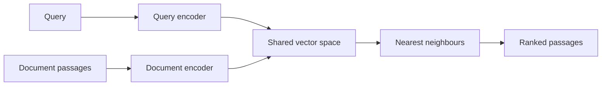
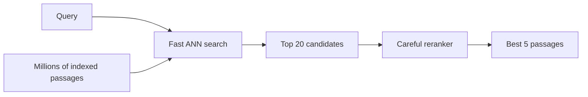

**Text search** returns a ranked list of existing passages. It does not write a new answer.

This is the first half of a text RAG system: find the evidence before asking a language model to explain it.

## Keyword search versus semantic search

Suppose the query is:

> How do I reset my password?

A useful policy says:

> To change your login credentials, open Settings.

The meaning matches, but many words do not.

| Search type | What it matches | Strength | Weakness |
| --- | --- | --- | --- |
| Keyword (TF-IDF/BM25) | Exact or related words | Fast, clear, good for names and IDs | Can miss synonyms |
| Dense semantic | Meaning represented by vectors | Finds paraphrases | Can blur negation or numbers |
| Hybrid | Keyword + semantic scores | Covers both signals | Needs score tuning |

:::key
Use meaning when wording varies. Keep keyword signals when exact product codes, names, dates, or numbers matter.
:::

## How dense retrieval works

A **bi-encoder** encodes the query and documents separately into the same vector space.



Document vectors can be calculated once and reused. At request time, only the new query must be encoded.

Similarity is often measured with a dot product or cosine similarity:

```text
cosine_similarity(x, y) = (x · y) / (||x|| × ||y||)
```

A larger value means the vector directions are more similar.

## Fast search, careful reranking

Comparing a query exactly with millions of vectors can be too slow. **Approximate nearest-neighbour (ANN)** indexes such as FAISS or HNSW quickly find a strong candidate set.

Then a more careful **reranker** reads the query and each candidate together.



Conceptual code:

```python
query = "How do I reset my password?"
query_vector = encoder.encode(query)

candidate_ids = index.search(query_vector, top_k=20)
ranked = reranker.rank(query, passages[candidate_ids])
context = ranked[:5]
```

The reranker would be too expensive over every passage, but it is practical over 20 or 50 candidates.

## How a retriever learns

During **contrastive training**:

- Pull a query closer to its correct passage.
- Push wrong passages farther away.
- Include **hard negatives**: wrong passages that look almost correct.

A random passage about gardening is easy to reject for a password query. A passage about changing an email address is a better training challenge because it is a near miss.

## How retrieval is measured

- **Precision** — Of the returned items, how many are useful?
- **Recall** — Of all useful items, how many were found?
- **Recall@K** — Did a correct item appear in the first K results?
- **F1** — A balance between precision and recall.

Common research benchmarks include **MS MARCO** for passage ranking, **BEIR** for testing across different domains, and **MTEB** for many embedding tasks.

## What goes wrong

### Chunking

A long document must usually be split.

- Too small: the chunk loses surrounding meaning.
- Too large: unrelated material weakens the match.

There is no universal best chunk size. Test it on real questions.

### Domain shift

A retriever trained on general web pages may perform poorly on medical, legal, or company-specific language.

### Negation and numbers

“Revenue grew” and “revenue did not grow” can look deceptively close as vectors. Hybrid search, reranking, and exact validation help.

### Relevant is not sufficient

A passage can discuss the same topic without answering the question. Evaluate whether results are **answer-bearing**, not merely similar.

## One-line summary

Text retrieval uses fast vector search to find candidates and an optional reranker to improve precision; hybrid signals protect exact words and numbers.

## Key terms

- **BM25** — Strong keyword-based ranking method.
- **Bi-encoder** — Encodes query and documents separately.
- **ANN** — Fast approximate vector lookup.
- **FAISS/HNSW** — Common vector-search technologies.
- **Reranking** — Careful second-pass scoring.
- **Hard negative** — A plausible but wrong training example.
