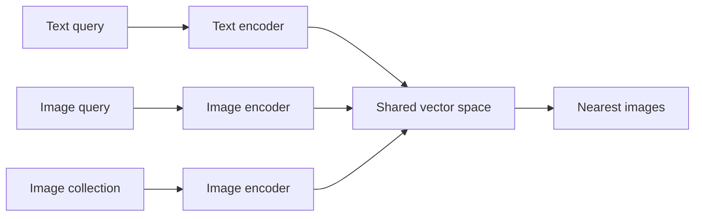
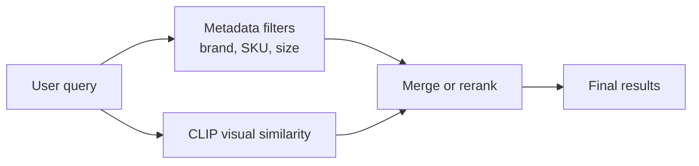

**Image search** finds matching images from a description or another image.

It is useful for product catalogs, stock-photo libraries, reverse image search, and content moderation.

## Two directions

### Text-to-image

The user types:

> Snow-capped mountains at sunset

The system returns matching images, even when nobody added that exact caption to them.

### Image-to-image

The user supplies a reference image. The system returns visually similar images.

Both directions can use the same image index. Only the query encoder changes.

## Why CLIP fits

CLIP learns with matched image-text pairs. Its image encoder and text encoder place both kinds of content in a **shared vector space**.



Because text and image vectors are comparable, a text description can search image vectors directly. The system does not need to write a caption for every image first.

:::key
Text search and image search can reuse the same ANN indexing pattern. The important difference is which encoders create the vectors.
:::

## A simple flow

Before search:

1. Encode every catalog image.
2. Save each vector with the image ID.
3. Build the ANN index.

For each user query:

```python
query_vector = clip.encode_text(
    "black waterproof hiking backpack with side pockets"
)
image_ids = image_index.search(query_vector, top_k=10)
return catalog.images(image_ids)
```

For image-to-image search, replace `encode_text` with the image encoder.

## Exact filters can still matter

A shared embedding is good at broad visual meaning. It may not reliably preserve an exact SKU, size, brand, or every spatial detail.

For product search, combine signals:



For example, filter by `brand = Acme` and then rank the remaining images by similarity to “red waterproof backpack.”

## How image retrieval is measured

Common benchmarks include **Flickr30K** and **MS COCO**.

- **Recall@1** — Is the correct result first?
- **Recall@5** — Is it anywhere in the first five?
- **Recall@10** — Is it anywhere in the first ten?

If 80 of 100 queries find their correct image in the first five, Recall@5 is 80%.

Benchmark scores depend on the model, data, direction, and test rules. Compare systems under the same protocol.

## What goes wrong

### Fine detail

“A red car” is easier than “the small red sedan facing left in the third row.”

### Compositional queries

A request with colour, object type, direction, position, and relation may lose one or more constraints in a single vector.

### Long descriptions

Very detailed queries can exceed what the text encoder learned to represent well.

### Bias

The training data and searchable collection affect which images appear “most relevant.” Test different cultures, environments, and long-tail examples.

### Similar is not identical

Image-to-image retrieval may focus on background, colour, or style instead of the specific object feature the user intended.

Controls include metadata filters, reranking, user feedback, and task-specific evaluation.

## One-line summary

CLIP-style image search compares text and images in one vector space, while filters and reranking protect exact or fine-grained requirements.

## Key terms

- **Text-to-image retrieval** — Find images using words.
- **Image-to-image retrieval** — Find images using a reference image.
- **Shared vector space** — Comparable representations for different content types.
- **Cross-modal retrieval** — Search one modality with another.
- **Recall@K** — Whether the correct result appears in the top K.
