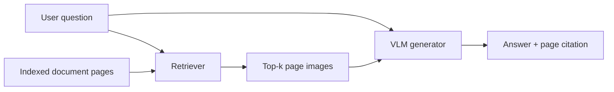
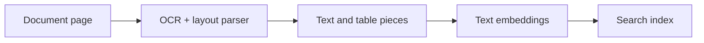

The last two lessons searched passages and photographs. This lesson tackles the messier thing most organisations actually need to search: **real documents** — reports, forms, manuals, invoices.

## Intuition

### A document is not a bag of words

Open any annual report and look at what carries the meaning:

- A financial answer may live only in a **chart**, never written out in a sentence.
- A **table** means what it means because of which row and column a number sits in.
- A technical manual may explain a connection with a **diagram** and nothing else.
- A **form** uses boxes and nearby labels to show which value belongs to which field.

Every one of those depends on **position**. Move the number out of its cell and it stops meaning anything.

### Where the traditional pipeline loses

The standard approach is to run OCR, pull the text out, and search that text. The trouble is what OCR produces: a stream of words with the layout stripped off.

The number `73` was in the Q3 column of a revenue table. After extraction it is just `73`, floating in a list beside dozens of other numbers. The fact that made it an *answer* — its position — is gone.

This happens silently, during indexing, long before anyone asks a question. By the time retrieval runs, the evidence has already been destroyed and nothing downstream can tell.

:::note Analogy
Imagine photocopying an annual report with a machine that prints only the words and drops every chart, table border, and column break.

Technically the text survived. But "Q3" and "73" now sit in a list somewhere with no indication that they belonged to the same bar, and the diagram that explained the process is simply gone. Anyone reading that photocopy would struggle to answer questions the original answered easily.

That is what a traditional text-extraction pipeline does to a visually rich document — and it happens silently, before the retriever ever gets a chance.
:::

### The alternative

The other option is to stop extracting altogether: keep each page **as an image**, and let a vision-language model encode it directly. Charts, tables, and layout stay intact because nothing was pulled apart.

Neither approach wins everywhere, which is why the rest of this lesson is about choosing between them.

## Retriever plus generator

A multimodal document QA system has two main components:



The retriever chooses the evidence. The vision-language model (VLM) reads it and writes the answer.

## Two document retrieval strategies

### Strategy A: Parse, then embed

1. Run OCR.
2. Detect layout and tables.
3. Extract text or structured pieces.
4. Embed those pieces.
5. Search the resulting vectors.



This is a sensible starting point for clean, mostly textual documents. It supports exact term matching and can be cheaper.

### Strategy B: Retrieve in vision space

1. Render each page as an image.
2. Encode the complete page with a vision-language model.
3. Search page representations directly.


This preserves charts, tables, text, and layout together. It avoids making OCR and layout parsing the only path to the evidence.

| Consideration | Parse then embed | Vision-space retrieval |
| --- | --- | --- |
| Clean native text | Strong choice | Often unnecessary |
| Exact keyword matching | Easy to include | May need a separate text path |
| Charts and unusual layouts | Parsing may lose structure | Preserves the original page |
| Compute and index size | Usually lower | Usually higher |
| Pipeline | Several extraction steps | Simpler core retrieval path |

:::key
Choose the least complicated strategy that preserves the evidence your questions need.
:::

## Chunking still matters

The retrieval unit might be a document, page, passage, or visual region.

- **Too small** — loses relationships and surrounding context.
- **Too large** — mixes unrelated content and weakens precision.
- **Page-level** — simple and naturally preserves page identity.
- **Region-level** — more precise, but may separate a chart from its legend.

Always save document ID and page number. The system must answer “which page supports this?”, not only “which file seems related?”

## The generation step

Give the VLM:

1. The original question.
2. Retrieved page images, extracted text, or both.
3. Clear grounding and citation rules.

```text
Use only the retrieved pages as evidence.
For every numeric claim, cite the page and chart or table region.
If the answer is unsupported, say:
"Not found in the retrieved documents."
```

Allowing the model to **abstain** is safer than forcing an answer.

## Worked example

Question:

> What was Q3 revenue growth over Q2?

The retriever finds a report page with this chart data:

```text
Q1: 42
Q2: 50
Q3: 73
Q4: 68
```

The VLM identifies Q2 and Q3. Deterministic code can calculate:

```python
q2, q3 = 50, 73
growth_percent = (q3 - q2) / q2 * 100  # 46%
```

Grounded answer:

> Q3 revenue grew 46% over Q2, using values 50 and 73 from the bar chart on page 7.

Separating visual reading from arithmetic makes both steps easier to verify.

## What goes wrong

- **Retrieval failure** — the correct page is absent from top-k.
- **Generator failure** — the right page is present, but the model ignores it.
- **Distracting context** — a related but unhelpful page misleads the model.
- **Decorative citation** — a cited page does not support the claim.
- **Multi-page reasoning** — the answer needs two pages, but only one is found or combined correctly.

Better prompting cannot repair a missing page. Diagnose retrieval and generation separately.

## One-line summary

Document RAG can parse pages into text or search page images directly; the right choice depends on whether visual layout carries the answer.

## Key terms

- **OCR** — Reads text from an image.
- **Parse-then-embed** — Extract document pieces before embedding.
- **Vision-space retrieval** — Search page-image representations directly.
- **Top-k** — The first k retrieved results.
- **Abstention** — Explicitly decline when evidence is insufficient.
- **Faithfulness** — Whether evidence truly supports the answer.
