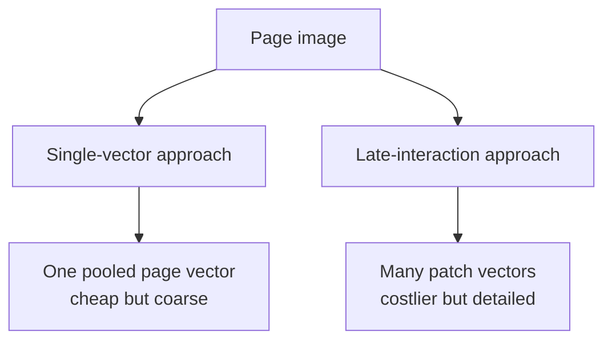
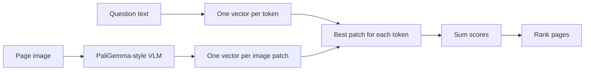

In the previous lesson, each document page was turned into **one vector** and stored in a search index. That works, it is cheap, and for most pages it is enough.

This lesson is about the cases where it is not enough — and about the technique, **late interaction**, that fixes them.

## Intuition

### The problem, with a real page in front of you

Picture a single page from an annual report. It contains a heading, two paragraphs, a bar chart with quarterly figures, and a small table of regional totals in the corner.

Now that whole page gets compressed into one vector — say 768 numbers that represent "what this page is about."

Those 768 numbers have to describe everything on the page at once. Inevitably they end up describing the page's **main themes**: revenue, quarterly performance, this company, this year. The small table in the corner contributes almost nothing to the result, because it is a tiny part of a busy page.

So when a user asks:

> What was the regional total for the South in Q3?

the page that genuinely holds the answer does not stand out. Its one vector says "this page is about quarterly revenue," which is true of forty other pages in the report. The evidence is on the page; the *summary* of the page lost it.

:::note Analogy
Summarising a page into one vector is like describing a 300-page book with a single sentence. "A novel about family and money in 19th-century Russia" is accurate, and it is hopeless for finding the paragraph where a specific character signs a specific contract.

Late interaction keeps the equivalent of a sentence-level index. When someone asks about that contract, the search can go straight to the paragraph rather than judging the whole book by its one-line summary.

The cost is exactly what you would expect: a detailed index takes far more room than a one-line summary.
:::

### The fix: stop summarising so early

**Late interaction** takes a different approach. Instead of one vector per page, it keeps **many** — roughly one for each small patch of the page image. The corner table gets its own vectors, and they are not averaged away into the page's general theme.

The query is broken up in the same way: one vector per query token rather than one for the whole question.

Matching then happens between those small pieces, at search time.

### Why it is called "late"

The name describes **when** the query and the document are allowed to interact.

| Approach | When query and page meet | Consequence |
| --- | --- | --- |
| **Early interaction** | The model reads query and page *together* before scoring | Very accurate, far too slow to run over a million pages |
| **No interaction** (single vector) | Never — each side is summarised alone, then two vectors are compared | Very fast, loses local detail |
| **Late interaction** | Each side is encoded alone, then the *pieces* are matched at search time | Keeps detail, still fast enough to index |

Late interaction is the middle path. The encoders still run separately, so you can index every page in advance — but the detailed comparison is postponed until you know the query, instead of being thrown away during indexing.

:::key
One vector per page summarises the page before it knows the question. Late interaction keeps the page in pieces so the question can pick out the piece that matters.
:::

## One vector versus many



A text query also becomes multiple vectors—roughly one per query token.

Each query token can then match the page region that best fits it.

## A simple example

Query:

> Q3 revenue growth

Different parts may match different page regions:

- `Q3` → the Q3 label below a bar
- `revenue` → the chart title
- `growth` → the comparison between Q2 and Q3

A single page vector must blend all page content together. Local patch vectors let these query parts find separate evidence.

## The late-interaction score

Let:

- `qᵢ` = one query-token vector. The small `i` identifies the query token.
- `dⱼ` = one page-patch vector. The small `j` identifies the page patch.

For every query token:

1. Compare it with every document patch.
2. Keep its best patch score.
3. Add all those best scores.

```text
Page score
  = best patch score for query token 1
  + best patch score for query token 2
  + ... 
  + best patch score for the final query token
```

The compact mathematical form is:

```text
Score(Q, D) = Σᵢ maxⱼ(qᵢ · dⱼ)
```

- `Q` = all query-token vectors
- `D` = all page-patch vectors
- `·` = dot product, a similarity score
- `maxⱼ` = keep the highest-scoring page patch for this query token
- `Σᵢ` = add the best scores from all query tokens

### Tiny numeric example

The query has two tokens: **Q3** and **revenue**.

```text
Best patch score for "Q3"      = 0.82
Best patch score for "revenue" = 0.74

Page score = 0.82 + 0.74 = 1.56
```

The page with the larger final score is ranked higher.

Conceptual code:

```python
def late_interaction_score(query_vectors, page_vectors):
    total = 0
    for query_token in query_vectors:
        patch_scores = query_token @ page_vectors.T
        total += patch_scores.max()
    return total
```

This explains the name: the encoders work separately first; detailed query-page interaction happens later.

## From ColBERT to ColPali

**ColBERT** popularised late interaction for text retrieval. **ColPali** applies the idea to complete document-page images.



The published ColPali design:

- Starts from a pretrained PaliGemma vision-language backbone.
- Adds a linear projection to compact vectors such as 128 dimensions.
- Produces query-token and page-patch vectors.
- Fine-tunes on `(query, page image)` pairs.
- Uses a contrastive objective to score correct pages above wrong pages.

No OCR is required for its **core retrieval representation**. OCR may still help with exact text lookup, display, filtering, or verification in a production system.

## Training intuition

Suppose a batch contains correct query-page pairs.

- Increase the score of each correct pair.
- Decrease scores for mismatched pages.
- Pay special attention to the hardest wrong page in the batch.

This teaches the model what a page that actually answers a question looks like—not merely which pages share similar words.

## Why the approach is useful

- Preserves page layout.
- Keeps charts, tables, images, and text together.
- Avoids brittle OCR/layout extraction in the main retrieval path.
- Allows fine-grained matching against local page areas.
- Simplifies offline indexing compared with pipelines containing many parsers.

The lecture notes report that query-time matching can remain fast with suitable indexing, while offline indexing is simpler than several traditional pipelines. Actual latency depends on hardware, page resolution, index design, and corpus size.

## The cost

One page represented by hundreds of patch vectors needs much more storage than one page represented by one vector.

| Representation | Detail | Index size | Search cost |
| --- | --- | --- | --- |
| One vector per page | Lower | Smaller | Lower |
| Many patch vectors per page | Higher | Larger | Higher |

This is the main trade-off: **local detail versus storage and compute**.

## ViDoRe

**ViDoRe** evaluates visual document retrieval across domains, languages, layouts, and visual styles. It contains visually rich PDF pages and asks systems to rank the page that answers each query.

The main metric highlighted in the lecture is **nDCG@5**:

- Correct pages near rank 1 receive more credit.
- Correct pages below the first few results receive less credit.
- The score reflects the order users and generators actually see.

Reported comparisons in the ColPali work show the direction:

1. BM25 over OCR text is a baseline.
2. Dense text embeddings over OCR improve it.
3. ColPali-style vision-space retrieval performs strongly on visually rich pages.

Treat paper results as benchmark evidence, not a guarantee for every private document collection.

## What goes wrong

- **Reaching for ColPali by default.** It earns its cost on visually rich pages. On a clean text document, single-vector retrieval is cheaper and usually just as good — the extra detail has nothing to preserve.
- **Underestimating the index.** Hundreds of vectors per page instead of one is a hundredfold difference in storage. Estimate it against your real corpus size before committing, not after.
- **Assuming no OCR is needed anywhere.** ColPali removes OCR from the *retrieval* path. You may still want it for exact term filtering, for displaying the text, or for verifying a number after the page is found.
- **Expecting it to rescue unreadable pages.** If a figure is too small or blurry for a person to read, patch vectors will not recover it either.
- **Stopping at retrieval.** Finding the right page is not answering the question. The generator can still misread the chart it was handed, and multi-page questions remain hard.

## One-line summary

ColPali searches complete page images with late interaction, matching each query token to its best page patch for more detail at a higher storage cost.

## Key terms

- **Late interaction** — Fine-grained matching after separate encoding.
- **Patch** — Small image region represented by a vector.
- **ColBERT** — Late-interaction text retriever.
- **ColPali** — Late-interaction visual document retriever.
- **ViDoRe** — Visual document retrieval benchmark.
- **nDCG@5** — Ranking score that rewards useful pages near the top five.
