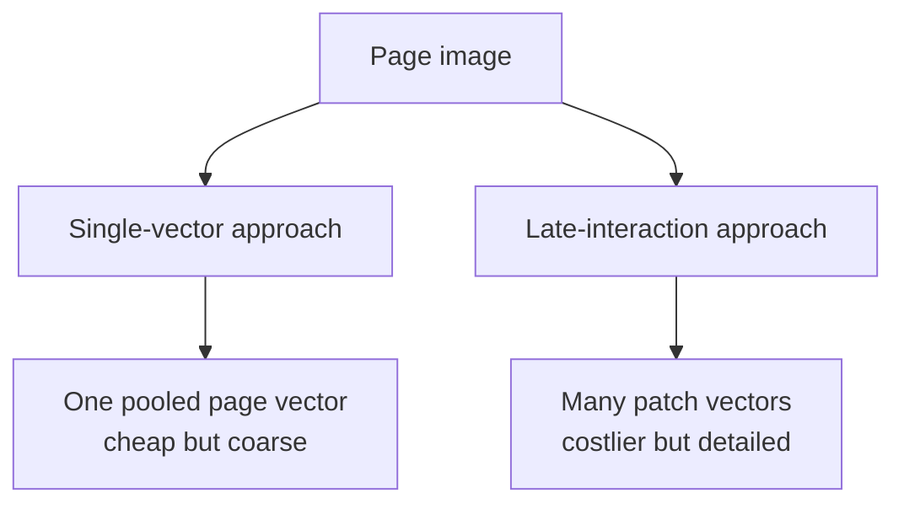
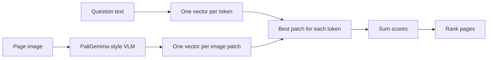

Compressing a complete document page into one vector is fast, but it can hide a tiny number in a table or a small label beside a chart.

**Late interaction** keeps many small vectors and delays detailed matching until search time.

## One vector versus many



A text query also becomes multiple vectors—roughly one per query token.

Each query token can then match the page region that best fits it.

## A simple example

Query:

> Q3 revenue growth

Different parts may match different page regions:

- `Q3` → the Q3 label below a bar
- `revenue` → the chart title
- `growth` → the comparison between Q2 and Q3

A single page vector must blend all page content together. Local patch vectors let these query parts find separate evidence.

## The late-interaction score

Let:

- `qᵢ` = one query-token vector. The small `i` identifies the query token.
- `dⱼ` = one page-patch vector. The small `j` identifies the page patch.

For every query token:

1. Compare it with every document patch.
2. Keep its best patch score.
3. Add all those best scores.

```text
Page score
  = best patch score for query token 1
  + best patch score for query token 2
  + ... 
  + best patch score for the final query token
```

The compact mathematical form is:

```text
Score(Q, D) = Σᵢ maxⱼ(qᵢ · dⱼ)
```

- `Q` = all query-token vectors
- `D` = all page-patch vectors
- `·` = dot product, a similarity score
- `maxⱼ` = keep the highest-scoring page patch for this query token
- `Σᵢ` = add the best scores from all query tokens

### Tiny numeric example

The query has two tokens: **Q3** and **revenue**.

```text
Best patch score for "Q3"      = 0.82
Best patch score for "revenue" = 0.74

Page score = 0.82 + 0.74 = 1.56
```

The page with the larger final score is ranked higher.

Conceptual code:

```python
def late_interaction_score(query_vectors, page_vectors):
    total = 0
    for query_token in query_vectors:
        patch_scores = query_token @ page_vectors.T
        total += patch_scores.max()
    return total
```

This explains the name: the encoders work separately first; detailed query-page interaction happens later.

## From ColBERT to ColPali

**ColBERT** popularised late interaction for text retrieval. **ColPali** applies the idea to complete document-page images.



The published ColPali design:

- Starts from a pretrained PaliGemma vision-language backbone.
- Adds a linear projection to compact vectors such as 128 dimensions.
- Produces query-token and page-patch vectors.
- Fine-tunes on `(query, page image)` pairs.
- Uses a contrastive objective to score correct pages above wrong pages.

No OCR is required for its **core retrieval representation**. OCR may still help with exact text lookup, display, filtering, or verification in a production system.

## Training intuition

Suppose a batch contains correct query-page pairs.

- Increase the score of each correct pair.
- Decrease scores for mismatched pages.
- Pay special attention to the hardest wrong page in the batch.

This teaches the model what a page that actually answers a question looks like—not merely which pages share similar words.

## Why the approach is useful

- Preserves page layout.
- Keeps charts, tables, images, and text together.
- Avoids brittle OCR/layout extraction in the main retrieval path.
- Allows fine-grained matching against local page areas.
- Simplifies offline indexing compared with pipelines containing many parsers.

The lecture notes report that query-time matching can remain fast with suitable indexing, while offline indexing is simpler than several traditional pipelines. Actual latency depends on hardware, page resolution, index design, and corpus size.

## The cost

One page represented by hundreds of patch vectors needs much more storage than one page represented by one vector.

| Representation | Detail | Index size | Search cost |
| --- | --- | --- | --- |
| One vector per page | Lower | Smaller | Lower |
| Many patch vectors per page | Higher | Larger | Higher |

This is the main trade-off: **local detail versus storage and compute**.

## ViDoRe

**ViDoRe** evaluates visual document retrieval across domains, languages, layouts, and visual styles. It contains visually rich PDF pages and asks systems to rank the page that answers each query.

The main metric highlighted in the lecture is **nDCG@5**:

- Correct pages near rank 1 receive more credit.
- Correct pages below the first few results receive less credit.
- The score reflects the order users and generators actually see.

Reported comparisons in the ColPali work show the direction:

1. BM25 over OCR text is a baseline.
2. Dense text embeddings over OCR improve it.
3. ColPali-style vision-space retrieval performs strongly on visually rich pages.

Treat paper results as benchmark evidence, not a guarantee for every private document collection.

## What remains difficult

- Large late-interaction indexes
- Tiny or blurry page content
- Messy documents outside training data
- Questions needing several pages or documents
- Faithfulness of the final generated answer
- Standard evaluation of claim-level evidence

## One-line summary

ColPali searches complete page images with late interaction, matching each query token to its best page patch for more detail at a higher storage cost.

## Key terms

- **Late interaction** — Fine-grained matching after separate encoding.
- **Patch** — Small image region represented by a vector.
- **ColBERT** — Late-interaction text retriever.
- **ColPali** — Late-interaction visual document retriever.
- **ViDoRe** — Visual document retrieval benchmark.
- **nDCG@5** — Ranking score that rewards useful pages near the top five.
