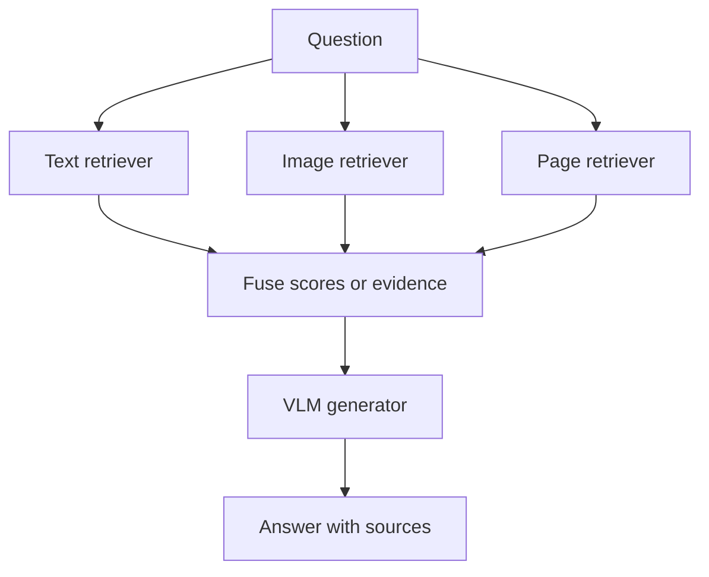
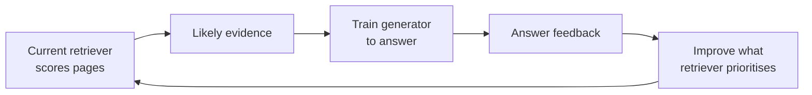

A good multimodal RAG system is not simply “a VLM plus a vector database.”

You must decide:

- What evidence to retrieve
- How to store and combine it
- How the model should reason over it
- How to train the components
- How to detect failure

## What can be retrieved?

| Retrieval family | Typical evidence |
| --- | --- |
| Text-centric | Passages, captions, OCR text |
| Vision-centric | Photos, diagrams, reference images |
| Video-centric | Frames, clips, events over time |
| Document and layout | Complete pages containing text, tables, charts, and layout |

Choose based on the evidence—not because one model is fashionable.

## Where it is used

- Knowledge-seeking QA and fact checking
- Document summaries and visual storytelling
- Medical question answering and report support
- Product and style search
- Software documentation and code assistance
- Video QA, driving assistance, and geolocation

These examples have different safety needs. A wrong stock-photo result is inconvenient; an unsupported medical or driving answer can be dangerous and needs stronger validation and human control.

## Three ways to combine evidence

### Score fusion

Search different indexes and combine their normalized scores.

```text
combined_score
  = alpha × text_score
  + (1 - alpha) × image_score
```

This keeps specialist retrievers and makes their influence visible.

### Attention-based fusion

The generator uses attention to focus on useful parts of retrieved text, images, or tables for the current question.

### Unified representation

Project several modalities into one shared space before generation. Some systems also turn images into captions, or preserve both images and captions.



## Reasoning over retrieved evidence

Useful patterns include:

- **Retrieved examples** — show similar solved examples in the prompt.
- **Step decomposition** — split a complex question into smaller searches and checks.
- **Instruction tuning** — teach the model when to retrieve, judge relevance, answer, or abstain.
- **Source attribution** — connect each claim to a page or region.

A citation at the end of a paragraph is weak. A link from each important claim to the exact supporting chart, table, or page region is easier to inspect.

## How systems are trained

### Alignment

Contrastive learning pulls a query toward its correct evidence and pushes wrong evidence away. Hard negatives teach fine distinctions.

### Generation

For text answers, the generator usually learns by predicting the next correct token.

### Robustness

Training can deliberately include irrelevant retrieved pages. The model learns that top-k content is not automatically trustworthy.

### Retriever and generator together

The correct supporting page is not always labelled. It can be a hidden choice:



This resembles an alternating process:

1. Use the current system to choose likely evidence.
2. Update the model to make the right answer more likely with that evidence.
3. Repeat.

In practice, many teams use a simpler staged approach: train the retriever and generator separately, then tune them together for the task if the benefit justifies the cost.

## Evaluate two systems, not one

Split diagnosis into:

### Retrieval quality

- Was the correct evidence in top-k?
- Was it near the top?
- Did chunking preserve enough context?
- Were exact names, negation, and numbers handled?

Useful metrics: Recall@K and nDCG@K.

### Answer quality

- Is the answer correct?
- Does every claim follow from retrieved evidence?
- Are citations accurate?
- Does the system abstain when evidence is missing?
- Can it combine multiple pages correctly?

:::key
High Recall@5 does not guarantee a faithful answer. A correct page can be retrieved and then misunderstood or ignored.
:::

## Choose the simplest fitting strategy

| Data and question | Good starting point | Why |
| --- | --- | --- |
| Mostly plain text | Text or hybrid RAG | Visual complexity adds little |
| Products or photos | CLIP-style image search | Shared image-text space fits |
| Reports, forms, charts | Multimodal document RAG | Layout may carry the answer |
| High-stakes numeric/legal QA | Retrieval + exact citations + validation | Claims must be verified |

## Practical safety checklist

1. Keep document and page identity in the index.
2. Test retrieval and generation separately.
3. Include difficult negatives, negation, and exact numbers.
4. Require evidence-linked answers.
5. Permit “not found” instead of forcing a guess.
6. Validate important calculations with code.
7. Send uncertain high-risk answers to a person.
8. Test messy, multilingual, multi-page, and out-of-domain documents.

## Mini design lab

Scenario:

> Build QA over annual reports containing paragraphs, tables, and charts.

A reasonable design:

1. Use hybrid text search for exact company names and values.
2. Use page-image retrieval to preserve charts and layout.
3. Merge or rerank candidates.
4. Send the top pages and question to a VLM.
5. Require page and region citations.
6. Extract numeric values, validate units, and calculate with code.
7. Abstain or route to review if evidence conflicts.

This design keeps both exact text and visual evidence instead of forcing one representation to do every job.

## Final recap

- Text search finds passages by words, meaning, or both.
- Image search uses a shared image-text vector space.
- Multimodal RAG retrieves visual and textual evidence before generation.
- Vision-space retrieval preserves page layout.
- Late interaction retains local detail but creates larger indexes.
- Retrieval grounding reduces hallucination; it does not eliminate it.
- Evaluate retrieval, answer correctness, and evidence support separately.

## One-line summary

Design multimodal RAG around the evidence and failure risk, then measure retrieval and grounded generation as separate parts of one pipeline.

## Key terms

- **Score fusion** — Combine scores from different retrievers.
- **Cross-attention** — Let one representation select useful parts of another.
- **Contrastive learning** — Pull correct pairs together and wrong pairs apart.
- **Robustness training** — Train with distractions or noise.
- **Latent variable** — A hidden choice, such as which page supports an answer.
- **Source attribution** — Link answer claims to exact evidence.
