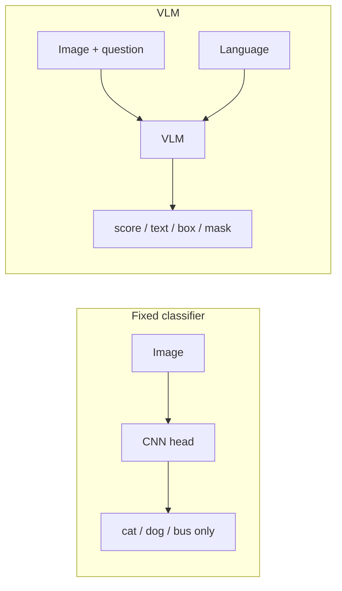
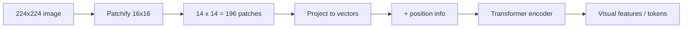
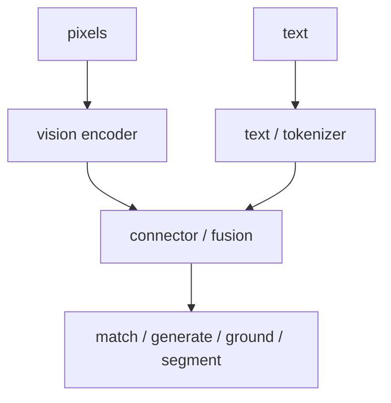

A **vision-language model (VLM)** connects what an image shows with what language can ask, describe, or decide about it.

Big picture: a VLM turns **pixels** into a representation that a downstream part can use to **match**, **describe**, **ground**, or **segment** visual content.

## Intuition

Old computer vision often worked like a **fixed multiple-choice test**:

- Train on labels: cat, dog, bus
- Want a new label? Collect data and retrain

VLMs work more like a **conversation about a photo**. You can ask in plain words — even about ideas the model never saw as a formal class name.

At every model in this chapter, ask three questions:

1. **What enters the model?** (image, text, prompt, box…)
2. **Where do image and text meet?** (similarity score, shared token sequence, adapter…)
3. **What comes out?** (score, caption, box, mask…)



:::key
A VLM is not defined only by having an image encoder. Identify the visual representation, the connector, the training goal, and the output type.
:::

## How it works

### What a VLM takes in and produces

**Inputs** can include:

- One or more images
- A caption, question, instruction, or spatial prompt (point, box)

**Outputs** may be:

- A similarity score
- A class-like label
- Free-form text
- Bounding boxes
- Pixel masks

**Multimodal** simply means the model handles more than one kind of information — here, pixels and text together.

**Walk the street-photo example step by step:**

1. Input: photo of a street + question *“Which vehicle is closest to the pedestrian?”*
2. Vision side must see: cars, pedestrian, distances
3. Language side must parse: *closest*, *vehicle*, *pedestrian*
4. Output might be text (*“The white sedan on the left”*) or a box around that car — depending on the model family

Same photo, different **output contracts** in later lessons: CLIP scores text matches; LLaVA writes an answer; Qwen-VL may add a box; SAM returns a mask if you click the car.

### Why multimodal AI became practical

Three forces came together:

| Force | Why it helped |
| --- | --- |
| **Web-scale image–text pairs** | Images with alt text, captions, filenames, or nearby page text — noisy but huge |
| **Transformers** | Same attention idea for text tokens **and** image-patch tokens |
| **Real demand** | Search, accessibility, robotics, agents, medical imaging, moderation, creative tools |

Important caveat: web data is abundant but **noisy and biased**. Scale gives coverage, not automatic truth or fairness.

Think of it like learning from billions of photo albums with messy captions — great for breadth, still needs careful use in production.

### Vision Transformer (ViT): the visual front end

A **ViT** (Vision Transformer) treats an image like a sentence made of small patches instead of words.

Steps:

1. **Patchify** — split an image of height **H** and width **W** into **P × P** patches. Patch count = `(H/P) × (W/P)`.
2. **Flatten and project** — turn each patch into a vector (hidden size).
3. **Add position info** — self-attention alone does not know top-left from bottom-right.
4. **Optional [CLS] token** — one summary token for the whole image; patch tokens keep local detail for grounding or segmentation.
5. **Transformer encoder** — self-attention + MLP blocks over the patch sequence.

**Simple math behind the patch count**

You do not need heavy formulas. Just count grid cells:

- Image: **224 × 224** pixels
- Patch size: **16 × 16**
- Patches per side: `224 / 16 = **14**`
- Total patch tokens: `14 × 14 = **196**` (before any special token like [CLS])

Each patch is one “word” of the image. A bigger image → more patches → more tokens → more compute in later models.



Tiny code sketch (concept only):

```python
# image: [batch, channels, height, width]
patches = split_into_patches(image, patch_size=16)   # 196 patches for 224x224
tokens = linear_projection(flatten(patches))
tokens = tokens + positional_embeddings              # where each patch lived
visual_features = vision_transformer(tokens)
```

Read the lines as the story: **cut → number → embed → remember position → encode**.

### Four architectural paradigms

| Paradigm | How image and text interact | Best for | Example |
| --- | --- | --- | --- |
| **Contrastive** | Two encoders; meet at a similarity score | Retrieval, zero-shot labels | CLIP |
| **Generative / instruction** | Visual tokens inside an LLM sequence | Chat, explanation, reasoning | LLaVA |
| **Grounded generative** | Compressed visual tokens + coordinate text | OCR, localization, multi-image | Qwen-VL |
| **Promptable dense prediction** | Prompt guides a spatial decoder | Segmentation, interactive vision | SAM |

Same eyes (ViT), different **what happens next**.

### The generic anatomy of a VLM

Reusable pipeline:

`pixels → vision encoder → connector / fusion → consumer → output`

| Part | Job |
| --- | --- |
| **Vision encoder** | Pixels → features or visual tokens (CNN or ViT) |
| **Text encoder / tokenizer** | Language → tokens or text embedding |
| **Connector / fusion** | Align or mix modalities (projection, cross-attention, shared space) |
| **Consumer** | Retrieve, generate language, localize, or produce masks |

Where fusion happens matters:

- **CLIP** — fusion only at the final similarity score
- **LLaVA** — visual tokens sit inside the LLM token sequence
- **Qwen-VL** — position-aware adapter + special text tokens
- **SAM** — prompt and image meet inside the mask decoder



**Final mental model:** to understand any VLM, name the visual representation, the fusion point, the training objective, and the output contract.

## What goes wrong

- Treating “has a ViT” as enough — the **output contract** (score vs essay vs box vs mask) defines the model family.
- Assuming web-scale training data is automatically fair or truthful.
- Forgetting positional information — without it, patch order is lost and spatial reasoning breaks.

## One-line summary

VLMs connect images and language through a vision encoder, a fusion point, and a consumer that produces scores, text, boxes, or masks.

## Key terms

- **VLM** — Vision-language model; links visual inputs with language inputs or outputs.
- **Modality** — A type of input/output (image, text, audio, video).
- **ViT** — Vision Transformer; image patches as a token sequence.
- **Patch / patchify** — A small image region treated as one visual token.
- **Positional embedding** — Tells attention where a token came from in the image or text.
- **Output contract** — What the model promises to produce (score, text, box, mask).
