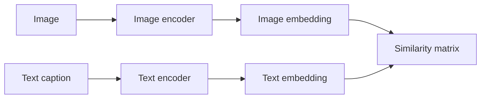
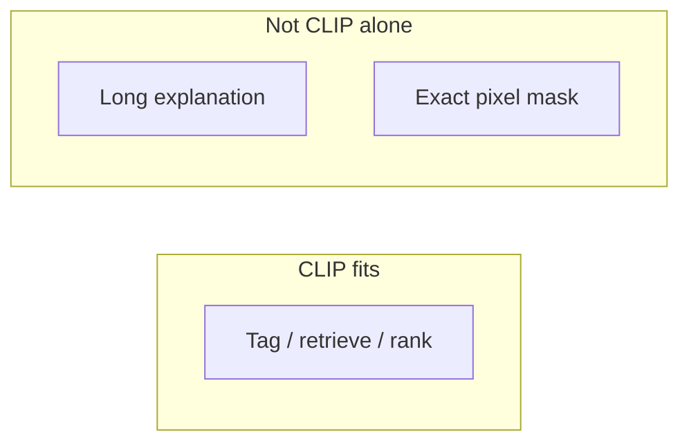

**CLIP** learns a shared space where a matching image and caption sit close together, and unrelated pairs sit far apart.

Plain sentence: CLIP answers *“Does this text describe this image?”* — not *“Write me a paragraph about this image.”*

## Intuition

A fixed classifier needs a new labeled head for every new category. CLIP can use a **text description as the label at test time**, so you can classify new categories without retraining on those labels.

Picture two separate encoders — one for images, one for text — meeting in a **shared embedding room**:

- Matching image + caption → stand close together
- Wrong pairings → pushed apart

That is **contrastive** learning: learn by comparison, not by memorizing one correct essay per image.

:::key
Choose CLIP when the main output is *which text matches this image?* Choose a generative VLM when you need an explanation or dialogue.
:::

## How it works

### Dual-encoder architecture

| Tower | What it does |
| --- | --- |
| **Image tower** | ResNet or ViT → one global image feature → project to shared dimension |
| **Text tower** | Transformer + BPE tokenizer → text representation (often from an end-of-sequence position) |

The towers do **not** do token-by-token cross-attention during encoding. Each modality is encoded independently — efficient for large-scale retrieval.



### The batch matrix — walk it once

**Batch picture:** 4 images and 4 captions → a **4 × 4** similarity matrix.

|  | Caption 0 | Caption 1 | Caption 2 | Caption 3 |
| --- | --- | --- | --- | --- |
| **Image 0** | ✓ match | ✗ negative | ✗ negative | ✗ negative |
| **Image 1** | ✗ | ✓ | ✗ | ✗ |
| **Image 2** | ✗ | ✗ | ✓ | ✗ |
| **Image 3** | ✗ | ✗ | ✗ | ✓ |

- The **diagonal** = intended image–caption pairs (4 positives)
- The other **12 cells** = **in-batch negatives** (free wrong pairings from the same batch)

Training job for image 0’s row: *“Which caption belongs to me?”* — caption 0 should win the softmax.

### Contrastive objective (InfoNCE intuition)

Core idea — two symmetric tasks:

1. For each **image**, pick which caption in the batch is its partner.
2. For each **caption**, pick which image in the batch is its partner.

Steps in plain words:

- Normalize image and text embeddings (dot product ≈ cosine similarity).
- Divide by a learnable **temperature** `τ` — smaller `τ` makes the softmax sharper (punishes near-ties harder).
- Loss = average of image→text cross-entropy **and** text→image cross-entropy.

Formula sketch: `s_ij = (image_i · text_j) / τ`

**Tiny score example** for one dog image row:

| Caption | Score | After softmax intuition |
| --- | --- | --- |
| *“a photo of a dog”* | **0.91** | Should dominate |
| *“a photo of a bus”* | **0.18** | Should stay low |
| Other in-batch captions | lower | In-batch negatives |

Temperature intuition: `τ = 0.5` vs `τ = 0.05` — the smaller value makes the model punish “almost tied” scores much harder.

```python
image_features = image_encoder(images)
text_features = text_encoder(captions)
image_features = l2_normalize(project_image(image_features))
text_features = l2_normalize(project_text(text_features))
scores = image_features @ text_features.T / temperature
labels = torch.arange(batch_size)  # diagonal = correct pairs
loss = 0.5 * (
    cross_entropy(scores, labels) + cross_entropy(scores.T, labels)
)
```

**More negatives without changing the encoders?** Increase **effective batch size** (more GPUs, gradient accumulation, or feature queues). A batch of 256 gives 255 negatives per image instead of 3 in a batch of 4.

### Zero-shot classification

At inference — no new classifier head:

1. Encode the target image **once**.
2. Turn class names into sentences like *“a photo of a {label}”*.
3. Encode those sentences and compare to the image embedding.
4. Optional: softmax over similarities for a probability-like distribution.

**Walk a tiny example:**

- Classes: `dog`, `cat`, `bus`
- Prompts: *“a photo of a dog”*, *“a photo of a cat”*, *“a photo of a bus”*
- Image embedding is closest to the dog prompt → predict **dog**

**Prompt wording matters:** *“dog”* vs *“a photo of a dog”* can produce different text embeddings. Teams often **average** several templates.

| Method | What you train at test time |
| --- | --- |
| **Zero-shot** | Nothing on the target set — language defines classes |
| **Linear probing** | Freeze CLIP encoder; train a small labeled head on top |

### Strengths, uses, and limits

**Strengths:** open-vocabulary tagging, image–text retrieval, strong visual backbone, natural-language categories.

**Uses:** search, tagging, moderation, similarity ranking, guidance for image generation.

**Limits:** coarse semantics, weak counting and spatial relations, small text in images, prompt sensitivity, web-data bias, **no free-form explanation**.



## What goes wrong

- Expecting CLIP to write essays — it produces embeddings and similarity, not autoregressive text.
- Using one prompt template when another wording scores much higher.
- Treating zero-shot as perfect — domain shift and bias still matter.

## One-line summary

CLIP aligns image and text in a shared embedding space with a symmetric contrastive loss, enabling zero-shot classification from language-defined labels.

## Key terms

- **Dual encoder** — Separate image and text towers that meet at similarity.
- **Contrastive learning** — Match pairs close, non-matches far.
- **InfoNCE** — Contrastive loss: find the correct positive among many candidates.
- **In-batch negative** — A wrong image–caption pair from the same training batch.
- **Temperature (τ)** — Scales similarities before softmax; controls sharpness.
- **Zero-shot** — Task or class without target-dataset training examples.
