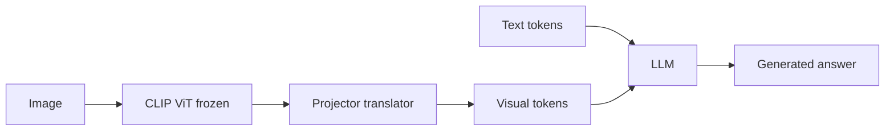

**LLaVA** teaches an existing language model to **read** image information by translating visual features into the LLM’s embedding space.

CLIP can say an image matches a caption. LLaVA can **answer open-ended questions** about what it sees.

## Intuition

Reuse two pretrained parts:

- A **frozen CLIP ViT** (eyes)
- An **LLM** (language brain — frozen in stage 1, trainable in stage 2)

Between them sits a lightweight **projector** — a translator, not the author of the final answer.

Sticky-note picture from Module 3:

- The **LLM** = the big textbook (language skills already there)
- The **projector** = the sticky note that says *“here is what the image means in your vocabulary”*
- The **CLIP encoder** = eyes that stay frozen while you teach the handoff

:::key
The projector maps visual features into language space. The LLM’s ordinary self-attention reads visual tokens alongside text tokens — no separate cross-attention module required.
:::

## How it works

### Architecture: vision encoder → projector → LLM

| Piece | Role |
| --- | --- |
| **Frozen CLIP ViT** | Patch-level visual features (not only one global vector) |
| **Projector** | Maps CLIP dimension → LLM word-embedding dimension |
| **LLM** | Self-attention over **visual + text tokens** in one sequence |

Same vector size is **not** enough — the spaces mean different things. Passing a CLIP vector directly into the LLM is like handing someone a word in a language they do not speak, even if the sentence is the same length.



### Two-stage training recipe

| Stage | What trains | Data | Goal |
| --- | --- | --- | --- |
| **1. Feature alignment** | Projector only | ~595K filtered image–caption pairs | Land visual tokens in LLM language space |
| **2. Instruction tuning** | Projector + LLM | ~158K GPT-4-generated visual instructions | Conversation, description, reasoning |

Vision encoder stays **frozen** in both stages.

**Stage 1 symptom and fix:**

- Symptom: LLM writes fluent text but **ignores the image**
- Fix: train the **projector** so CLIP features map into the LLM’s existing embedding geometry; keep both big backbones frozen

**Stage 2:** now teach *how to answer* — conversations, descriptions, reasoning.

**Loss:** Standard next-token cross-entropy on **assistant response tokens** only.

**Walk the training sequence once:**

```
[system prompt]
+ [256 visual tokens from projector]
+ [user: "What is unusual about this image?"]
+ [assistant: "The bicycle is on the roof of the bus."]
```

Loss is computed on the **assistant** tokens. The model learns what to say, not to parrot the user question.

```python
# Concept: only assistant tokens get loss
sequence = system + visual_tokens + user_question + assistant_answer
loss = next_token_cross_entropy(
    model(sequence),
    labels=mask_everything_except(assistant_answer),
)
```

### Instruction data from symbolic descriptions

Clever data trick — the generator does not need to see every pixel:

1. Start from images with captions and bounding boxes (e.g. COCO).
2. Convert caption + box info into **text-only symbolic prompts** (object names, positions).
3. Ask GPT-4 to write plausible visual instruction Q&A **from that text description alone**.
4. Three data types: **conversation**, **detailed description**, **complex reasoning**.

Example symbolic input (text only):

> *Image has: person, red umbrella at (120,80), wet street, overcast sky.*

GPT-4 might generate:

- *Q: What color is the umbrella? A: Red.*
- *Q: Does the scene look rainy? A: Yes, the street appears wet.*

Lower manual labeling cost; language supervision from structured metadata.

### LLaVA-1.5 and LLaVA-NeXT

**LLaVA-1.5 improvements:**

- 2-layer MLP + GELU projector (more capacity than one linear layer)
- Stronger academic VQA mix, length-control prompts, higher input resolution

**LLaVA-NeXT — AnyRes:**

- Split a **high-resolution** image into **tiles**
- Encode each tile separately
- Combine with a **downsampled global view**

Trade-off in plain numbers:

- One low-res view → **fewer** visual tokens → cheaper, may miss small text
- Global + tiles → **more** visual tokens → better OCR/charts, **more LLM compute**

```python
# Concept: high-res image -> global view + tile encodings -> many visual tokens
global_tokens = encode(resize(image, low_res))           # whole-scene context
tile_tokens = [encode(tile) for tile in split_into_tiles(image, high_res)]
visual_tokens = combine(global_tokens, tile_tokens)      # longer sequence
response = llm.generate(visual_tokens + text_tokens)
```

### Evaluation and limitations

| Benchmark | What it probes |
| --- | --- |
| **LLaVA-Bench** | Open-ended quality (often GPT-4-as-judge) |
| **ScienceQA** | Reasoning with diagrams |
| **VQAv2 / GQA** | Visual question answering |
| **POPE** | Object **hallucination** — claiming objects that are absent |

**Limits:** hallucination, detail loss at low resolution, weak precise localization and counting, blind spots from the **frozen CLIP** encoder.

POPE in plain words: show an image **without** a horse; ask *“Is there a horse?”* — a careful model should say no. A sloppy one hallucinates objects to please the question.

## What goes wrong

- Passing CLIP vectors directly into the LLM without a projector — equal dimension ≠ equal meaning.
- Unfreezing everything in stage 1 — that is not feature alignment.
- Expecting LLaVA-NeXT-level OCR without paying the token/compute cost of tiling.

## One-line summary

LLaVA maps CLIP patch features through a projector into an LLM’s token sequence so the model can chat about images.

## Key terms

- **Projector** — Learned map from vision feature space to LLM embedding space.
- **Visual token** — A vector representing image regions inside the LLM sequence.
- **Feature alignment** — Stage 1: teach the projector, not the whole LLM.
- **Instruction tuning** — Train on instructions and target responses.
- **AnyRes** — High-res tiling plus global view (LLaVA-NeXT).
- **Hallucination** — Model claims content not supported by the image.
