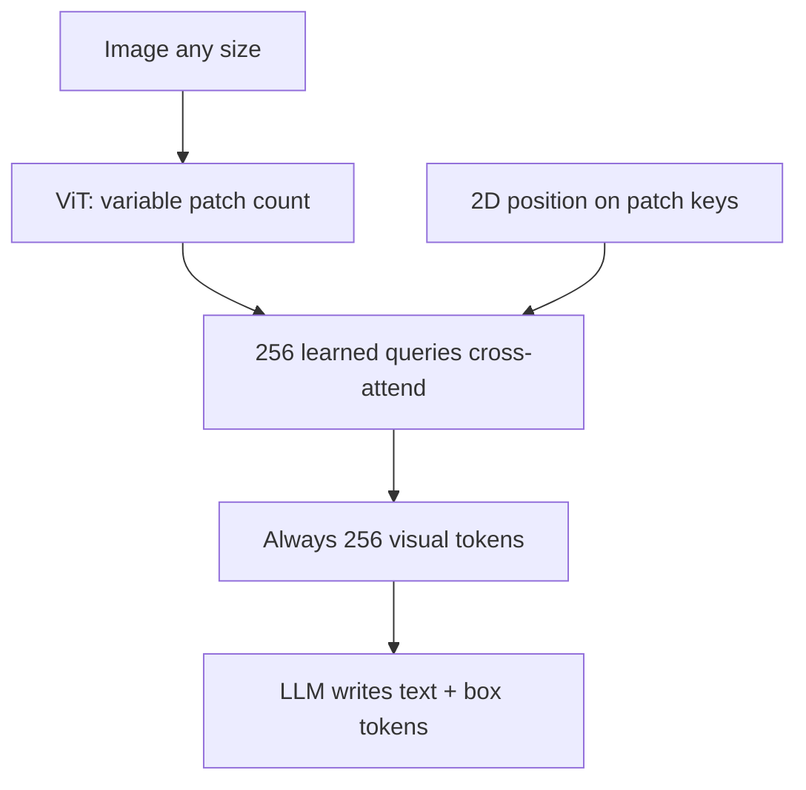
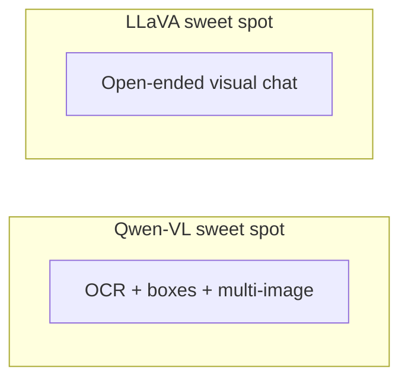

**Qwen-VL** compresses visual information into a **fixed number of position-aware tokens** so one LLM can chat, read text in images (OCR), compare images, and **point to regions**.

LLaVA is strong at visual conversation. Qwen-VL adds **exact locations** and dense text as part of normal text generation.

## Intuition

Variable-resolution images produce **variable** patch counts. LLM cost grows with sequence length — every token is a bill.

Qwen-VL’s adapter always outputs **256 visual tokens** per image. Think of it as:

> Summarize a big, detailed poster into **256 bullet points** that still remember *where* each bullet came from.

The **2D position encodings** are the “where on the poster” labels on those bullets.

:::key
Grounding coordinates are generated as **text tokens** (like words), not from a separate floating-point regression head.
:::

## How it works

### Position-aware vision-language adapter

Pipeline:

1. ViT → variable grid of patch features (more patches for larger images).
2. **256 learned query embeddings** cross-attend over all patches → **256 output tokens**.
3. **2D absolute position encodings** on patch keys preserve spatial layout.
4. Fixed **256 visual tokens** per image enter the LLM.

Why fixed length helps: multi-image and multi-round chat stay predictable. Cost: fine detail may be compressed away.



Tiny sketch (concept only):

```python
Q = learned_queries               # [256, d]  — fixed output budget
K, V = patch_features + pos_2d    # [num_patches, d] — grows with image size
attention = softmax(Q @ K.T / sqrt(d)) @ V
visual_tokens = attention           # [256, d] — always 256, always
```

Each of the 256 queries asks: *“What should I remember from the patches, and where was it?”*

### Grounding with special text tokens

| Token | Role |
| --- | --- |
| `` | Where visual tokens enter the sequence |
| `<ref>` | Links a phrase to the region it refers to |
| `<box>` | Wraps normalized coordinates (0–1000 range) |

Example output for *“Find the red umbrella”*:

`<ref>the red umbrella</ref><box>(342,128),(410,256)</box>`

The coordinates are **not** from a separate regression head. The model predicts them **token by token**, like spelling a word.

### Simple math: normalized coordinates

Coordinates use a **0–1000** scale so the same token system works for any image size:

`x_norm = 1000 × x_pixel / image_width`  
`y_norm = 1000 × y_pixel / image_height`

**Walk one conversion:**

- Image size: **2000 × 1000** pixels
- Model outputs: `<box>(500,0),(1000,500)</box>`

Convert back to pixels:

| Corner | Normalized | Pixel math | Pixel result |
| --- | --- | --- | --- |
| Top-left x | 500 | `500/1000 × 2000` | **1000** |
| Top-left y | 0 | `0/1000 × 1000` | **0** |
| Bottom-right x | 1000 | `1000/1000 × 2000` | **2000** |
| Bottom-right y | 500 | `500/1000 × 1000` | **500** |

So the box covers x **1000–2000**, y **0–500** — the right half of the image.

Tiny helper sketch (concept only):

```python
def norm_to_pixels(x_norm, y_norm, width, height):
    x_px = x_norm / 1000 * width
    y_px = y_norm / 1000 * height
    return x_px, y_px
```

### Multi-image and multi-round reasoning

Several `` blocks can sit in one sequence, each labeled (image 1, image 2…).

**Walk a dialogue:**

1. User: *[image 1 uploaded]* “What brand is on the box?”
2. Model: *“Acme Corp.”*
3. User: *[image 2 uploaded]* “Compare the logo in image 2 to the box in image 1.”
4. Model must keep **both** images and **history** in one sequence.

That requires multiple image-token blocks plus persistent context — not a single global embedding that forgets which image is which.

### Three-stage training pipeline

| Stage | Resolution / data | What trains | Purpose |
| --- | --- | --- | --- |
| **1. Pretraining** | 224px; ~1.4B weak pairs | Vision + adapter; LLM frozen | Broad image–text alignment |
| **2. Multi-task** | 448px; caption, VQA, grounding, OCR | Whole model | Fine-grained + spatial skills |
| **3. Instruction tuning** | 448px; multi-image chat | Vision frozen; rest adapts | Qwen-VL-Chat behavior |

**Stage 1 rationale:** align the **visual side** to an already capable **language model** before asking for boxes, OCR, and multi-image reasoning.

**Look ahead:** Qwen2-VL moves toward dynamic resolution — token count can adapt instead of always 256.

### Trade-offs vs LLaVA

| | Qwen-VL | LLaVA |
| --- | --- | --- |
| Visual budget | Fixed **256** tokens | Can grow (AnyRes tiles) |
| Spatial output | Box/reference tokens in text | Weaker native grounding |
| Training | Three stages | Simpler two-stage recipe |
| Best fit | OCR, grounding, multi-image | Open visual chat and explanation |



## What goes wrong

- Assuming 256 tokens preserve every tiny detail — compression has a cost.
- Forgetting to convert normalized boxes back to pixel space for your image size.
- Skipping stage-1 alignment and expecting perfect grounding immediately.

## One-line summary

Qwen-VL compresses patches to 256 position-aware tokens and generates grounded language — including box coordinates — as ordinary text tokens.

## Key terms

- **Cross-attention adapter** — Fixed queries summarize variable patch features.
- **Grounding** — Link language to a spatial region (box or reference).
- **OCR** — Reading text inside an image.
- **Normalized coordinate** — 0–1000 scale independent of image pixel size.
- **Token budget** — How many tokens a representation is allowed to use.
