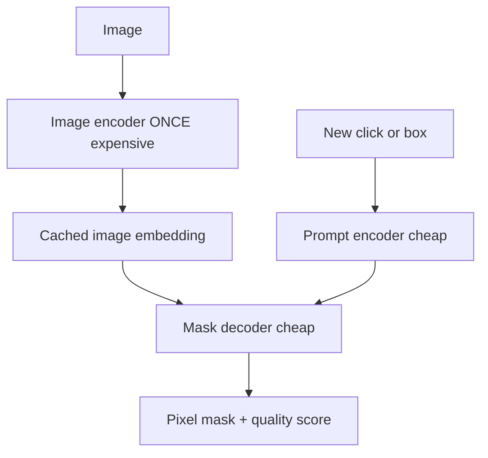
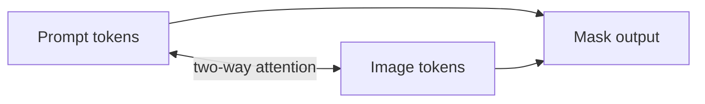

**SAM** takes an image plus a **prompt** (point, box, mask, or experimental text) and returns a **pixel-level mask** for that region.

Plain sentence: SAM answers *“Where is this region?”* more directly than *“What is it called?”*

## Intuition

### What "segmentation" actually asks for

The models so far answered questions about an image as a whole: does this match that caption, what is happening here, where roughly is the umbrella.

Segmentation asks something stricter. For **every single pixel**, it wants a yes or no: is this pixel part of the thing I mean?

That is what separates a box from a mask. A box around a cat also contains grass, fence, and sky. A mask contains the cat and nothing else — down to the gaps between its whiskers. If you want to cut the cat out of the photo, or measure exactly how much of a scan is affected, the box is not good enough.

### Why the old approach did not scale

Before SAM, segmentation models were built **one domain, one label set** at a time — a model trained for lungs in medical scans, another for street scenes, another for retail products.

Each one worked well and only inside its own world. Wanting to segment something new meant collecting a labelled dataset and training another model, which is why segmentation stayed a specialist tool rather than something you could just use.

### What SAM changed

SAM makes segmentation **promptable**. Instead of training a model that knows a fixed list of objects, you give it a hint at the moment you ask: click a point, drag a box, or supply a rough mask. It returns the pixel outline of whatever you indicated.

The consequence is that nothing needs to be decided in advance. You do not tell SAM which categories exist, so it never runs out of them — it will outline an object it has no name for just as readily as a common one.

Photo-editor picture:

- **Heavy step:** understand the whole image once (like loading a high-res file into memory)
- **Light step:** each new click or box is a quick follow-up (like adjusting a selection)

That split is why SAM feels interactive in a browser.

:::key
SAM separates heavy image encoding (once) from lightweight prompt decoding (many times). It does not assign semantic class names by itself.
:::

## How it works

### Three components

| Component | Job | Design note |
| --- | --- | --- |
| **Image encoder** | Dense embedding from pixels | Heavy ViT-H/16 — run **once per image**, cacheable |
| **Prompt encoder** | Encode point, box, mask, or text prompt | Lightweight — runs per new prompt |
| **Mask decoder** | Combine image + prompt → masks + quality scores | Lightweight transformer |



**Cost story in plain words:**

| Step | Relative cost | How often |
| --- | --- | --- |
| Image encoder | **High** | Once per image |
| Prompt encoder + decoder | **Low** | Every new click/box |

Cache the embedding during an interactive session — do not re-run the heavy encoder on every click.

### Prompt encoding and two-way attention

- **Sparse prompts** (points, boxes): positional encoding + learned prompt-type embedding.
- **Dense prompts** (rough masks): convolutional embedding fused with the image embedding.
- **Mask decoder:** **two-way attention** — prompts attend to image tokens **and** image tokens attend back to prompts.
- Image features are upsampled → full-resolution masks.

Why two-way beats one-way:

- Prompt → image: *“Focus on what I clicked.”*
- Image → prompt: *“Gather evidence from the image for this prompt.”*

More like a conversation than appending a note at the end.



### Multi-mask output for ambiguous prompts

One click on a **shirt** may mean:

| Interpretation | What the user might want |
| --- | --- |
| Whole person | Full body mask |
| Shirt | Garment only |
| Button | Tiny sub-part |

SAM predicts **three candidate masks** at different granularities plus an **IoU / confidence** score for each. The UI can pick the best automatically or show alternatives.

**IoU in plain numbers:**

Intersection over Union = overlap area ÷ union area

| Predicted vs reference | IoU | Meaning |
| --- | --- | --- |
| Perfect overlap | **1.0** | Ideal |
| Half overlap | **~0.5** | Mediocre |
| No overlap | **0.0** | Wrong |

Training uses mask losses (focal, dice-style) and IoU-head regression (e.g. MSE).

### The SA-1B data engine

| Stage | What happens |
| --- | --- |
| **1. Assisted-manual** | Humans label with SAM help; model retrained periodically |
| **2. Semi-automatic** | SAM proposes masks; humans fill gaps |
| **3. Fully automatic** | 32×32 point grid prompts SAM; keep stable masks, drop near-duplicates |

Scale from the lecture: ~**11M** images, ~**1.1B** masks (~**100 masks per image** on average).

The data engine and the model **co-evolve** — better SAM speeds labeling, more labels improve SAM.

### Uses, composition, and limits

**Uses:** medical annotation, robotics grasp planning, background removal, rotoscoping, AR, geospatial mapping.

**Grounded-SAM composition:**

1. Grounding or detection model names a region → outputs a **box**
2. SAM turns the box into a **pixel-accurate mask**

SAM alone does not say *“bicycle”* — it says *“here are the pixels for the region you pointed at.”*

**Limits:**

- No semantic class name or natural-language description by itself
- Thin structures, tiny objects, domain shift (e.g. medical scans) may need validation or fine-tuning
- Text prompting was experimental; **points and boxes** are the reliable core prompts

**SAM 2 pointer:** same idea extended to **video** with memory attention across frames.

Tiny interactive sketch (concept only):

```python
image_embedding = image_encoder(image)  # expensive — do this ONCE

def segment(prompt):
    prompt_embedding = prompt_encoder(prompt)
    masks, iou_scores = mask_decoder(image_embedding, prompt_embedding)
    return masks, iou_scores  # often 3 candidates at different scales

mask_shirt, scores = segment(click_on_shirt)
mask_bike, scores = segment(box_around_bicycle)  # same cached embedding
```

## What goes wrong

- Expecting SAM to label *what* the object is — pair with a VLM or detector for semantics.
- Re-running the heavy encoder on every click instead of caching.
- Treating zero-shot transfer as perfect on thin structures or new medical domains.

## One-line summary

SAM caches a heavy image embedding, then uses lightweight prompt decoding to produce pixel-accurate masks — often with multiple candidates when a prompt is ambiguous.

## Key terms

- **Promptable segmentation** — Segmentation controlled by point, box, mask, or prompt.
- **Mask** — Pixel map of which pixels belong to the selected region.
- **Two-way attention** — Prompt ↔ image attention inside the decoder.
- **IoU** — Intersection over Union; overlap measure for masks.
- **SA-1B** — Large segmentation dataset from SAM’s data engine.
