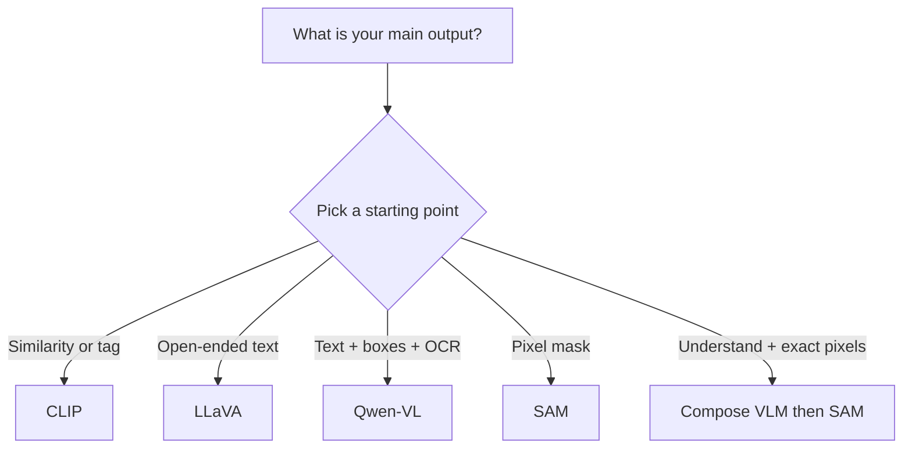
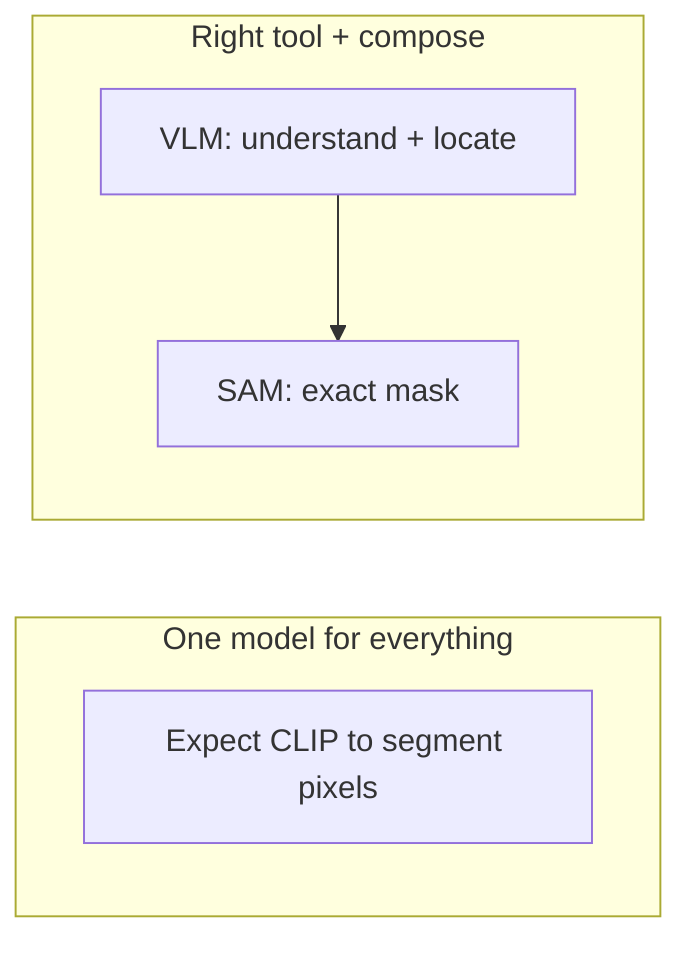

All four systems in this chapter turn **pixels** into a representation. The difference is **what that representation connects to** and **what output** the system is trained to produce.

This lesson is the map for choosing — or combining — them.

## Intuition

Ask one practical question first:

> Do I need **matching**, **language generation**, **grounded coordinates**, or **pixel boundaries**?

That answer usually tells you which architecture to start with.



:::key
Real pipelines often compose models: a language-capable VLM for understanding and location, then SAM for the exact mask.
:::

## How it works

### Side-by-side comparison

| Model | Fusion / connector | Training focus | Output | Best fit |
| --- | --- | --- | --- | --- |
| **CLIP** | Two encoders; similarity at the end | Symmetric contrastive loss | Score, zero-shot label | Retrieval, tagging |
| **LLaVA** | Projector → visual tokens in LLM | Instruction tuning (autoregressive) | Open-ended text | Visual chat, explanation |
| **Qwen-VL** | 256-query adapter + grounding tokens | Multi-stage alignment + tasks | Text, OCR, boxes | Grounded, multi-image VLM |
| **SAM** | Prompt encoder + two-way mask decoder | Mask + IoU losses | Pixel masks | Promptable segmentation |

Shared thread from lesson 4.1.1:

`pixels → vision encoder → connector → consumer → output`

Each row changes the **connector**, **consumer**, and **output contract**.



### Three design trade-offs

**1. Frozen vs fine-tuned backbone**

| Approach | Example | Trade-off |
| --- | --- | --- |
| **Freeze vision (and sometimes LLM)** | LLaVA stages | Lower cost; may inherit encoder blind spots |
| **Train vision + adapter in stages** | Qwen-VL | More capability; more data, memory, tuning |

**2. Token efficiency vs spatial fidelity**

| Approach | Trade-off |
| --- | --- |
| **Fixed 256 tokens** (Qwen-VL) | Predictable LLM cost; may lose fine detail |
| **Tiling / AnyRes** (LLaVA-NeXT) | More detail for OCR/charts; more tokens and compute |

**3. Scale vs curation**

| Data style | Examples |
| --- | --- |
| **Huge noisy / weak labels** | CLIP, Qwen-VL pretraining |
| **Engineered or human-in-the-loop supervision** | LLaVA GPT-4 instructions, SAM SA-1B engine |

### Composition examples — walk each pipeline

**1. Warehouse robot (understand → grasp)**

1. **Qwen-VL** reads the package label, answers *“Which box matches order #4821?”*, outputs a **box**
2. **SAM** turns that box into a **pixel mask** for the gripper

**2. Grounded-SAM (name → mask)**

1. Grounding/detection model finds *“red forklift”* → **box**
2. **SAM** converts box → **precise mask** for overlay or path planning

**3. Content tagging at scale (no LLM needed)**

1. **CLIP** encodes the image once
2. Compare to text templates: *“a photo of damaged packaging”*, *“a photo of intact packaging”*
3. Pick highest similarity — zero-shot tag, no generative model

**Walk the robotics example step by step:**

```
User instruction: "Pick up the smallest box with the Acme label."
        ↓
Qwen-VL: reads label, compares box sizes, outputs
         <ref>smallest Acme box</ref><box>(…)</box>
        ↓
Convert normalized box → pixel rectangle
        ↓
SAM: box prompt → pixel mask for grasp planner
```

Tiny pipeline sketch (concept only):

```python
# Step 1: understand + locate (VLM)
vlm_answer = qwen_vl.generate(image, "Find the red package label")
box = parse_box_tokens(vlm_answer)          # normalized 0-1000 coords
pixel_box = norm_to_pixels(box, image.size)

# Step 2: precise pixels (SAM)
image_emb = sam.image_encoder(image)        # cache once
mask = sam.segment(image_emb, prompt=pixel_box)
# mask → motion planner / grasp / overlay
```

Read the stages:

| Step | Model | Output |
| --- | --- | --- |
| Understand + locate | Qwen-VL (or LLaVA) | Text + optional box |
| Exact boundary | SAM | Pixel mask |
| Tag / rank only | CLIP | Similarity score |

### Quick revision checklist

- **ViT** — `(H/P) × (W/P)` patch tokens; add position info. Example: 224×224, 16×16 → **196** patches.
- **CLIP** — dual encoders, diagonal of batch matrix, zero-shot via text templates.
- **LLaVA** — projector translator; stage 1 alignment, stage 2 instruction tuning.
- **Qwen-VL** — 256 queries + 2D position; `<box>` coords as text tokens (0–1000).
- **SAM** — cache image embedding; prompt → mask; 3 candidates when ambiguous.
- **Compose** — VLM for *what/where in language*; SAM for *exact pixels*.

### A practical selection question

| You need… | Start with… |
| --- | --- |
| Weekly-changing category tags, no retraining | CLIP zero-shot |
| *“Explain this chart”* | LLaVA |
| *“Read this receipt and box the total”* | Qwen-VL |
| Click-to-cut-out in an editor | SAM |
| Robot pick with language instruction | Qwen-VL or LLaVA **then** SAM |

## What goes wrong

- Using CLIP alone when the product needs paragraphs of explanation.
- Using only SAM when the product needs class names and multi-turn instructions.
- Ignoring compute: high-res LLaVA-NeXT and multi-image Qwen-VL both have token bills.
- Skipping domain validation after zero-shot transfer (medical, thin structures).

## One-line summary

CLIP matches, LLaVA explains, Qwen-VL grounds in text and boxes, SAM segments pixels — and real systems often chain them together.

## Key terms

- **Output contract** — What the model promises to produce (score, text, box, mask).
- **Composition** — Chaining specialized models instead of one model for everything.
- **Zero-shot transfer** — Useful but not a guarantee — validate on your domain.
- **Grounded-SAM** — Detector/grounding model + SAM for named, precise regions.
