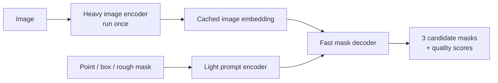
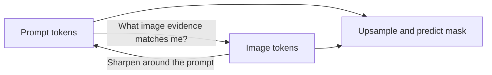
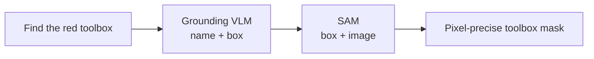

**SAM** (Segment Anything Model) takes an image plus a prompt and returns one or more **pixel-level masks**.

This is a short recap from lesson 4.1.5 because SAM is useful inside many vision applications.

## Intuition

Think of selecting an object in a photo editor:

1. Upload the image once.
2. Click the object or draw a box around it.
3. The system outlines the exact pixels.
4. Add another click to correct the selection.

Older segmentation models were often tied to one dataset or object type. SAM was trained as a **promptable foundation model**, so the prompt says what region matters.

:::key
SAM answers **“which pixels belong to this region?”** It does not reliably answer **“what is this object called?”**
:::

## How it works

### Three components

| Component | Plain job | How often it runs |
| --- | --- | --- |
| **Image encoder** | Heavy ViT turns the whole image into a reusable embedding | Once per image |
| **Prompt encoder** | Turns a point, box, or rough mask into prompt features | For every prompt |
| **Mask decoder** | Combines image and prompt features to predict masks | For every prompt |



The reported architecture used a heavy MAE-pretrained ViT-H/16. Encoding an image took about **0.15 seconds** on the reported hardware; the reusable decoder path took about **50 milliseconds**. Exact speed changes with hardware, but the design lesson stays the same: **heavy once, cheap many times**.

### Why the image embedding is cached

Suppose a user clicks a flower, then clicks again to remove a leaf:

- First click: encode image + encode click + decode mask
- Second click: reuse image embedding + encode new click + decode again

The expensive image encoder does not need to start over.

```python
# Concept only: the important idea is what gets reused.
image_embedding = sam.encode_image(image)  # expensive — run once

flower_mask = sam.decode(image_embedding, point=(420, 260))
refined_mask = sam.decode(
    image_embedding,
    positive_points=[(420, 260)],
    negative_points=[(515, 300)],
)
```

### Prompt types

| Prompt | How SAM reads it | Typical use |
| --- | --- | --- |
| Foreground/background point | Position + learned point-type embedding | Fast interactive selection |
| Box | Positions of two corners | Precise single-object selection |
| Rough mask | Small convolutional encoder | Refine an existing mask |
| Text | Experimental CLIP-based path | Language-driven selection |

Points and boxes are the main reliable prompt types in the original SAM story.

### Two-way attention

Inside the mask decoder, information moves in both directions:

1. Prompt tokens look at image tokens to collect evidence.
2. Image tokens look back at prompt tokens to focus on the requested region.



It is a short conversation between the prompt and the image, not a one-way lookup.

### Why SAM returns multiple masks

A point on a shirt is ambiguous. It could mean:

- the **button** (sub-part)
- the **shirt** (part)
- the **person** (whole object)

SAM predicts **three candidate masks** instead of pretending one interpretation is certainly correct. An extra head predicts a quality score for each mask.

### Mask losses in simple language

A mask contains many easy background pixels and relatively few object pixels. A plain pixel loss can therefore learn to say “background” too often.

SAM combines:

- **Focal loss** — pays extra attention to hard pixels
- **Dice loss** — rewards the overlap and overall shape of the region

The lecture’s mask-loss weighting is:

`Mask loss = 20 × Focal loss + 1 × Dice loss`

Dice loss is based on:

`Dice loss = 1 − 2 × overlap / (predicted area + true area)`

A separate MSE loss trains the mask-quality (IoU) prediction head.

### IoU: how mask overlap is measured

`IoU = intersection area / union area`

- `1.0` → perfect overlap
- `0.5` → only half-overlapping in a rough sense
- `0.0` → no overlap

### How SA-1B was built

| Stage | Human and model roles |
| --- | --- |
| **Assisted manual** | People label masks with SAM’s help; SAM is retrained |
| **Semi-automatic** | SAM proposes confident masks; people add missed objects |
| **Fully automatic** | A 32 × 32 point grid prompts SAM; stable masks are kept and duplicates removed |

The result described in the lecture: about **11 million licensed images** and **1.1 billion masks** — roughly **100 masks per image**.

## Where SAM fits

SAM is useful for background removal, medical annotation, robotics, rotoscoping, AR, and geospatial mapping.

For language + exact pixels, compose models:



This is the **Grounded-SAM** pattern: one model understands and locates; SAM refines the pixels.

## What goes wrong

- Thin structures and tiny objects can be difficult.
- A mask does not automatically include a semantic class name.
- Zero-shot transfer is useful, not guaranteed; medical or specialist use needs validation.
- Re-running the image encoder for every click wastes the main efficiency benefit.

## One-line summary

SAM encodes an image once, then cheaply turns points, boxes, or masks into several pixel-level candidates with quality scores.

## Key terms

- **Segmentation mask** — Pixel map showing the selected region.
- **Promptable segmentation** — Choose a region using a point, box, or rough mask.
- **Two-way attention** — Prompt tokens and image tokens update each other.
- **Focal loss** — Focuses learning on difficult pixels.
- **Dice loss** — Rewards region overlap and shape.
- **IoU** — Intersection over Union; mask-overlap score.
