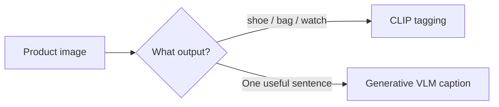
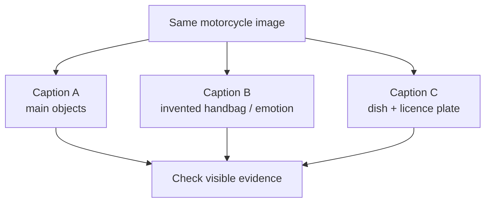
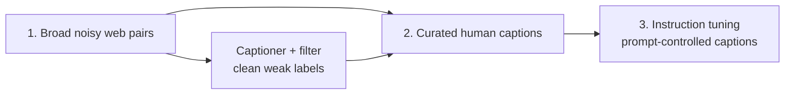

**Image captioning** turns visible image content into a useful natural-language description.

It is different from classification: a classifier returns a fixed label such as `mountain`; a captioner can say *“A snow-covered mountain under a clear evening sky.”*

## Intuition

Start with the output you need:

- Need a **tag** or category → CLIP is often cheaper and faster.
- Need a **sentence** or explanation → use a generative VLM such as LLaVA or Qwen-VL.



:::key
Rule of thumb: need a sentence → generative VLM. Need only a tag → contrastive model such as CLIP.
:::

## How it works

### Captioning is more than listing objects

A useful caption can include:

- **Objects** — motorcycle, two riders, satellite dish
- **Attributes** — red, large, snow-covered
- **Relationships** — one person sits behind another
- **Scene context** — a quiet tree-lined road

But it should not invent names, emotions, or events that the pixels do not support.

### A practical model choice

Imagine a catalog with **10 million product photos**:

1. Run CLIP for fast category filtering.
2. Generate captions only for products that need customer-facing descriptions.

This uses the expensive generative model where language adds value, not for every simple tag.

### Prompting for consistent captions

“Describe this image” leaves too much freedom. At scale, consistency matters more than creativity.

A better template:

```text
Write one sentence under 125 characters.
Describe only visible objects and relationships.
Do not infer names, emotions, or events not shown.
```

Why each line matters:

| Instruction | What it prevents |
| --- | --- |
| One sentence, under 125 characters | Long, inconsistent catalog descriptions |
| Visible objects and relationships | Generic filler |
| Do not infer hidden facts | Hallucinated stories or identities |

**Worked example**

Prompt:

> Write a one-sentence caption describing only what is visually present.

Output:

> A snow-capped mountain range under a clear sky, with the sun low on the horizon.

The answer names the main subject and setting without guessing the location or who took the photo.

### Why different models describe the same image differently

The lecture compares models on a motorcycle image:

- One model notices the **large satellite dish**.
- Another invents a **handbag** and says the people are “enjoying their ride.”
- Another reads a licence plate but may not read every character reliably.

This reveals three important differences:

1. **Salience** — which detail the model thinks matters
2. **Hallucination** — plausible detail that is not present
3. **Confidence** — uncertain OCR may still be stated as fact



### Why captioning is hard

| Challenge | Plain explanation |
| --- | --- |
| Fine detail | Similar species, products, or brands may differ only in tiny features |
| Composition | The model must describe relationships, not merely list objects |
| Spatial/common sense | Occlusion and position can change what a scene means |
| Salience | There is no single answer to “what is worth mentioning?” |
| Long-tail concepts | Rare objects and local brands appear less often in training data |
| Subjectivity | Alt text and marketing copy need different detail levels |

### Evaluation: one score is not enough

Common metrics include:

- **BLEU, ROUGE, METEOR** — word or phrase overlap
- **CIDEr** — agreement with informative reference phrases
- **SPICE** — compares semantic scene-graph ideas
- **CLIPScore** — image–caption compatibility using CLIP

Automatic metrics can miss what humans care about. A caption may use different wording and still be better.

For a real product, also track:

- Factual accuracy
- Hallucination rate
- Missing important objects
- Language and cultural coverage
- Style consistency
- Human preference

### Useful datasets

| Dataset | Approximate scale | Main use |
| --- | --- | --- |
| COCO Captions | 330K images, 5 captions each | Human-written benchmark |
| Flickr30K | 31K images, 5 captions each | Smaller caption benchmark |
| Conceptual Captions | 3M–12M pairs | Noisy web pretraining |
| Visual Genome | 108K images | Dense objects, attributes, relations |
| LAION-5B | 5B+ pairs | Web-scale pretraining |

### Typical training path



1. Broad pretraining learns many visual-language associations.
2. Curated caption data teaches accurate, fluent style.
3. Instruction tuning teaches conversational control.

BLIP-style bootstrapping can train a captioner and filter together to clean noisy web captions before reuse.

### A small captioning call

The exact API differs by model; the important part is the constrained prompt:

```python
prompt = """
Write one sentence under 125 characters.
Describe only visible objects and relationships.
Do not infer names, emotions, or events not shown.
"""

caption = vlm.generate(image=image, prompt=prompt)
```

## What goes wrong

- **Hallucination** — adds an absent object.
- **Over-generic caption** — “a photo of a scene” says almost nothing.
- **Salience error** — describes background clutter and misses the subject.
- **Inherited bias** — repeats cultural or demographic patterns from training data.
- A prompt tuned for creative social posts may be unsuitable for factual alt text.

## One-line summary

Use CLIP for fast tags and a generative VLM for sentences; constrain scope and length, then evaluate factuality with humans as well as metrics.

## Key terms

- **Captioning** — Natural-language description of visible content.
- **Tagging** — Assigning one or more class-like labels.
- **Salience** — Which visible details deserve mention.
- **Hallucination** — Unsupported detail added by the model.
- **CIDEr / SPICE / CLIPScore** — Different ways to evaluate captions.
