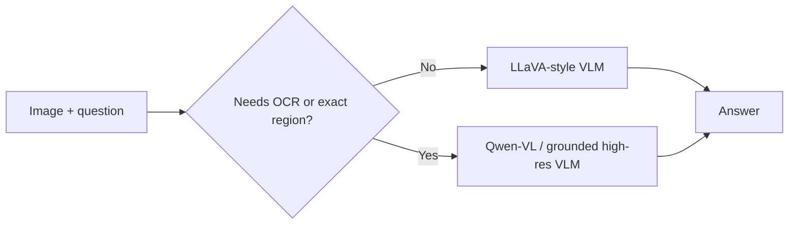
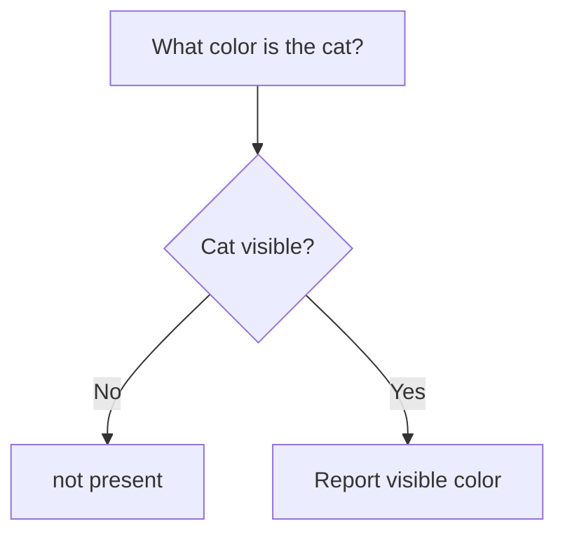

**Visual Question Answering (VQA)** means answering a specific question grounded in an image.

Captioning asks *“What is in this image?”* VQA asks something targeted, such as *“How many peaks are visible?”*

## Intuition

The question decides which visual details matter.

For the same street image:

- Caption: *“Two people ride a motorcycle on a tree-lined road.”*
- VQA: *“What is attached to the motorcycle?”* → *“A large satellite dish.”*

Everything unrelated to the question can be ignored.

:::key
Captioning describes generally. VQA finds the image evidence needed for one particular question.
:::

## How it works

### Common question types

| Type | Example |
| --- | --- |
| Yes / no | Is the traffic light red? |
| Multiple choice | Which animal is closest to the fence? |
| Counting | How many peaks are visible? |
| Spatial | What is to the left of the bus? |
| OCR-based | What total is printed on the receipt? |
| Open-ended | Why might this road be unsafe? |

### Which model fits?

- **LLaVA-style model** — broad, conversational questions about a whole image
- **Qwen-VL-style model** — OCR, grounding, pointing, or a specific image region



Rule of thumb: whole-image question → either model. Region-specific or text-reading question → prefer a grounded or high-resolution model.

### Direct prompts for simple facts

For clear perception questions, ask directly:

> What color is the car?

Do not request a long reasoning trace when a short answer is enough.

### Counting and comparison: make the evidence visible

Direct question:

> How many red objects are visible?

Better prompt:

```text
First list each visible red object and its location.
Then count the list.
If no red object is visible, answer "not present".
```

This does not guarantee correctness, but it makes mistakes easier to see. If the list has six objects and the final answer says seven, you can catch the mismatch.

**Worked example**

Question:

> How many distinct peaks are visible?

Answer:

> Two — a smaller peak on the left and a taller, sunlit peak on the right.

The answer includes both the count and the evidence used.

### Presupposition hallucination

Question:

> What color is the cat?

What if there is **no cat**?

A model may confidently answer “black” because the question assumes a cat exists. This is **presupposition hallucination**.

A safer prompt:

```text
First verify that a cat is visible.
If no cat is visible, answer "not present".
Otherwise, state its color.
```



### Ambiguous questions need a criterion

*“Is this good?”* is not a useful visual question. Good for what — safety, design, quality, or price?

Improve it:

> Is this parking position safe according to the visible signs and road markings?

The model now knows which evidence and standard to use.

### Does the answer actually depend on the image?

A fluent answer can come from language patterns rather than visual evidence.

One practical **visual-dependence test**:

1. Ask the question with the original image.
2. Ask again with a blurred or deliberately perturbed image.
3. Compare answers or token probabilities.
4. If the answer barely changes, the model may be relying on language priors.

```python
answer_real = vlm.answer(original_image, question)
answer_blurred = vlm.answer(blur(original_image), question)

if meaning_is_almost_same(answer_real, answer_blurred):
    flag("Answer may not depend enough on the image")
```

Research visualizations also show four possible cases:

| Focus | Answer | What it means |
| --- | --- | --- |
| Correct region | Correct | Desired behaviour |
| Correct region | Wrong | Image was inspected but misread |
| Wrong region | Wrong | Attention/focus failure |
| Wrong region | Correct | Possibly guessed from language priors |

### Why VQA is hard

It combines three skills:

1. Visual perception
2. Language understanding
3. World knowledge or reasoning

Counting, occlusion, spatial relations, and multi-step composition are still difficult. Open-ended answers also make evaluation hard.

### Datasets and what they test

| Dataset | Focus |
| --- | --- |
| VQAv2 | Broad general-purpose VQA |
| GQA | Compositional and relational reasoning |
| OK-VQA | Outside/common-sense knowledge |
| TextVQA | Reading text inside images |
| VizWiz | Noisy real questions and photos from blind/low-vision users |

### Training and evaluation

Modern systems usually:

1. Start from a generative VLM.
2. Mix several VQA datasets during instruction tuning.
3. Train the expected answer format (short benchmark answer vs conversational reply).
4. Use preference tuning to reduce hallucinated and overconfident answers.

Synthetic preference pairs can be made carefully by using:

- Correct vs random answer
- Correct vs answer from a mismatched question
- Original vs blackened/perturbed object regions, so the visual input must matter

Exact-match scores can mark *“I can see two distinct peaks”* wrong when the reference is simply *“two.”* Use semantic or human evaluation alongside strict metrics.

## What goes wrong

- Answering about an object that is not present.
- Stating a wrong answer with the same confidence as a correct one.
- Counting beyond roughly 5–10 partly hidden objects without checking.
- Treating attention heatmaps alone as proof of valid reasoning.
- Asking an ambiguous question and blaming the model for choosing the wrong criterion.

## One-line summary

VQA answers one image-grounded question; use direct prompts for simple facts, visible evidence lists for counting, and an explicit “not present” path for false assumptions.

## Key terms

- **VQA** — Visual Question Answering.
- **Presupposition hallucination** — Answering about something the image does not contain.
- **Grounding** — Linking the answer to a visible region.
- **Visual-dependence test** — Perturb the image to check whether the answer changes.
- **Compositional reasoning** — Combine several visual facts or relationships.
