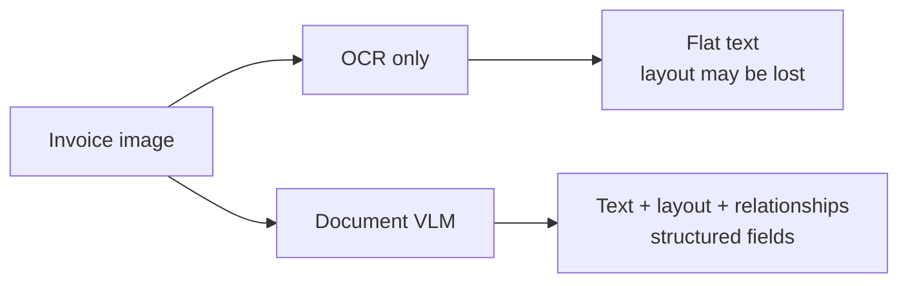
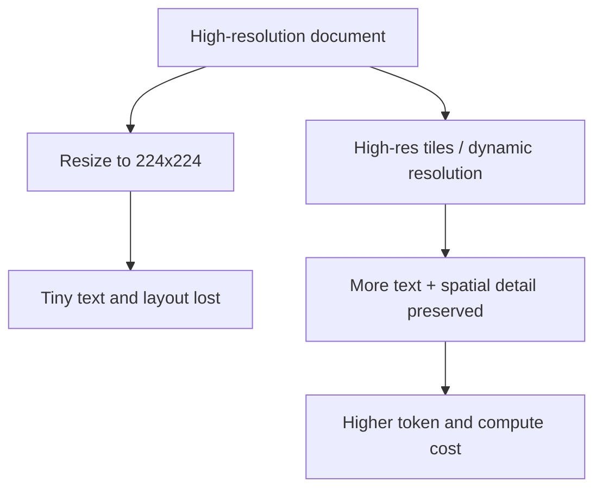
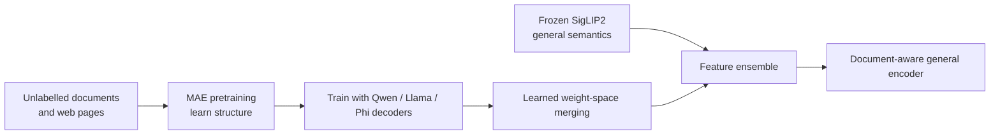
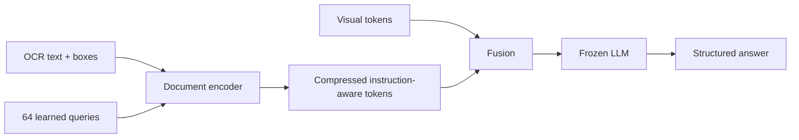

**Document intelligence** reads invoices, forms, receipts, and contracts while preserving enough layout and meaning to return **structured fields**.

The output is usually not a paragraph. It is data that another system can consume.

## Intuition

An invoice contains text, but plain OCR is not the whole job.

The system must understand:

- Which number is the **total**
- Which label belongs to that number
- Which date is the invoice date
- How columns, tables, and pages relate

:::key
Dedicated OCR reads text. A document VLM also reasons about layout, field relationships, and visual context.
:::

## How it works

### OCR or document VLM?

| Need | Better starting point |
| --- | --- |
| Fast transcription of clean printed text | Dedicated OCR |
| Named fields whose meaning depends on layout | Document VLM |
| Tables, boxes, relationships, or visual context | Document VLM / OCR + layout pipeline |



Naively sending flat OCR text to an LLM can lose coordinates, columns, merged cells, and which value belongs to which label.

### Prompt for an exact schema

Weak prompt:

> Return the important details.

Possible result: different keys every time, missing values, or prose.

Better prompt:

```text
Extract the invoice fields below.
Return only valid JSON. Use null when a field is missing.

{
  "vendor": string | null,
  "invoice_number": string | null,
  "date": "YYYY-MM-DD" | null,
  "total": number | null
}
```

Why every part matters:

| Prompt instruction | Benefit |
| --- | --- |
| Name every field | The model does not guess what “important” means |
| Show the JSON shape | Stable machine-readable keys |
| Use `null` when missing | Reduces plausible-looking invented values |
| State date/number format | Consistent downstream data |

### Worked invoice example

Visible document:

```text
Vendor:     Acme Supplies Ltd.
Invoice #:  INV-20394
Date:       14 Mar 2026
Total:      $481.50
```

Expected output:

```json
{
  "vendor": "Acme Supplies Ltd.",
  "invoice_number": "INV-20394",
  "date": "2026-03-14",
  "total": 481.50
}
```

The prompt explicitly allows `null`, so a missing total should not become a confident guess.

### Validate after extraction

The VLM output is a proposal, especially for financial and legal documents.

```python
record = extract_invoice(image, schema=invoice_schema)

if record["total"] is None:
    route_to_human("Total is missing")
elif record["total"] < 0:
    route_to_human("Unexpected negative total")
elif not invoice_number_pattern.fullmatch(record["invoice_number"] or ""):
    route_to_human("Invoice number could not be verified")
else:
    save_for_approval(record)
```

Do not auto-approve a blurred account number just because it looks plausible.

### Why document resolution matters

Natural-image tasks often work at **224 × 224** or **448 × 448**. A document may contain:

- tiny text
- multi-column layout
- tables and merged cells
- handwriting
- multiple pages

Shrinking a full invoice to 224 pixels can make every character unreadable. Higher or dynamic resolution preserves detail but costs more visual tokens and compute.



### DAVE: a document-specialized vision encoder

Standard CLIP/SigLIP-style encoders are good at broad semantics but may miss the low-level structure documents and web pages need.

DAVE’s idea:

1. Use **MAE self-supervised pretraining** on unlabeled document and web images.
2. Learn structural and spatial details.
3. Train encoder versions for several LLM decoders.
4. Learn **weight-space merging coefficients** instead of simply averaging models.
5. Combine the specialist encoder with a frozen generalist encoder such as SigLIP2.



Why combine specialist + generalist?

- Specialist preserves structure and layout.
- Generalist preserves broad visual meaning.

The lecture reports **+10.5% average over SigLIP2** on document/web vision-language benchmarks and **+5% on Mind2Web**, without losing general VQA ability. Treat such numbers as paper-specific results, not a guarantee for every dataset.

### DocVLM: OCR + 2D layout compression

A DocVLM-style design:

1. OCR produces text tokens and bounding-box positions.
2. A document encoder reads both text and **2D layout**.
3. **64 learned queries** compress the OCR/layout signal.
4. Project those query outputs to the VLM hidden size.
5. Combine them with visual tokens and feed the frozen LLM.



This keeps layout information that plain OCR text would discard.

### Common datasets

| Dataset | Main focus |
| --- | --- |
| DocVQA | Questions over scanned documents; often evaluated with ANLS |
| InfographicVQA | Dense visual + text layout |
| RVL-CDIP | Document-type classification |
| FUNSD | Noisy forms, entities, and key-value relations |

### Typical training recipe

- Higher/dynamic resolution
- Mixed OCR, layout-QA, grounding, and table data
- Synthetic rendered documents at scale
- Domain fine-tuning for invoices, receipts, or contracts

Document understanding improved quickly as models kept more pixels and trained directly on OCR/layout tasks.

## What goes wrong

- A prompt tuned for one invoice layout fails on another vendor.
- Skew, blur, handwriting, and low resolution damage OCR.
- Missing fields become plausible guesses unless `null` is allowed.
- Multi-page relationships and complex table headers are still difficult.
- Low-resource languages and non-Latin scripts may lag.
- High-stakes values are accepted without validation or human review.

## One-line summary

Document intelligence combines OCR, layout, and relationships; request an explicit JSON schema, preserve resolution, allow missing values, and validate before approval.

## Key terms

- **OCR** — Reads text inside an image.
- **Structured output** — Machine-readable response such as JSON.
- **ANLS** — Document-QA metric tolerant of small string differences.
- **DAVE** — Structure-focused document/web vision encoder.
- **DocVLM** — Pattern that combines OCR tokens with 2D layout positions.
- **Weight-space merging** — Learn how to combine model parameters instead of averaging them.
