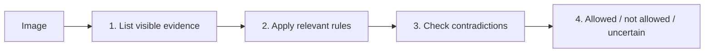
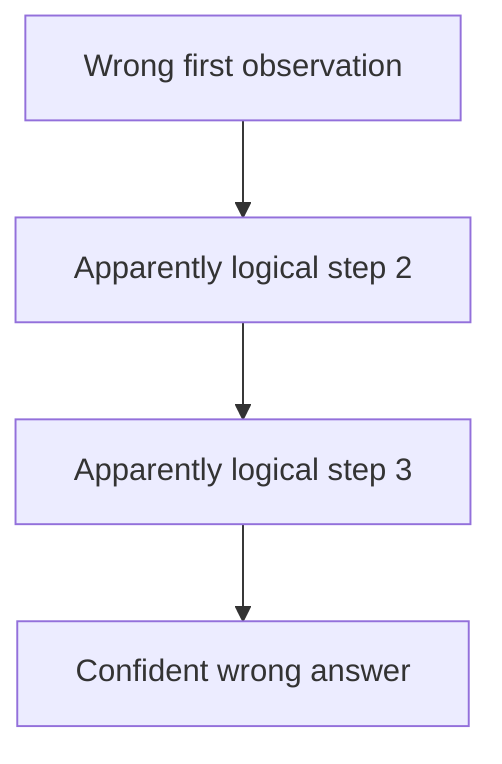

**Visual reasoning** combines several observations from an image before producing an answer or decision.

It goes beyond simply naming an object or reading one visible fact.

## Intuition

Basic VQA:

> What does the sign say?  
> **No Parking.**

Visual reasoning:

> Is it safe and legal to park here?

Now the model may need to inspect signs, road markings, vehicle position, time restrictions, and possibly outside knowledge.

:::key
The vision encoder supplies visual evidence. The LLM backbone and its reasoning training do most of the multi-step inference.
:::

## How it works

### What makes it different from basic VQA?

| Basic VQA | Visual reasoning |
| --- | --- |
| Reads one visible fact | Combines several observations |
| “What color is the light?” | “Is it safe to cross?” |
| Often one perception step | Perception + comparison + inference |

Common tasks include:

- Spatial relationships
- Counting under conditions
- Comparison between regions or images
- Cause and effect
- Diagram interpretation
- Quality inspection and safety audits

### Model choice

Both LLaVA-style and Qwen-VL-style models can reason:

- Use a strong **LLM backbone** for difficult inference.
- Prefer Qwen-VL or another grounded model when reasoning must point to a particular region.
- Use high resolution when the evidence is small text, chart labels, or fine markings.

### Decompose before deciding

Direct prompt:

> Is it safe to park here?

This invites a confident yes/no jump.

Better prompt:

```text
First list every visible sign, marking, and object relevant to parking.
Second, explain which rule each item suggests.
Third, check for contradictory evidence.
Finally answer: allowed, not allowed, or uncertain.
```



The benefit is **auditability**: a reviewer can see whether the model noticed the No Parking sign.

### A reasoning trace is not proof

A model can write a polished five-step explanation whose first observation is wrong.

Example:

1. “The sign says Parking Allowed.” ← wrong visual read
2. “The vehicle is inside the marked bay.”
3. “No obstruction is visible.”
4. “Therefore parking is allowed.” ← conclusion inherits step 1

This is a **compounding error**: one bad observation contaminates every later step.



Do not confuse a detailed chain with a correct chain.

### Add a verification pass

For important decisions:

1. Generate the evidence list.
2. Independently verify key observations.
3. Check calculations or rules with a deterministic tool when possible.
4. Allow `uncertain` instead of forcing an answer.

```python
observations = vlm.inspect(image, task="list parking signs and markings")
decision = reasoner.decide(observations)

verification = verifier.check(image, observations)
if verification.has_conflict or verification.low_confidence:
    final = {"decision": "uncertain", "needs_review": True}
else:
    final = {"decision": decision, "needs_review": False}
```

The verifier can be a second prompt, another model, OCR, a rule engine, or a human — depending on risk.

### Why visual reasoning is hard

| Difficulty | Why it matters |
| --- | --- |
| Multi-step inference | Several facts must remain correct at once |
| External knowledge | Physics, maths, laws, or domain rules may be needed |
| Occlusion | Important evidence may be partly hidden |
| Counterfactuals | “What would happen if…” is not directly visible |
| Verification | Fluent pattern matching can look like real reasoning |

### Benchmarks

| Dataset | Focus |
| --- | --- |
| MMMU | College-level multimodal questions across subjects |
| MathVista | Visual mathematical reasoning |
| ScienceQA | Science questions with diagrams |
| NLVR2 | Relationships across image pairs |
| Winoground | Difficult compositional language–image reasoning |

The lecture notes that visual reasoning still has a large gap between current models and human experts. Reported benchmark gains can also be affected by test-data contamination.

### Training patterns

Modern systems often mix:

- General VQA
- Maths and science diagrams
- Explicit rationale or evidence data
- Reasoning-focused preference tuning
- Curriculum learning across easier and harder tasks

A strong text-reasoning LLM can transfer some of that ability once the visual features are properly grounded. Better “eyes” help perception; they do not automatically provide better reasoning.

## What goes wrong

- One wrong visual observation spreads through the whole chain.
- A confident explanation is treated as evidence of correctness.
- The model is never allowed to say `uncertain`.
- Arithmetic and geometry are performed in free text when a calculator could verify them.
- Benchmark gains are assumed to prove general reasoning.

## One-line summary

Visual reasoning combines multiple observations; expose the evidence, check key steps independently, and allow uncertainty because a convincing chain can still be wrong.

## Key terms

- **Visual reasoning** — Multi-step inference over image evidence.
- **Chain of thought** — Intermediate reasoning or evidence steps.
- **Compounding error** — One early mistake causes later mistakes.
- **Compositional reasoning** — Reason about relationships among several objects or facts.
- **Verification** — Independently check observations and conclusions.
