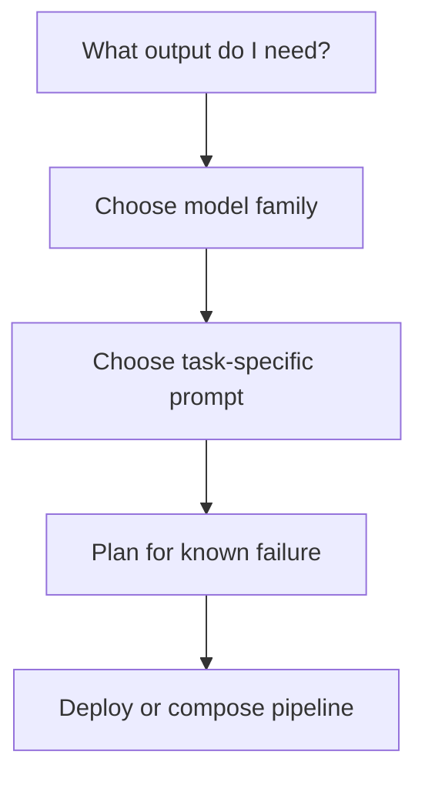
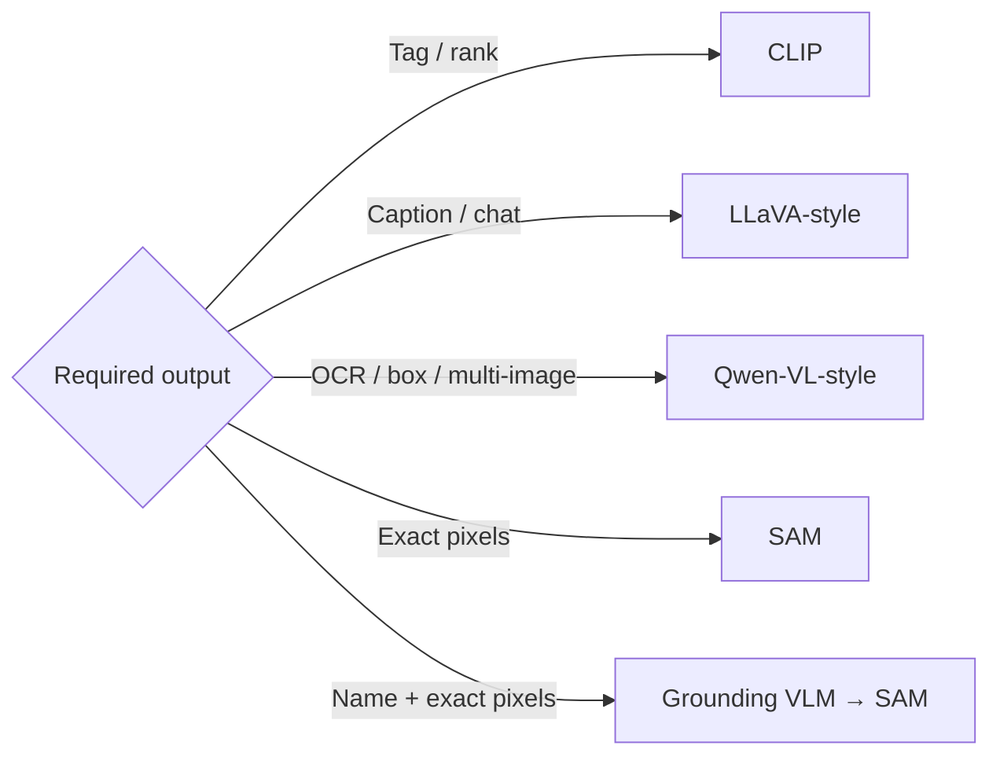
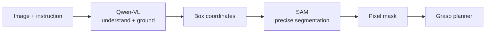

The main skill in this session is not memorising model names. It is matching the **task shape** to the right model, prompt, output, and safety check.

## Intuition

Start with the output:

- Tag
- Sentence
- Targeted answer
- Structured field
- Grounded box
- Pixel mask

Then ask what error would be costly.



:::key
Choose the output contract first. Then choose the model and verification plan — not the other way around.
:::

## Application map

| Application | Start with | Prompting strategy | Main failure |
| --- | --- | --- | --- |
| Image understanding | LLaVA-style / CLIP | Scoped, length-constrained caption | Hallucinated or generic detail |
| Visual Q&A | LLaVA-style / Qwen-VL | Direct; evidence list for counting | False assumption / overconfidence |
| Document intelligence | Qwen-VL / document VLM | Explicit JSON schema | Guessed missing field |
| Visual reasoning | Strong LLM-backed VLM | Decompose + verify | Compounding error |
| Chart and data QA | Qwen-VL / high-res LLaVA | Extract values, then calculate | Misread labels or silent arithmetic error |
| Pixel segmentation | SAM | Point, box, or rough mask | Thin/tiny structure missed |

### Chart and data QA

Charts combine several session skills:

1. Read small labels and legends (OCR/high resolution).
2. Match values to the correct series (layout and grounding).
3. Compare or calculate (reasoning).
4. State uncertainty when a value is not readable.

Better prompt:

```text
First list the chart title, axes, units, legend, and visible data values.
Then calculate the requested comparison.
Show the values used.
If a label cannot be read, say "uncertain" instead of guessing.
```

For reliable calculations, let code do the arithmetic after the model extracts values:

```python
values = vlm.extract_chart_values(image)
validated = validate_units_and_labels(values)

if validated:
    growth_percent = (values["2026"] - values["2025"]) / values["2025"] * 100
else:
    growth_percent = None  # request review; do not calculate from uncertain data
```

### Choose by output contract



| Need | Why this starting point fits |
| --- | --- |
| Fast open-vocabulary tagging | CLIP uses text descriptions as classes |
| Natural-language description | Generative VLM writes free-form text |
| OCR or grounded references | Position-aware/high-resolution VLM preserves layout |
| Exact pixel boundary | SAM’s decoder directly predicts masks |
| Semantic name + pixel boundary | Grounding VLM locates; SAM refines |

### Composition example: warehouse robot

Instruction:

> Pick the red box beside the pallet.

Pipeline:

1. Qwen-VL understands **red box beside pallet**.
2. It generates a reference and bounding box.
3. Convert normalized coordinates to image pixels.
4. Pass the box prompt to SAM.
5. SAM returns the exact mask.
6. The grasp planner uses that mask.



```python
grounding = qwen_vl.locate(image, "the red box beside the pallet")
pixel_box = normalized_box_to_pixels(grounding.box, image.size)

image_embedding = sam.encode_image(image)
mask = sam.segment(image_embedding, box=pixel_box)
grasp_planner.plan(mask)
```

No one model is forced to do everything:

- Qwen-VL handles language and approximate location.
- SAM handles exact pixels.
- A deterministic planner handles robot motion.

### A practical prompt-design lab

For any use case, write down:

1. **Task** — What exactly must the system do?
2. **Output** — Tag, text, JSON, box, or mask?
3. **Model** — Which architecture naturally produces that output?
4. **Prompt** — What scope, schema, evidence, or uncertainty rules are needed?
5. **Failure test** — What negative or difficult examples should be tested?
6. **Human check** — When is approval required?

Example:

| Design question | Invoice system answer |
| --- | --- |
| Task | Extract invoice fields |
| Output | Fixed JSON object |
| Model | Qwen-VL/document VLM |
| Prompt | Named schema; missing → `null` |
| Failure test | Blur, missing total, unfamiliar layout |
| Human check | Financial total fails validation |

### Known failure → planned control

| Failure | Control |
| --- | --- |
| Caption hallucination | Visible-only prompt + negative evaluation |
| VQA false assumption | Verify object exists; allow `not present` |
| Missing document field | Explicit `null` + validation + human review |
| Reasoning chain error | Independent evidence/verifier pass |
| SAM misses thin object | Domain test, extra points, specialist model |
| Chart arithmetic error | Extract values, then calculate in code |

## Quick revision

- Captioning describes; tagging labels.
- VQA is question-driven.
- Document intelligence = OCR + layout + field meaning.
- Visual reasoning combines observations and needs verification.
- SAM produces masks, not semantic names.
- High resolution preserves details but raises token and compute cost.
- Compose models when different outputs require different strengths.

## What goes wrong

- Picking a popular model before defining the output.
- Using one generic prompt for every task.
- Expecting SAM to reason or a VLM-generated box to be pixel-perfect.
- Evaluating only happy-path images.
- Deploying without a response for missing, unreadable, or uncertain evidence.

## One-line summary

Define the output and costly failure first, choose the model and prompt that fit, and compose specialised components when one model cannot safely do the whole job.

## Key terms

- **Output contract** — Exact type and shape a model must return.
- **Model composition** — Connect specialised models into one workflow.
- **Grounded-SAM** — Grounding VLM supplies a region; SAM supplies a mask.
- **Human verification** — Person checks high-risk or uncertain output.
- **Visual evidence** — Image details that support the answer.
