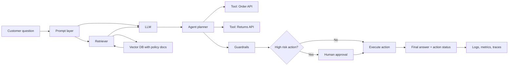

**Use case:** Build an AI Support Agent for an e-commerce company that answers customer questions, checks order status, and creates return requests safely.

## 1) Problem statement

Customers ask: "Where is my order?", "Can I return this item?", "What is refund policy?" The company wants fast answers, lower support load, and safe automation.

## 2) Full architecture (combined concepts)

## 3) Where each concept fits

| Concept | How used in this use case |
| --- | --- |
| LLM basics | Generates natural language replies to users |
| Tokens/context | Controls prompt size, chat history, and doc chunks |
| Prompt engineering | System prompt defines support tone, policy, and output format |
| Embeddings | Policy documents converted to vectors for semantic retrieval |
| RAG | Retrieves latest return/refund rules before answer generation |
| Agentic behavior | Plans steps and calls tools (order lookup, return creation) |
| Tool calling | Uses structured function calls with validated parameters |
| Memory | Short-term: current chat; long-term: user preferences/history |
| Reflection loop | Checks if output is policy-compliant and complete |
| Guardrails | Blocks unsafe requests and sensitive data leaks |
| HITL | Manager approval for high-value refunds |
| Observability | Tracks accuracy, latency, tool failures, and cost |

## 4) End-to-end execution example

**User:** "I received a damaged product. Can you return it and tell me refund time?"

1. Agent understands intent: return + policy question.
2. RAG retrieves "damaged item return policy" and "refund SLA."
3. Agent calls Order API to verify order and delivery date.
4. Agent calls Returns API to create return request.
5. Agent validates response and generates final answer with ticket ID.
6. System logs all steps for monitoring and audit.

## 5) Evaluation checklist for this use case

- **Accuracy:** answer matches policy and order data.
- **Latency:** response within target (for example, less than 3 seconds).
- **Cost:** token usage and tool calls within budget.
- **Safety:** no policy violations, no sensitive leakage.
- **Reliability:** handles API timeout with retry/fallback.

## 6) Why this capstone matters

This one workflow demonstrates how Gen AI + Agentic AI are combined in real products: model reasoning, retrieval, actions, safety controls, and production monitoring.
