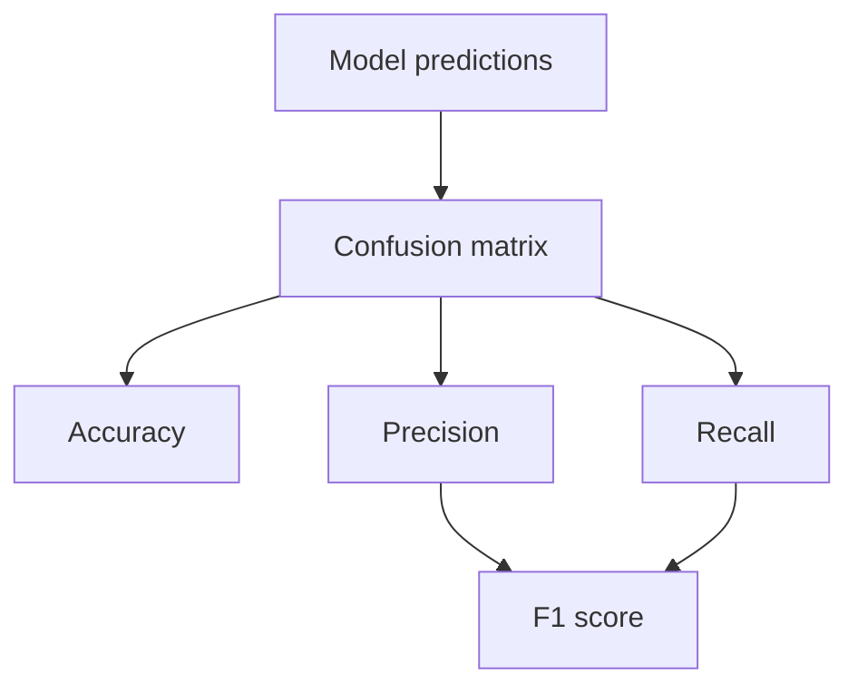

A practical AI system is not only accurate. It must also be fast, affordable, and safe.

| Metric | Question | Example Measurement |
| --- | --- | --- |
| Accuracy | Is output correct? | Pass rate on golden dataset |
| Latency | Is it fast enough? | P95 response time |
| Cost | Is it sustainable? | Cost per request/session |
| Safety | Does it follow policy? | Violation rate |

## Evaluation strategy

- Offline tests before release.
- Shadow testing in production.
- A/B comparison for model/prompt changes.

## Classification metrics (ML foundation)

When your task is classification, confusion-matrix-based metrics are essential.

| Metric | Formula | When important |
| --- | --- | --- |
| Accuracy | (TP + TN) / Total | Balanced datasets |
| Precision | TP / (TP + FP) | When false alarms are costly |
| Recall | TP / (TP + FN) | When missing positives is risky |
| F1 score | 2PR / (P + R) | Imbalanced datasets |

## Overfitting quick check

- Train loss goes down but validation loss goes up -> likely overfitting.
- Use regularization, more data, or early stopping.
